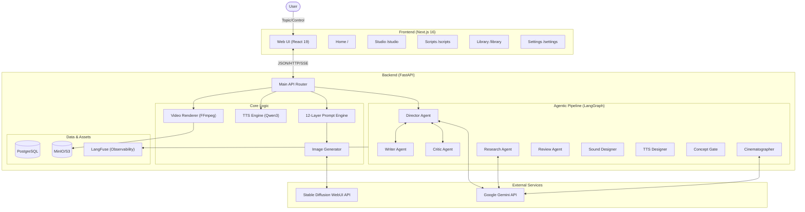

# Shorts Producer

**Shorts Producer**는 쇼츠 영상 콘텐츠 제작을 자동화하는 AI 기반 워크스페이스입니다. **LangGraph** 기반 Agentic AI Pipeline에서 **Google Gemini**가 스토리보드를 기획하고, **Stable Diffusion**으로 이미지를 생성하며, **Qwen3-TTS**로 음성을 합성하고, **FFmpeg**로 최종 영상을 렌더링합니다.

## System Architecture

시스템은 **V3 관계형 스키마** + **LangGraph Agentic Pipeline**을 채택하여, 여러 AI 에이전트가 자율적으로 협업하며 고품질 영상을 생성합니다.



## 주요 기능

1.  **Agentic AI Pipeline**: Director, Writer, Critic, Research, Cinematographer, SoundDesigner 등 15개 에이전트 노드가 LangGraph 기반으로 자율 협업하며 스토리보드를 창작합니다.
    - ReAct Loop (자율 의사결정), Tool-Calling (Gemini Function Calling), Agent Communication Protocol
    - Concept Gate (자동 품질 게이트), Graceful Degradation (에이전트 장애 내성)
2.  **12-Layer Prompt Engine**: 캐릭터의 고유 속성(Trait)과 임시 속성(Outfit)을 분리하여 일관성 있는 이미지를 생성합니다.
3.  **지능형 검수**:
    - **WD14 Tagger**: 생성 이미지와 프롬프트 키워드 일치 여부를 정량 검증합니다.
    - **Gemini Vision**: 검증 점수가 낮으면 이미지를 시각 분석하여 보정합니다.
4.  **TTS & 렌더링**: Qwen3-TTS 로컬 음성 합성 (오디오 정규화) + AI BGM + FFmpeg 영상 합성으로 최종 영상을 완성합니다.
5.  **스마트 렌더링**: 얼굴 감지 기반 크롭, 동적 Scene Text 높이, 플랫폼별 Safe Zone, 배경 밝기 기반 텍스트 색상 자동 조정.

## 기술 스택

| 레이어 | 기술 |
|--------|------|
| Backend | FastAPI, Python 3.13 |
| Frontend | Next.js 16, React 19, Zustand 5, Tailwind CSS 4 |
| DB | PostgreSQL, SQLAlchemy, Alembic |
| AI Pipeline | LangGraph, Google Gemini (`google-genai`) |
| Image Gen | Stable Diffusion WebUI (SDXL), ControlNet, IP-Adapter |
| TTS | Qwen3-TTS (로컬 MPS) |
| Video | FFmpeg (Ken Burns, 13종 전환 효과) |
| Storage | MinIO/S3 |
| Observability | LangFuse (셀프호스팅) |
| Testing | pytest (Backend), Vitest (Frontend), Playwright (VRT) |

## Project Structure

### Backend (`/backend`)
```
backend/
├── routers/          # 도메인별 API 엔드포인트 (33개 라우터)
├── services/
│   ├── agent/        # LangGraph Agentic Pipeline
│   │   ├── nodes/    #   Director, Writer, Critic, Research 등 15개 노드
│   │   ├── tools/    #   Gemini Function Calling 도구
│   │   ├── state.py  #   Graph State
│   │   └── routing.py#   조건부 라우팅
│   ├── video/        # FFmpeg 렌더링 파이프라인
│   ├── prompt/       # 12-Layer Prompt Builder
│   ├── keywords/     # 태그 시스템 (캐시, 검증, 분류)
│   ├── storyboard/   # 스토리보드 CRUD, Scene Builder
│   └── characters/   # 캐릭터 관리, LoRA 연동
├── models/           # SQLAlchemy ORM (V3 Relational Schema)
├── templates/        # Jinja2 (스토리보드 생성 + 리뷰 프롬프트 4개)
├── schemas.py        # Pydantic Request/Response 모델
├── config.py         # 환경변수/상수 SSOT
└── main.py           # FastAPI 앱 + Lifespan
```

### Frontend (`/frontend`)
```
frontend/
├── app/
│   ├── (app)/
│   │   ├── page.tsx       # Home (창작 대시보드)
│   │   ├── studio/        # Studio (씬 편집 워크스페이스)
│   │   ├── scripts/       # Scripts (Manual + AI Agent 대본 생성)
│   │   ├── storyboards/   # Storyboards (스토리보드 관리)
│   │   ├── characters/    # Characters (캐릭터 관리)
│   │   ├── library/       # Library (에셋 통합 관리)
│   │   ├── settings/      # Settings (프로젝트/시스템 설정)
│   │   └── ...            # voices, music, backgrounds, lab, pipeline-demo 등
│   ├── components/        # 공유 UI 컴포넌트
│   ├── hooks/             # Custom Hooks (38개)
│   ├── store/             # Zustand 4-Store (UI/Context/Storyboard/Render)
│   └── utils/             # 유틸리티
├── tests/                 # Vitest 단위 테스트 + Playwright VRT
└── package.json
```

## Getting Started

### Prerequisites
1.  **Stable Diffusion WebUI**: `--api` 플래그 활성화
2.  **Google Gemini API Key**: `backend/.env` 설정
3.  **FFmpeg**: 시스템 설치
4.  **PostgreSQL**: DB 인스턴스

### Installation

**Backend:**
```bash
cd backend
# .env 설정 (DATABASE_URL, GEMINI_API_KEY 등)
uv run main.py
```

**Frontend:**
```bash
cd frontend
npm install
npm run dev
```

## Testing

- **Backend**: `cd backend && uv run pytest` (1,805개 테스트)
- **Frontend**: `cd frontend && npm test` (339개 테스트)
- **VRT**: `cd frontend && npm run test:vrt`
- **총 2,144개 테스트**

## Documentation

### Product
- [Roadmap](docs/01_product/ROADMAP.md)
- [PRD](docs/01_product/PRD.md)
- [Feature Specs](docs/01_product/FEATURES/)

### Engineering
- [System Overview](docs/03_engineering/architecture/SYSTEM_OVERVIEW.md)
- [DB Schema](docs/03_engineering/architecture/DB_SCHEMA.md)
- [API Reference](docs/03_engineering/api/REST_API.md)
- [Render Pipeline](docs/03_engineering/backend/RENDER_PIPELINE.md)

### Design & Operations
- [Design Guide](docs/02_design/STUDIO_DESIGN_GUIDE.md)
- [Deployment](docs/04_operations/DEPLOYMENT.md)
- [TTS Setup](docs/04_operations/TTS_SETUP.md)
- [SD WebUI Setup](docs/04_operations/SD_WEBUI_SETUP.md)
