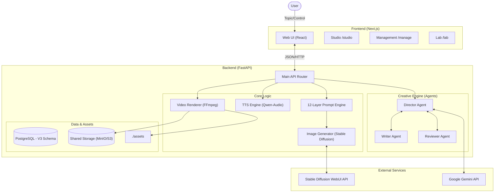

# Shorts Producer

**Shorts Producer**는 쇼츠 영상 콘텐츠 제작을 자동화하는 AI 기반 워크스페이스입니다. **Google Gemini**를 통한 스토리보드 기획, **Multi-Agent Creative Engine** 협업, **Stable Diffusion** 기반의 이미지 생성, 그리고 **Qwen-Audio** 기반의 TTS를 결합하여 고품질의 영상을 자동으로 렌더링합니다.

## 🏗 System Architecture (V3)

시스템은 **V3 관계형 스키마**를 채택하여 캐릭터 일관성과 복합적인 프롬프트 제어를 구현하며, **Creative Engine**을 통해 여러 AI 에이전트가 협업하여 콘텐츠 품질을 극대화합니다.



## 🔄 주요 워크플로우

1.  **AI 기획 (Creative Engine)**: Director, Writer, Reviewer 에이전트가 협업하여 스토리보드, 스크립트, 이미지 프롬프트를 창작하고 검수합니다.
2.  **12-레이어 프롬프트 엔진**: 캐릭터의 고유 속성(Trait)과 임시 속성(Outfit)을 분리하여 일관성 있는 이미지를 생성합니다.
3.  **지능형 검수 및 보정**:
    *   **WD14 Tagger**: 생성된 이미지가 프롬프트의 키워드(태그)와 일치하는지 정량적으로 검증합니다.
    *   **Gemini Vision**: 검증 점수가 낮을 경우, 이미지를 시각적으로 분석하여 불일치 요소를 파악하고 보정을 수행합니다.
4.  **TTS & 합성**: **Qwen-Audio**를 활용한 고품질 TTS와 AI 생성 BGM, 오버레이를 FFmpeg로 결합하여 최종 영상을 완성합니다.

## 📂 Project Structure

### Backend (`/backend`)
*   **`routers/`**: 도메인별 API 엔드포인트.
*   **`services/`**:
    *   `creative/`: Multi-Agent 협업 로직.
    *   `video/`: FFmpeg 렌더링 파이프라인.
    *   `prompt/`: 12-Layer 프롬프트 빌더.
*   **`models/`**: SQLModel 기반의 V3 스키마 (Creative, Lab, Core 등).
*   **`scripts/`**: 데이터 마이그레이션 및 유틸리티 스크립트.

### Frontend (`/frontend`)
*   **`app/studio/`**: 영상 제작 워크스페이스.
*   **`app/manage/`**: 에셋 및 설정 관리 UI.
*   **`app/lab/`**: 실험적 기능 (태그 렌더링, 번역 등) 테스트.

## 🚀 Getting Started

### Prerequisites
1.  **Stable Diffusion WebUI**: `--api` 플래그 활성화.
2.  **Google Gemini API Key**: `.env` 설정 필수.
3.  **FFmpeg**: 시스템 설치 필요.
4.  **PostgreSQL**: DB 인스턴스 준비.

### Installation

**Backend:**
```bash
cd backend
# .env 설정
uv run main.py
```

**Frontend:**
```bash
cd frontend
npm install
npm run dev
```

## 📖 Documentation

### 🔗 Key Documents

#### 🚀 Product
- [Roadmap](docs/01_product/ROADMAP.md)
- [PRD](docs/01_product/PRD.md)

#### 🏗 Engineering
- [System Overview](docs/03_engineering/architecture/SYSTEM_OVERVIEW.md)
- [V3 DB Schema](docs/03_engineering/architecture/DB_SCHEMA.md)
- [API Reference](docs/03_engineering/api/REST_API.md)
- [Render Pipeline](docs/03_engineering/backend/RENDER_PIPELINE.md)

#### 🧪 Experiments
- Lab Experiments (Evaluation Runs 대체)

#### 🎨 Design & Ops
- [Design Guide](docs/02_design/STUDIO_DESIGN_GUIDE.md)
- [Deployment](docs/04_operations/DEPLOYMENT.md)