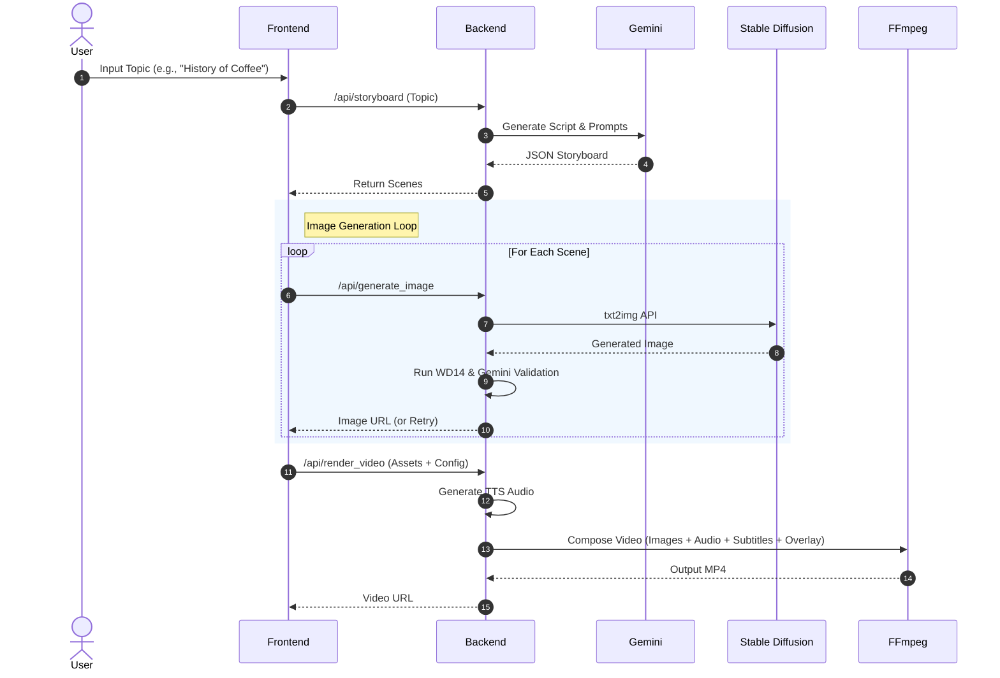

# Shorts Producer

**Shorts Producer** is an AI-powered workspace for automating short-form video content production. It integrates **Google Gemini** for planning and logic, **Stable Diffusion** for visual generation, and **FFmpeg** for professional-grade video rendering.

## 🏗 System Architecture

The system follows a standard **Client-Server** architecture, heavily relying on external AI services and local media processing tools.

```mermaid
graph TD
    %% Nodes
    User([User])
    
    subgraph Frontend [Frontend (Next.js)]
        UI[Web UI (React)]
        State[State Machine (Autopilot)]
    end
    
    subgraph Backend [Backend (FastAPI)]
        API[Main API Router]
        
        subgraph Logic [Core Logic]
            Planner[Storyboard Planner (Gemini)]
            GenImg[Image Generator (Stable Diffusion)]
            Validator[Image Validator (WD14 + Gemini)]
            Renderer[Video Renderer (FFmpeg)]
        end
        
        subgraph Data [Data & Assets]
            DB[(PostgreSQL - Storyboards, Scenes, Tags, Characters, LoRAs)]
            AssetsDir[./assets (Fonts, Overlays, BGM)]
            OutputsDir[./outputs (Images, Avatars, Videos)]
        end
    end

    subgraph External [External Services]
        SD_API[Stable Diffusion WebUI API]
        Gemini_API[Google Gemini API]
    end

    %% Connections
    User -->|Topic/Control| UI
    UI <-->|JSON/HTTP| API
    
    API --> Planner
    API --> GenImg
    API --> Validator
    API --> Renderer
    
    Planner <--> Gemini_API
    GenImg <--> SD_API
    Validator <-->|Vision Analysis| Gemini_API
    Validator <-->|Tagging| Logic
    
    Renderer --> AssetsDir
    Renderer --> OutputsDir
```

## 🔄 Autopilot Workflow

The core feature is the **Autopilot** mode, which turns a single topic into a finished video.



## 📂 Project Structure

### Backend (`/backend`)
*   **`main.py`**: FastAPI application with modular routers.
*   **`models/`**: SQLAlchemy models (Tag, Character, LoRA, etc.) - keyword data stored in PostgreSQL.
*   **`templates/`**: Jinja2 templates for prompting Gemini (e.g., storyboard structure).
*   **`assets/`**: Static resources like fonts (`.ttf`), overlays (`.png`), and background music.
*   **`outputs/`**: Generated artifacts (Images, Avatars, Videos).

### Frontend (`/frontend`)
*   **`app/page.tsx`**: The main studio interface. Handles the complex state for the video creation workflow.
*   **`app/manage/page.tsx`**: Management UI for keywords and asset review.
*   **`app/prompt-builder/`**: (WIP) Interface for testing prompt combinations.

## 🚀 Getting Started

### Prerequisites
1.  **Stable Diffusion WebUI**: Running locally on port `7860` with `--api` flag enabled.
2.  **Google Gemini API Key**: Set in `.env`.
3.  **FFmpeg**: Installed and available in system PATH.

### Installation

**Backend:**
```bash
cd backend
# Create .env file with GEMINI_API_KEY=...
uv run main.py
```

**Frontend:**
```bash
cd frontend
npm install
npm run dev
```

Access the studio at `http://localhost:3000`.