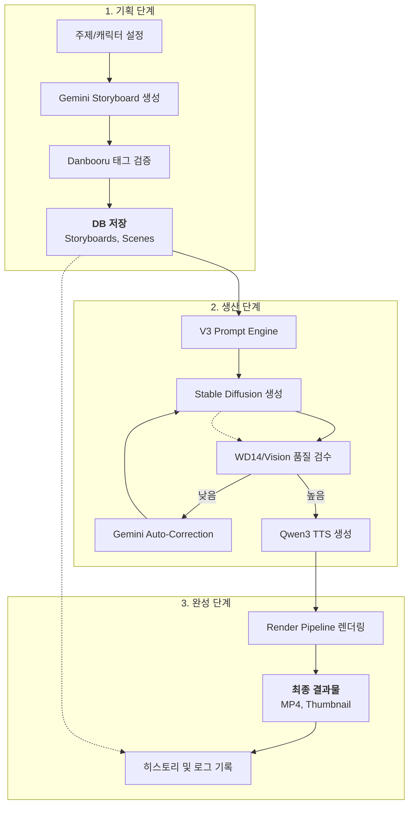
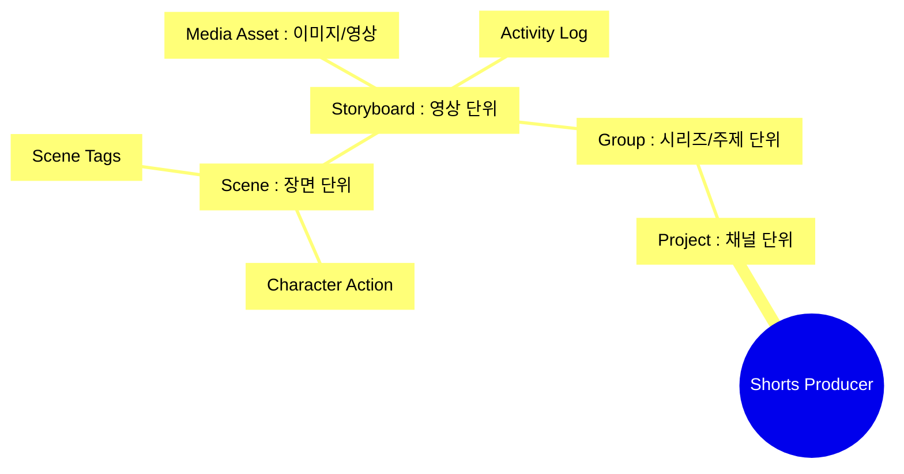

# Shorts Factory - Actionable PRD (v3.1)

이 문서는 추상적인 전략이 아닌, **현재 개발 단계에서 구현 및 검증해야 할 실질적인 요구사항**을 정의합니다.

## 1. 비즈니스 프로세스 맵 (Business Process Map)

전체 서비스가 사용자 입력으로부터 최종 영상으로 이어지는 비즈니스 프로세스입니다.

## 2. 데이터 영속화 구조 (Persistence Hierarchy)

V3 아키텍처의 핵심 계층 구조입니다.

---

## 3. 프로젝트 범위 (Scope & Priorities)
*(기존 상세 내용 유지)*
...
