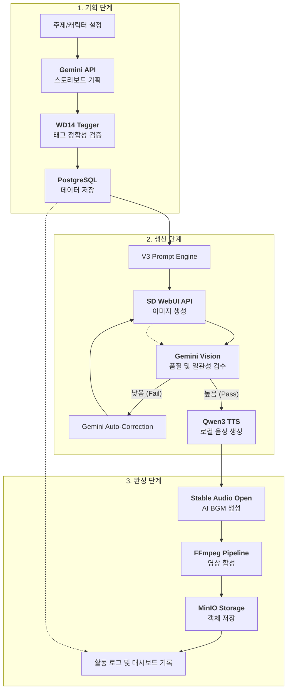
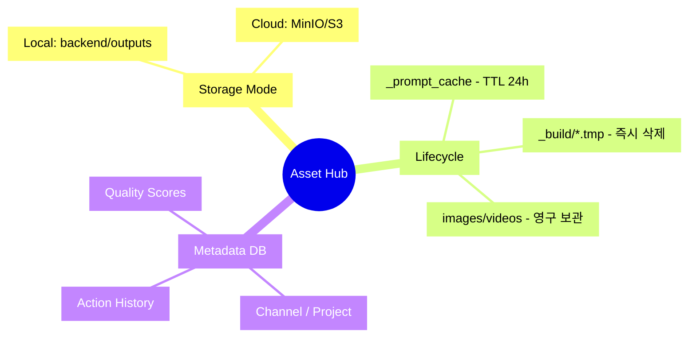

# Shorts Factory - Actionable PRD (v3.1)

이 문서는 추상적인 전략이 아닌, **현재 개발 단계에서 구현 및 검증해야 할 실질적인 요구사항**을 정의합니다. 상세 아키텍처는 [System Overview](../03_engineering/architecture/SYSTEM_OVERVIEW.md)를 참조하세요.

## 1. 비즈니스 프로세스 맵 (Business Process Map)

전체 서비스가 사용자 입력으로부터 최종 영상으로 이어지는 비즈니스 프로세스입니다.

---

## 2. 에셋 관리 및 데이터 영속화 (Assets & Persistence)

V3에서는 모든 에셋(이미지, 영상, 음성)이 고유 ID를 가지며 채택/기각 여부에 따라 생명 주기가 관리됩니다.

## 3. 제품 요구사항 및 우선순위

### 핵심 기능 요약

| # | 기능 | 설명 | Phase | 상태 |
|---|------|------|-------|------|
| 1 | AI 스토리보드 생성 | Gemini API 기반 주제→스토리보드 자동 기획 | 6-1 | 완료 |
| 2 | V3 Prompt Engine | 12-Layer Builder + 4개 런타임 캐시 | 6-2.5 | 완료 |
| 3 | 캐릭터 시스템 | 다중 캐릭터, LoRA, Tag Autocomplete, IP-Adapter | 6-3~6-4 | 완료 |
| 4 | 이미지 생성 | SD WebUI API + ControlNet + 포즈 제어 | 6-4/7-0 | 완료 |
| 5 | 영상 렌더링 | FFmpeg Pipeline, Ken Burns, 전환 효과, Layout | 5-2 | 완료 |
| 6 | TTS/음성 | Qwen3-TTS 로컬, Voice Preset, Context-Aware | 6-8 | 완료 |
| 7 | AI BGM | Stable Audio Open, Music Preset | 6-8 | 완료 |
| 8 | 프로젝트/그룹 | Cascading Config, Group Defaults | 7-2 | Phase 1.7 완료 |
| 9 | Creative Lab | Multi-Agent Creative Engine (9-Agent) | 7-1 | V2 완료 |
| 10 | Structure별 Gemini 템플릿 | 5종 전용 J2 템플릿 | 7-1 | 미구현 |
| 11 | 이미지 생성 Progress | SSE 실시간 진행률 | 7-1 | 미구현 |
| 12 | Multi-Character UI | Studio 다중 캐릭터 생성기 | 7-1 | 미구현 |

### 3.1 AI BGM 생성

**배경**: 현재 BGM은 정적 파일(File 모드)만 지원. 콘텐츠 분위기에 맞는 배경음악을 매번 수동으로 찾아야 하는 비효율 발생.

**요구사항**:

| # | 요구사항 | 우선순위 |
|---|---------|---------|
| 1 | Stable Audio Open 모델 기반 텍스트-투-뮤직 로컬 생성 (M4 Pro MPS) | P0 |
| 2 | Music Preset CRUD + 프롬프트 기반 미리듣기/생성 | P0 |
| 3 | 렌더 설정에서 BGM 모드 선택 (File: 기존 정적 파일 / AI: 프리셋 기반 생성) | P0 |
| 4 | 시스템 프리셋 10종 기본 제공 (Lo-fi Chill, Epic Cinematic, Dark Ambient 등) | P1 |
| 5 | SHA256 캐시로 동일 프롬프트 중복 생성 방지 | P1 |

**기능 명세**: [AI_BGM.md](../99_archive/features/AI_BGM.md)

---

## 4. Definition of Done (DoD)

모든 Phase 완료 판정 시 다음 4개 항목을 검증합니다:

| # | 항목 | 검증 기준 |
|---|------|----------|
| 1 | **Autopilot** | 주제 입력 후 '이미지 생성 완료'까지 멈춤 없이 진행되는가? |
| 2 | **Consistency** | 캐릭터의 머리색/옷이 Base Prompt대로 유지되는가? |
| 3 | **Rendering** | 최종 비디오 파일 생성, 소리(TTS+BGM) 정상 출력되는가? |
| 4 | **UI Resilience** | 새로고침해도 Draft가 복구되는가? |

---

## 5. 비기능 요구사항

| 항목 | 기준 | 근거 |
|------|------|------|
| 테스트 | Backend 1,291개 이상 유지 | CONTRIBUTING.md Rule #9 |
| 코드 크기 | 함수 50줄, 파일 400줄 이하 | CLAUDE.md 가이드라인 |
| 문서 크기 | 800줄 이하 (초과 시 분할/아카이브) | CLAUDE.md 가이드라인 |
| 태그 표준 | Danbooru 언더바(_) 형식 통일 | CLAUDE.md Tag Format Standard |
| 설정 SSOT | 모든 상수/환경변수 `config.py` 관리 | CLAUDE.md Configuration Principles |
