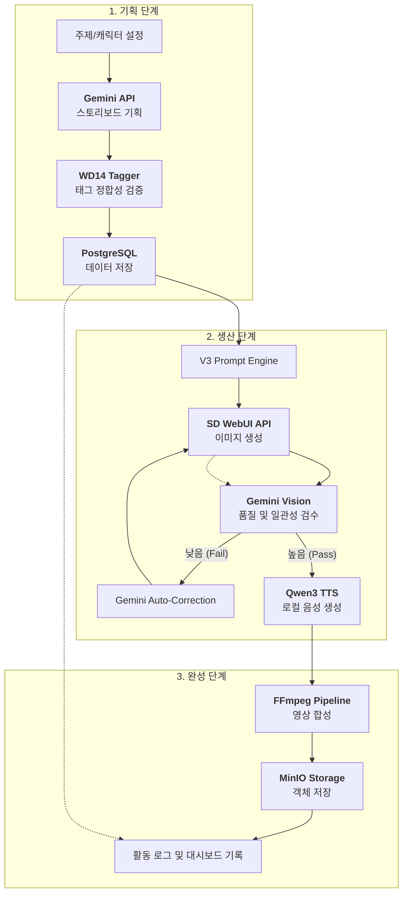
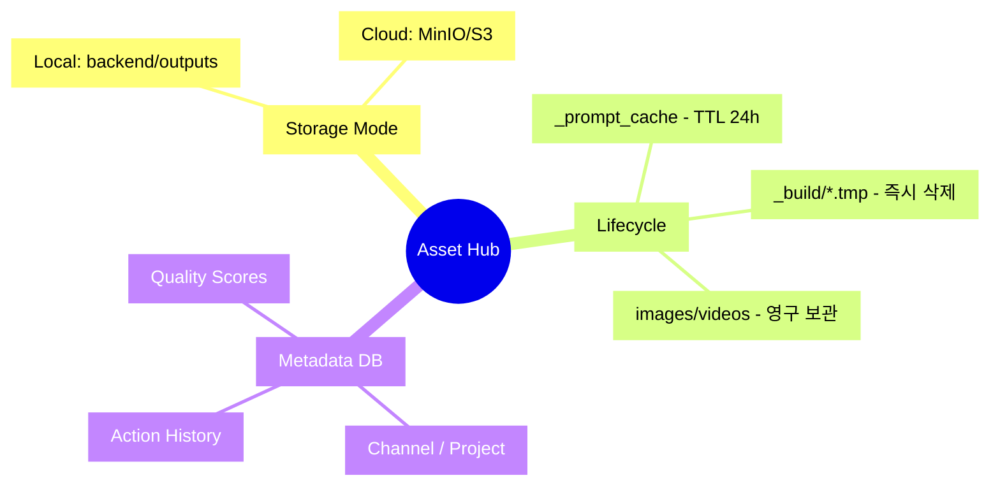

# Shorts Factory - Actionable PRD (v3.1)

이 문서는 추상적인 전략이 아닌, **현재 개발 단계에서 구현 및 검증해야 할 실질적인 요구사항**을 정의합니다. 상세 아키텍처는 [System Overview](../03_engineering/architecture/SYSTEM_OVERVIEW.md)를 참조하세요.

## 1. 비즈니스 프로세스 맵 (Business Process Map)

전체 서비스가 사용자 입력으로부터 최종 영상으로 이어지는 비즈니스 프로세스입니다.

---

## 2. 에셋 관리 및 데이터 영속화 (Assets & Persistence)

V3에서는 모든 에셋(이미지, 영상, 음성)이 고유 ID를 가지며 채택/기각 여부에 따라 생명 주기가 관리됩니다.

## 3. 제품 요구사항 및 우선순위
*(기존 상세 내용 유지)*
...
