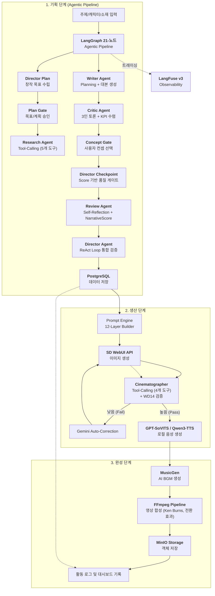
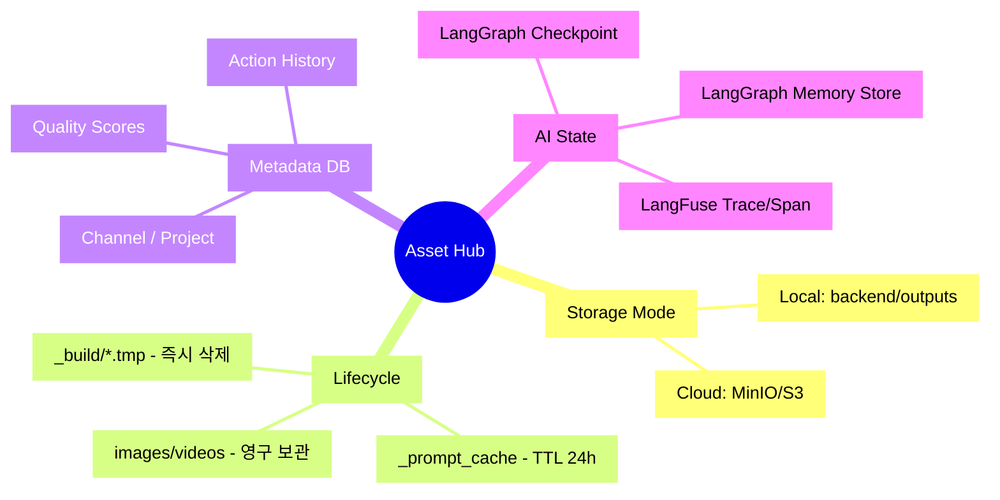

# Shorts Factory - Actionable PRD (v4.0)

이 문서는 추상적인 전략이 아닌, **현재 개발 단계에서 구현 및 검증해야 할 실질적인 요구사항**을 정의합니다. 상세 아키텍처는 [System Overview](../03_engineering/architecture/SYSTEM_OVERVIEW.md)를 참조하세요.

## 1. 비즈니스 프로세스 맵 (Business Process Map)

전체 서비스가 사용자 입력으로부터 최종 영상으로 이어지는 비즈니스 프로세스입니다.

---

## 2. 에셋 관리 및 데이터 영속화 (Assets & Persistence)

모든 에셋(이미지, 영상, 음성)이 고유 ID를 가지며 채택/기각 여부에 따라 생명 주기가 관리됩니다.

## 3. 제품 요구사항 및 우선순위

### 핵심 기능 요약

| # | 기능 | 설명 | 상태 |
|---|------|------|------|
| 1 | AI 스토리보드 생성 | Gemini API 기반 주제→스토리보드 자동 기획 | 완료 |
| 2 | Prompt Engine | 12-Layer Builder + 4개 런타임 캐시 | 완료 |
| 3 | 캐릭터 시스템 | 다중 캐릭터, LoRA, Tag Autocomplete, IP-Adapter | 완료 |
| 4 | 이미지 생성 | SD WebUI API + ControlNet + 포즈 제어 (28개 포즈) | 완료 |
| 5 | 영상 렌더링 | FFmpeg Pipeline, Ken Burns, 13개 전환 효과, Full/Post Layout | 완료 |
| 6 | TTS/음성 | GPT-SoVITS(씬 TTS) + Qwen3-TTS(보이스 디자인), Voice Preset, Context-Aware, 오디오 정규화 | 완료 |
| 7 | AI BGM | MusicGen (facebook/musicgen-small), Music Preset, SHA256 캐시 | 완료 |
| 8 | 프로젝트/그룹 | Cascading Config, Group Defaults, Channel DNA | Phase 2-1 완료 |
| 9 | Agentic AI Pipeline | LangGraph 21-노드, 3단계 협업형 UX(Auto/Guided/Hands-on), Memory, LangFuse | 완료 |
| 10 | True Agentic Architecture | Director-as-Orchestrator, Score 기반 라우팅, Revision History, ReAct Loop | 완료 |
| 11 | Studio Coordinator + Script Vertical | Studio 코디네이터 + 대본 버티컬 분리 (Zustand 4-Store) | 완료 |
| 12 | Scene UX Enhancement | Figma 기반 씬 편집 개선 (Phase A~G), 3-Column 레이아웃 | 완료 |
| 13 | Script Quality & AI Transparency | NarrativeScore, Concept Gate, Pipeline Stepper, Reasoning 패널 | 완료 |
| 14 | 렌더링 품질 강화 | 얼굴 감지 크롭, 동적 폰트, Safe Zone, 배경 밝기 적응 | 완료 |
| 15 | Layout & Navigation | 4탭 네비(Home/Studio/Library/Settings), 공유 레이아웃 시스템 | 완료 |
| 16 | Home Dashboard & Publish UX | 2-Column 대시보드, Continue Working, Publish 3-Column 재배치 | 완료 |
| 17 | Structure별 Gemini 템플릿 | 5종 전용 J2 템플릿 | 미구현 |
| 18 | 이미지 생성 Progress | SSE 실시간 진행률 | 미구현 |

### 3.1 Agentic AI Pipeline (Phase 9-10)

**배경**: 대본 생성을 LangGraph 기반 에이전틱 AI로 전환하여 반복 개선, 자율 판단, 메모리 학습 도입.

**구현 완료 요약**:

| # | 요구사항 | 상태 |
|---|---------|------|
| 1 | LangGraph 21-노드 조건 분기 그래프 (Interaction Mode 기반 유연 제어) | 완료 |
| 2 | 3단계 협업형 UX (Auto, Guided, Hands-on) 및 Stage-level Skip 통합 | 완료 |
| 3 | Revise 루프 (MAX_REVISIONS=3) + Human Gate (Creator 모드 interrupt) | 완료 |
| 4 | AsyncPostgresStore Memory + LangFuse v3 Docker Observability | 완료 |
| 5 | Concept Gate (Critic 3컨셉 사용자 선택) + Interactive Feedback 4종 프리셋 | 완료 |
| 6 | NarrativeScore (Hook 40% + 감정 25% + 반전 20% + 톤 10% + 정합성 5%) | 완료 |
| 7 | Pipeline Stepper + Agent Reasoning 패널 + Score 시각화 | 완료 |
| 8 | Research References (URL/텍스트 소재 분석, SSRF 방어) | 완료 |
| 9 | E2E 자동 체인 (Script→Preflight→AutoRun→Image→Validate→Render) | 완료 |

**기능 명세**: [AGENTIC_PIPELINE.md](FEATURES/AGENTIC_PIPELINE.md), [SCRIPT_QUALITY_UX.md](FEATURES/SCRIPT_QUALITY_UX.md)

### 3.2 True Agentic Architecture (Phase 10)

**배경**: DAG Workflow → 진정한 Agentic AI 전환. 5대 Agentic 요건 충족.

**구현 완료 요약**:

| # | 요구사항 | 상태 |
|---|---------|------|
| 1 | Director ReAct Loop (Observe→Think→Act 3-step) | 완료 |
| 2 | Director-as-Orchestrator (director_plan + director_checkpoint 2노드 추가) | 완료 |
| 3 | Score 기반 라우팅 + Decision Override 안전망 (LOW=0.4, HIGH=0.85) | 완료 |
| 4 | Revision History 누적 (동일 실패 반복 방지, 최대 3회) | 완료 |
| 5 | Gemini Function Calling 인프라 (Research 5도구 + Cinematographer 4도구) | 완료 |
| 6 | Agent Message Protocol + Director↔Production 양방향 소통 | 완료 |
| 7 | Review Self-Reflection + Writer Planning Step | 완료 |
| 8 | Critic 실시간 3인 토론 + KPI 수렴 (Groupthink 감지) | 완료 |

**기능 명세**: [AGENTIC_PIPELINE.md](FEATURES/AGENTIC_PIPELINE.md) (Phase 10 섹션)

---

## 4. Definition of Done (DoD)

모든 Phase 완료 판정 시 다음 항목을 검증합니다:

| # | 항목 | 검증 기준 |
|---|------|----------|
| 1 | **Autopilot** | 주제 입력 후 '이미지 생성 완료'까지 멈춤 없이 진행되는가? |
| 2 | **Agentic Quality** | Auto/Guided 모드에서 NarrativeScore ≥ 0.6 이상 달성하는가? |
| 3 | **Consistency** | 캐릭터의 머리색/옷이 Base Prompt대로 유지되는가? |
| 4 | **Rendering** | 최종 비디오 파일 생성, 소리(TTS+BGM) 정상 출력되는가? |
| 5 | **UI Resilience** | 새로고침해도 Draft가 복구되는가? |
| 6 | **Observability** | LangFuse 트레이스에 전체 파이프라인 기록되는가? |

---

## 5. 비기능 요구사항

| 항목 | 기준 | 근거 |
|------|------|------|
| 테스트 | Backend 1,902 + Frontend 352 = **총 2,254개** 이상 유지 | CONTRIBUTING.md Rule #9 |
| 코드 크기 | 함수 50줄, 파일 400줄 이하 | CLAUDE.md 가이드라인 |
| 문서 크기 | 800줄 이하 (초과 시 분할/아카이브) | CLAUDE.md 가이드라인 |
| 태그 표준 | Danbooru 언더바(_) 형식 통일 | CLAUDE.md Tag Format Standard |
| 설정 SSOT | 모든 상수/환경변수 `config.py` 관리 | CLAUDE.md Configuration Principles |
| Observability | LangFuse v3 트레이싱 (per-node trace, Gemini 토큰 추적) | Phase 9-2 |
| 보안 | SSRF 방어 (private IP 차단), Path Traversal 방어 | Phase 7-5, 9-5E |

---

## 6. 미구현 기능 백로그

| # | 기능 | 설명 | 명세 |
|---|------|------|------|
| 1 | Structure별 Gemini 템플릿 | 5종 전용 J2 템플릿 | [명세](FEATURES/GEMINI_TEMPLATES.md) |
| 2 | 이미지 생성 Progress | SSE 실시간 진행률 | [명세](FEATURES/IMAGE_GENERATION_PROGRESS.md) |
| 3 | VEO Clip | Video Generation 통합 | [명세](FEATURES/VEO_CLIP.md) |
| 4 | Visual Tag Browser | 태그별 예시 이미지 | [명세](FEATURES/VISUAL_TAG_BROWSER.md) |
| 5 | Profile Export/Import | Style Profile 공유 | [명세](FEATURES/PROFILE_EXPORT_IMPORT.md) |
| 6 | Scene Clothing Override | 장면별 의상 변경 | [명세](FEATURES/SCENE_CLOTHING_OVERRIDE.md) |
| 7 | Scene 단위 자연어 이미지 편집 | 자연어 기반 씬 이미지 수정 | [명세](FEATURES/SCENE_IMAGE_EDIT.md) |
| 8 | Multi-Style Architecture | Anime 외 화풍 확장 (Phase 8) | - |
| 9 | PipelineControl 커스텀 | 사용자 파이프라인 제어 + 분산 큐 | Phase 9-4 잔여 |
| 10 | 배치 렌더링/브랜딩/분석 | 대규모 운영 기능 | Phase 7-2 P3 |
