# Shorts Producer — Master Roadmap

**원칙**: 안정성 → 리팩토링 → 안정성 → 신규 개발 사이클. 영상 품질 100% 일관성(Zero Variance) 유지.

---

## 현재 상태 (2026-02-23)

| 항목 | 상태 |
|------|------|
| Phase 5~7 계열 | 전체 완료 (ARCHIVED) |
| Phase 9 (Agentic Pipeline) | 전체 완료 (ARCHIVED) |
| Phase 10 (True Agentic) | 전체 완료 (ARCHIVED) |
| Phase 11 (Scene Diversity) | 전체 완료 (ARCHIVED) |
| Phase 12 (Agent Enhancement & AI BGM) | 전체 완료 (ARCHIVED) |
| Phase 13 (Creative Control & Production Speed) | 전체 완료 (ARCHIVED) |
| Phase 8 (Multi-Style) | **Phase 8-0 완료, Phase 8-1 완료 (8/8)** |
| 테스트 | Backend 2,199 + Frontend 352 = **총 2,551개** |

### 최근 작업

- **Compose 중개 제거 리팩토링** (02-23): Frontend `/compose`→`/validate`→`/generate` 3회 왕복 → `/generate` 1회로 통합. Backend `context_tags` 필드 추가, `_handle_character_scene/background_scene`에서 자동 병합. `buildScenePrompt` async→sync(56줄→3줄). `prompt_pre_composed` deprecated. `autoComposePrompt` 토글 제거(Backend negative 합성으로 대체). 테스트 11개 추가(Backend 43개 PASS)
- **Cinematographer → Ken Burns 씬별 연결** (02-22): 감정/서사 기반 Ken Burns 모션 자동 지정. motion.py EMOTION_MOTION_MAP(27감정→프리셋), suggest_ken_burns_preset(). Finalize _validate_ken_burns_presets() 검증+fallback. Cinematographer 템플릿 Rule 15. VideoScene.ken_burns_preset 필드. resolve_scene_preset() 씬별>전역 우선순위. Frontend 전 경로 연결(mapGeminiScenes/mapEventScenes/sync/render). 테스트 22개 추가
- **파이프라인 → Frontend 씬 필드 매핑 갭 수정** (02-22): Finalize `_flatten_tts_designs()` — tts_design dict → voice_design_prompt/head_padding/tail_padding flat fields 분해. `scenes.controlnet_pose` 컬럼 추가 (DB_SCHEMA v3.29). Frontend 전 경로(mapGeminiScenes/mapEventScenes/sync/load/persist/autoSave/save/render)에 5필드 매핑 보강. 11파일 수정
- **DB 정합성 수정: bgm_mode 기본값 + gender_locked 설정 경로** (02-22): `render_presets.bgm_mode` 3행 NULL → 'manual' 기본값 + NOT NULL 제약 적용 (Alembic 마이그레이션). `LoRAUpdate` 스키마에 `gender_locked` 필드 추가 + Frontend EditLoraModal에 Gender Lock 드롭다운 UI 추가. PUT 페이로드 전체 전송으로 개선. DB_SCHEMA v3.28
- **Dead 컬럼 제거** (02-22): `scenes.description` (929행 빈 값) + `creative_traces.diff_summary` (1,962행 NULL) DROP. Alembic 마이그레이션
- **Duration 부족 검증 + 자동 보정** (02-22): 목표 45s→실제 33.5s(25% 미달) 버그 수정. 3단 방어 구조 — (1) Review 노드에 총 duration < 85% 검증 추가, (2) Revise Tier 1.5 `redistribute_durations()` 비례 확대 + 2차 gap 보정, (3) Finalize `_ensure_minimum_duration()` 최종 안전장치. `DURATION_DEFICIT_THRESHOLD` 상수화. 11개 신규 테스트 (33개 PASS)
- **LLM 하드코딩 제거 3종** (02-22): Phase 14-A. (1) `negative_prompt_extra` — Cinematographer가 씬별 배제 태그 직접 결정, Finalize에서 기본 negative와 병합. (2) `detect_pose_from_prompt()` 96줄→10줄 단순화 — synonym 77개 삭제, LLM이 포즈를 직접 선택하므로 exact longest-match fallback만 유지. (3) Environment 정규화 — `context_tags.setting`→`environment` 통일, `_check_keyword_conflict()` 8개 키워드 삭제. 신규 테스트 10개, 전체 98개 PASS
- **Zustand isDirty subscribe + debounce 자동 저장** (02-22): `updateScene`/`setScenes` 후 수동 `saveStoryboard()` 누락으로 DB 미저장되던 반복 버그 방지. `store/effects/autoSave.ts` 신규 모듈 — isDirty `false→true` 변경 감지 → 2초 debounce → `persistStoryboard()`. isSaving guard + 저장 완료 후 재확인. sceneActions/batchActions/imageActions 수동 save 6곳 제거, 즉시 저장 필요한 곳(upload/edit/generate) 유지. 테스트 6개
- **SSE 이벤트에 controlnet_pose/ip_adapter_reference 전달** (02-22): 이미지 생성 결과의 ControlNet pose/IP-Adapter reference 정보를 SSE `ImageProgressEvent` → Frontend `processGeneratedImages` → Zustand 스토어에 전달. auto-save와 결합하여 DB 자동 저장. Backend 스키마+라우터, Frontend 타입+처리 로직. 테스트 4개
- **character_actions DB 미저장 수정** (02-22): `mapEventScenes()`/`syncToGlobalStore()`에서 `context_tags`/`character_actions` 매핑 누락 → 파이프라인이 생성한 데이터가 Frontend→Backend 저장 시 유실되던 버그 수정
- **Safety Filter 에러 Frontend 미표시 수정** (02-22): revise 노드 에러 시 review→finalize→explain→learn 체인이 에러를 삼키는 문제. `route_after_revise()` short-circuit 추가, `route_after_finalize()` 에러 시 explain 스킵, learn 에러 전파, Frontend 에러 스텝 보호. 테스트 5건
- **레거시 mode 필드 완전 제거** (02-22): Stage-Level Skip 전환 후 잔존하던 `mode: "quick"|"full"` 필드 제거. config_pipelines(DEFAULT_MODE+레거시 프리셋), schemas(2필드), routers/scripts(fallback), state(TypedDict), learn(메타데이터→skip_stages), critic(context). 테스트 14파일 `skip_stages` 전환. 22파일 수정
- **Stage-Level Skip 통합 아키텍처** (02-22): Quick/Full 모드 이원화 → `skip_stages: list[str]` 4단계(research, concept, production, explain) 통합. `_skip_guard.py` 모듈(노드별 스테이지 매핑+스킵 판단), 라우팅 전체 `mode`→`skip_stages` 전환, 프리셋 재편(express/standard/creator + 레거시 후방 호환), Frontend 동적 스텝 필터링. 29파일, 테스트 업데이트
- **비활성 태그 필터링 일관성 수정** (02-22): `load_allowed_tags_from_db()`에 `is_active=True` 필터 추가, `filter_prompt_tokens()`에 `replace_deprecated_tags()` 연동하여 비활성 태그 자동 대체+차단
- **Gemini 안전 필터 차단 수정** (02-22): Writer Planning `_create_plan()`에 safety_settings 5개 카테고리 BLOCK_NONE 추가, Creative Agent GeminiProvider에 `HARM_CATEGORY_CIVIC_INTEGRITY` 누락 보완
- **ControlNet Pose Pipeline 완성** (02-22): Cinematographer 템플릿 포즈 28개 전체 명시, Finalize context_tags 기본 pose/gaze fallback 주입, auto_populate 태그 카테고리 검증 강화
- **씬 플래그 파이프라인 수정 + 테스트 보강** (02-22): character_actions 파이프라인 확장 (Quick 1인 캐릭터 지원, Full 모드 Finalize 노드 통합, Cinematographer pose/gaze 카테고리 명시), StyleProfile `/full` API 응답 필드 누락 수정 (default_enable_hr 등 5개), Frontend Hi-Res 토글 양방향 동기화, ControlNet 포즈 선택 강화 (pose_hint), 테스트 보강 (generation_controlnet, scene_flags, finalize_node 등)
- **Finalize 노드 에러 전파 수정** (02-22): Writer에서 Gemini 안전 필터 차단 시 finalize_node가 error 필드를 무시하고 빈 씬 목록(`[]`)을 HTTP 200으로 반환하던 버그 수정. finalize 진입 시 error 필드 존재하면 즉시 에러 반환하도록 수정
- **IP-Adapter 고도화 Phase 1~3 + Seed Anchoring** (02-22): Per-character guidance_start/end 오버라이드(Phase 3-A), 실사 사진 업로드+얼굴 크롭(Phase 1-A), 멀티앵글 레퍼런스 선택(Phase 2-A), FaceID face tag suppression(Phase 3-B), 레퍼런스 품질 검증(얼굴 감지+해상도). Seed Anchoring: storyboard base_seed+scene_order 기반 결정론적 seed, 이미지 캐시(deterministic only), scene last_seed DB 저장. 마이그레이션 2건, 테스트 4파일(888줄). 코드 리뷰 후 schemas.py 이동, 캐시 로직 분리 등 6건 수정
- **Cinematographer 연출력 강화 + 에이전트 경쟁** (02-22): Writer Plan 브릿지(writer_plan→템플릿 전달), 시네마틱 기법/내러티브-비주얼/감정-비주얼 규칙(Rule 11-13) 추가, 3 Lens 경쟁 시스템(Full 모드: Tension/Intimacy/Contrast 병렬 실행+6차원 스코어링), search_similar_compositions 매트릭스 확장(16개 mood×scene_type, Danbooru 검증 태그), Director revise_script 루프 조기 종료. 13개 신규 테스트 (총 73개 PASS)
- **StyleProfile별 Hi-Res 기본값 자동 적용** (02-21): `style_profiles`에 `default_enable_hr` Boolean 컬럼 추가(v3.25). `_adjust_parameters()`에서 StyleProfile의 Hi-Res 설정 자동 적용. Realistic(True, 512→768 업스케일 필수) vs Anime(False). Frontend StyleProfileEditor에 Hi-Res 체크박스 UI 추가. DB_SCHEMA v3.25
- **StyleProfile 화풍별 생성 파라미터 자동 적용** (02-21): `style_profiles`에 `default_steps/cfg_scale/sampler_name/clip_skip` 4컬럼 추가. Realistic(steps=6, CFG 1.5, DPM++ SDE Karras, clip_skip=1) vs Anime(steps=28, CFG 7.0, DPM++ 2M Karras, clip_skip=2) 자동 오버라이드. 씬 생성(`_adjust_parameters`)+캐릭터 프리뷰(`preview.py`) 양쪽 적용. Frontend StyleProfileEditor에 Generation Parameters UI 추가. complexity boost 우회 수정. E2E 검증 완료: Yuna/Jimin 프리뷰 재생성 + storyboard 455 씬 생성. DB_SCHEMA v3.24
- **FaceID IP-Adapter 얼굴 유사도 개선** (02-21): faceid control_mode "Balanced"→"ControlNet is more important"(얼굴 정체성 보존 우선), auto-enable weight 우선순위 수정(캐릭터>request>default). 정면 포트레이트 레퍼런스 생성 테스트 완료. 고도화 과제로 이관
- **TagClassifier Danbooru 비동기 전환 + Circuit Breaker** (02-21): `/tags/classify` 실시간 Danbooru 호출이 서버 블로킹 유발하던 문제 해결. Step 1-2(Rules+DB캐시) 즉시 반환, Step 3(Danbooru)는 `BackgroundTasks`로 비동기 처리. Circuit breaker 추가(3회 연속 실패 → 60초 스킵), 타임아웃 15초→3초 축소
- **Style Profile 기반 IP-Adapter 모델 자동 선택** (02-21): `style_profiles.default_ip_adapter_model` 컬럼 추가(Anime→clip_face, Realistic→faceid). ConsistencyResolver 3단계 우선순위(캐릭터>스타일프로필>기본값). Alembic 마이그레이션+데이터, joinedload N+1 방지
- **캐릭터 프리뷰 Checkpoint 전환 누락 수정** (02-21): `regenerate_reference()`와 `generate_wizard_preview()`에서 StyleProfile의 SD 모델로 전환하는 `_ensure_correct_checkpoint()` 호출이 누락되어 Realistic 캐릭터가 Anime 모델로 생성되던 버그 수정. Realistic 남녀 캐릭터(Yuna/Jimin) 생성 검증 완료
- **characters.project_id 제거** (02-21): 미사용 FK 정리. ORM/스키마/라우터/서비스/Frontend 타입·훅에서 project_id 완전 제거. Alembic 마이그레이션 적용, DB_SCHEMA v3.23. 12개 파일 수정, 테스트 3파일 정리
- **Phase 8-1 #4 base_model UI 표시** (02-21): LoRA/Embedding base_model 의존성 필터링 + lora_type 정리, StyleTab에 base_model 회색 배지 추가(Embedding 리스트+LoRA 카드), StyleProfileEditor에 필터 안내 서브텍스트
- **Phase 8-1 #2 Style Profile UI 개선** (02-21): StyleTab 카드 보강(SD Model/LoRA/캐릭터 수 배지, is_default, display_name), StyleProfileEditor 메타데이터 필드(display_name, description, is_default) + 연결된 캐릭터 목록, DebouncedInput으로 API 호출 최적화, EditLoraModal 컴포넌트 분리
- **캐릭터 상세 화풍 배지** (02-21): 캐릭터 상세 페이지 헤더에 style_profile_name 읽기 전용 배지 추가. Hana/Sora 캐릭터 화풍 매핑 (Studio Ghibli)
- **Phase 8-1 Style-Character Hierarchy** (02-21): `characters.style_profile_id` FK 추가, Alembic 스키마+데이터 마이그레이션(6캐릭터 역매핑), GET /characters?style_profile_id 필터, Wizard Step 0(화풍 선택), LoRA base_model 호환성 필터. Backend 14파일 + Frontend 7파일, DB_SCHEMA v3.22
- **Phase 8-0 Realistic Style Quick Fix** (02-21): Anime 전용 embedding 범용화, Realistic StyleProfile 개선, LoRA `base_model` 필드, StyleContext SD모델 확장, Checkpoint 자동 전환, LoRA 호환성 경고. 6건 수정 + 7개 신규 테스트
- **SSE 스트림 에러 수정** (02-20): video/scene progress SSE 제너레이터에 예외 처리 추가. 클라이언트 disconnect 시 `ERR_INCOMPLETE_CHUNKED_ENCODING` 해소 (CancelledError 핸들링)
- **캐릭터 프리뷰 Gemini 기능 복원** (02-20): Phase 7-Y 리팩토링 시 누락된 Enhance(Gemini 보정)+Edit(자연어 편집) 복원. Regen/Enhance/Edit 3버튼 배치, GeminiEditModal 신규 생성
- **캐릭터 태그 정비 + 개성화** (02-20): 8캐릭터 identity/clothing 태그 분리(is_permanent 정정), 비표준 태그(a_cute_girl, anime_style) 제거, 캐릭터별 개성 의상 재설계. Ghibli 캐릭터(Hana/Sora) auto 모드 전환
- **Studio Ghibli LoRA + Style Profile** (02-20): Civitai model 6526 등록, Style Profile "Studio Ghibli" 생성, Hana(여)/Sora(남) 캐릭터 생성
- **BGM 모드 리팩토링** (02-20): 3-mode(file/ai/auto) → 2-mode(manual/auto) 단순화. Manual=Music Preset 선택(bgm_file 폴백), Auto=Sound Designer 자동. Alembic 마이그레이션, 후방 호환 매핑(file/ai→manual), Frontend localStorage migrate. 19개 테스트, 5개 문서 업데이트
- **Phase 13-A Performance Quick Wins** (02-20): Review Gemini 3회→1회 통합 호출(~70% 단축), Learn Store 4개 병렬화, Studio loadGroupDefaults 병렬화, Narrative weight 불일치 버그 수정. 6개 테스트 추가
- **TTS 비음성 씬 선별 (Speakable Flag)** (02-20): Writer→TTS 파이프라인에 `speakable` 플래그 도입. `has_speakable_content()` 게이트 + TTS Designer skip 가이드. 13개 테스트 추가
- **Phase 13 Creative Control & Production Speed 완료** (02-20): 19건 완료. 성능 최적화, 이미지 UX, Structure 템플릿, Clothing Override. [아카이브](../99_archive/archive/ROADMAP_PHASE_12_13.md)
- **Phase 12 Agent Enhancement & AI BGM 완료** (02-20): 26건 완료. Agent Bug Fix 5건, Data Flow 10건, 3-Mode BGM 6건, Gemini Model Upgrade 5건. [아카이브](../99_archive/archive/ROADMAP_PHASE_12_13.md)
- **Cinematographer 프롬프트 품질 개선** (02-20): 5개 버그 수정 — negative_prompt Finalize 주입(Full+Quick), characters_tags+LoRA 템플릿 전달, 장면별 오브젝트 가이드, 환경 태그 남용 제약, search_similar_compositions DB 연동. 9개 신규 테스트 (총 63개 PASS)
- **Duration Auto-Calculation from Reading Time** (02-20): Duration을 파생 값으로 전환. `config.py` READING_SPEED SSOT → `estimate_reading_duration()` → writer/gemini_generator/revise_expand 후처리. QC FAIL→WARN 완화, Frontend 하드코딩 제거→API 소비. 20개 파일, 10개 신규 테스트
- **Cinematographer 한글 장면설명 표시** (02-20): `CinematographerSection`에 `image_prompt_ko` 표시 추가. 백엔드에서 이미 생성하던 한글 설명을 UI에 노출
- **Gemini 코드 리뷰 + BLOCKER 수정** (02-20): `gemini_generator.py` preset.system_prompt AttributeError 수정, Frontend UI 패딩/레이아웃 일관성 개선
- **Phase 11 전체 완료** (02-20): P0~P3 10건 + P2+ 4건. 정면 편향 해소, gaze 5종, 정면 비율 22%. [아카이브](../99_archive/archive/ROADMAP_PHASE_11.md)
- **Pipeline 고도화 + UX 개선** (02-19~20): Tier 2 5건 완료, Director-as-Orchestrator, Safety Preflight, Pydantic 전환, Research 점수 체계. 200+ 테스트 추가. [아카이브](../99_archive/archive/ROADMAP_PHASE_11.md)
- **렌더링 품질 개선** (02-14~17): Scene Text 동적 높이/폰트, Safe Zone, 얼굴 감지, TTS 정규화. 52개 테스트

---

## Completed Phases (ARCHIVED)

모든 Phase가 완료되어 아카이브됨. 각 Phase 상세는 아카이브 링크 참조.

| Phase | 이름 | 핵심 성과 | 아카이브 |
|-------|------|----------|----------|
| 1-4 | Foundation & Refactoring | 기반 구축 + 코드 정리 | [아카이브](../99_archive/archive/ROADMAP_PHASE_1_4.md) |
| 5 | High-End Production | Ken Burns, Scene Text, 13종 전환, Preset System, 402개 테스트 | [아카이브](../99_archive/archive/ROADMAP_PHASE_1_4.md) |
| 6 | Character & Prompt System (v2.0) | PostgreSQL/Alembic, 12-Layer PromptBuilder, Qwen3-TTS, 786개 테스트 | [아카이브](../99_archive/archive/ROADMAP_PHASE_6.md) |
| 7-0 | ControlNet & Pose Control | ControlNet 포즈 제어, IP-Adapter 캐릭터 일관성, 28개 포즈 | — |
| 7-1 | UX & Feature Expansion | Quick Start, Multi-Character, Scene Builder, YouTube Upload 등 27건 | [아카이브](../99_archive/archive/ROADMAP_PHASE_7_1.md) |
| 7-2 | Project/Group System | 채널/시리즈 계층, 설정 상속 엔진, Channel DNA | [명세](FEATURES/PROJECT_GROUP.md) |
| 7-3 | Production Workspace | /voices, /music, /backgrounds 독립 페이지 | [아카이브](../99_archive/archive/ROADMAP_PHASE_7_3.md) |
| 7-4 | Studio + Script Vertical | Zustand 4-Store 분할, /scripts 페이지, 칸반/타임라인 뷰 | [명세](FEATURES/STUDIO_VERTICAL_ARCHITECTURE.md) |
| 7-5 | UX/UI Quality & Reliability | 8개 에이전트 크로스 분석, 30건 (Toast, SSE 진행률, UUID, 페이지네이션 등) | [아카이브](../99_archive/archive/ROADMAP_PHASE_7_5.md) |
| 7-6 | Scene UX Enhancement | Figma 기반 씬 편집 UX, 완성도 dot, 3탭 분리, DnD, Publish 통합 | [명세](FEATURES/SCENE_UX_ENHANCEMENT.md) |
| 7-Y | Layout Standardization | Library+Settings 분리, 공유 레이아웃, 네비 4탭, Setup Wizard | [아카이브](../99_archive/archive/ROADMAP_PHASE_7_Y.md) |
| 7-Z | Home Dashboard & Publish UX | 창작 대시보드 전환, 2-Column Home, 3-Column Publish | [아카이브](../99_archive/archive/ROADMAP_PHASE_7_Z.md) |
| 9 | Agentic AI Pipeline | LangGraph 17-노드, Memory Store, LangFuse, Concept Gate, NarrativeScore | [아카이브](../99_archive/archive/ROADMAP_PHASE_9.md) · [명세](FEATURES/AGENTIC_PIPELINE.md) |
| 10 | True Agentic Architecture | ReAct Loop, Director-as-Orchestrator, Gemini Function Calling 9 tools, Agent Communication, 3-Architect Debate | [아카이브](../99_archive/archive/ROADMAP_PHASE_10.md) · [명세](FEATURES/AGENTIC_PIPELINE.md) |
| 11 | Scene Diversity & Frontal Bias Fix | 정면 편향 해소 10건, Gaze 5종 다양화, 정면 비율 22%, P0~P3+P2+ 14항목, Tier 2 Pipeline 고도화 5건 | [아카이브](../99_archive/archive/ROADMAP_PHASE_11.md) |
| 12 | Agent Enhancement & AI BGM | Agent Bug Fix 5건, Data Flow 10건, 3-Mode BGM, Gemini Model Upgrade | [아카이브](../99_archive/archive/ROADMAP_PHASE_12_13.md) |
| 13 | Creative Control & Production Speed | 성능 최적화 5건+13-A 4건, 이미지 UX 5건, Structure 템플릿 6건, Clothing Override 3건 | [아카이브](../99_archive/archive/ROADMAP_PHASE_12_13.md) |

---

## Development Cycle

```mermaid
graph LR
    P5["Phase 5<br/>High-End<br/>Production"] --> P6["Phase 6<br/>Character &<br/>Prompt v2.0"]
    P6 --> P70["Phase 7-0<br/>ControlNet<br/>& Pose"]
    P70 --> P71["Phase 7-1<br/>UX & Feature<br/>Expansion"]
    P71 --> P72["Phase 7-2<br/>Project/Group<br/>System"]
    P72 --> P73["Phase 7-3<br/>Production<br/>Workspace"]
    P73 --> P74["Phase 7-4<br/>Studio +<br/>Script Vertical"]
    P74 --> P75["Phase 7-5<br/>UX/UI<br/>Quality"]
    P75 --> P76["Phase 7-6<br/>Scene UX<br/>Enhancement"]
    P76 --> P7Y["Phase 7-Y<br/>Layout<br/>Standardization"]
    P7Y --> P7Z["Phase 7-Z<br/>Home &<br/>Publish UX"]
    P7Z --> P9["Phase 9<br/>Agentic<br/>Pipeline"]
    P9 --> P10["Phase 10<br/>True Agentic<br/>Architecture"]
    P10 --> P11["Phase 11<br/>Scene Diversity<br/>& Frontal Bias"]
    P11 --> P12["Phase 12<br/>Agent Enhancement<br/>& AI BGM"]
    P12 --> P13["Phase 13<br/>Creative Control<br/>& Speed"]
    P13 --> P8["Phase 8<br/>Multi-Style<br/>(Future)"]

    style P5 fill:#4CAF50,color:#fff
    style P6 fill:#4CAF50,color:#fff
    style P70 fill:#4CAF50,color:#fff
    style P71 fill:#4CAF50,color:#fff
    style P72 fill:#4CAF50,color:#fff
    style P73 fill:#4CAF50,color:#fff
    style P74 fill:#4CAF50,color:#fff
    style P75 fill:#4CAF50,color:#fff
    style P76 fill:#4CAF50,color:#fff
    style P7Y fill:#4CAF50,color:#fff
    style P7Z fill:#4CAF50,color:#fff
    style P9 fill:#4CAF50,color:#fff
    style P10 fill:#4CAF50,color:#fff
    style P11 fill:#4CAF50,color:#fff
    style P12 fill:#4CAF50,color:#fff
    style P13 fill:#4CAF50,color:#fff
    style P8 fill:#FF9800,color:#fff
```

---

## Phase 8: Multi-Style Architecture

**목표**: Anime, Realistic, 3D 등 다양한 화풍 지원을 위한 유연한 파이프라인 구축.

### Phase 8-0: Realistic Style Quick Fix (완료 2026-02-21)

| # | 항목 | 상태 |
|---|------|------|
| 1 | DEFAULT_SCENE/REFERENCE_NEGATIVE_PROMPT에서 Anime 전용 embedding 제거 | ✅ |
| 2 | Realistic StyleProfile 개선 (negative_embeddings=[], 품질/negative 태그) | ✅ |
| 3 | LoRA `base_model` 필드 추가 (ORM + 마이그레이션 + 스키마) | ✅ |
| 4 | StyleContext에 `sd_model_name`, `sd_model_base` 추가 | ✅ |
| 5 | 이미지 생성 전 Checkpoint 자동 전환 (`_ensure_correct_checkpoint`) | ✅ |
| 6 | Character LoRA 호환성 경고 (base_model 불일치 시 warning) | ✅ |

### Phase 8-1: Multi-Style Full Support (완료 02-21, 8/8)

| # | 항목 | 상태 |
|---|------|------|
| 1 | Style-Character Hierarchy (캐릭터 ↔ 화풍 연결) | ✅ (02-21) |
| 2 | Style Profile UI (Frontend 관리 화면) | ✅ (02-21) |
| 3 | Negative Embedding 스타일별 자동 주입 | ✅ (02-21) |
| 4 | LoRA/Embedding base_model 필터링 + UI 표시 | ✅ (02-21) |
| 5 | 화풍별 생성 파라미터 자동 적용 (steps/cfg/sampler/clip_skip) | ✅ (02-21) |
| 6 | IP-Adapter 모델 자동 선택 (clip_face/faceid) | ✅ (02-21) |
| 7 | 캐릭터 프리뷰 Checkpoint 자동 전환 | ✅ (02-21) |
| 8 | Hi-Res 기본값 자동 적용 (default_enable_hr) | ✅ (02-21) |

---

## Phase 14: ControlNet Pose Pipeline 완성

**목표**: ControlNet 포즈가 실질적으로 작동하도록 파이프라인 갭 해소. Cinematographer → Finalize → auto_populate → ControlNet 전 경로에서 포즈 데이터 누락 방지.

| # | 항목 | 상태 |
|---|------|------|
| 1 | Cinematographer 템플릿 Available Poses 28개 전체 명시 | ✅ (02-22) |
| 2 | Finalize context_tags 누락 시 기본 pose/gaze 주입 | ✅ (02-22) |
| 3 | auto_populate 태그 카테고리 검증 (category mismatch 방지) | ✅ (02-22) |

### Phase 14-A: LLM 하드코딩 제거 (완료 02-22, 3/3)

| # | 항목 | 상태 |
|---|------|------|
| 1 | 씬별 LLM Negative Prompt (`negative_prompt_extra` 필드, Finalize 병합) | ✅ (02-22) |
| 2 | `detect_pose_from_prompt()` 단순화 (synonym 삭제, exact longest-match) | ✅ (02-22) |
| 3 | Environment Consistency 정규화 (`setting`→`environment`, keyword 충돌 삭제) | ✅ (02-22) |

---

## Feature Backlog

Phase 9 이후 또는 우선순위 미정 항목.

### Content & Creative

| 기능 | 참조 |
|------|------|
| VEO Clip (Video Generation 통합) | [명세](FEATURES/VEO_CLIP.md) |
| Visual Tag Browser (태그별 예시 이미지) | [명세](FEATURES/VISUAL_TAG_BROWSER.md) |
| ~~Scene Clothing Override (장면별 의상 변경)~~ | ✅ Phase 13-D 완료 |
| ~~Scene 단위 자연어 이미지 편집~~ | ✅ Phase 13-B 완료 |
| ~~Style-Character Hierarchy (캐릭터 ↔ 화풍 연결)~~ | ✅ Phase 8-1 완료 |
| Profile Export/Import (Style Profile 공유) | [명세](FEATURES/PROFILE_EXPORT_IMPORT.md) |
| Storyboard Version History | — |
| Real-time Prompt Preview (12-Layer) | — |
| IP-Adapter 캐릭터 유사도 고도화 (Phase 1~3 완료, SDXL 미착수) | [명세](FEATURES/CHARACTER_CONSISTENCY.md) |

### Intelligence & Automation

| 기능 | 참조 |
|------|------|
| Tag Intelligence (채널별 태그 정책 + 데이터 기반 추천) | [명세](FEATURES/PROJECT_GROUP.md) §2-2 |
| Series Intelligence (에피소드 연결 + 성공 패턴 학습) | [명세](FEATURES/PROJECT_GROUP.md) §2-3 |
| LoRA Calibration Automation | — |
| v3_composition.py 하드코딩 프롬프트 DB/config 이동 | — |

### Infrastructure & Scale

| 기능 | 참조 |
|------|------|
| PipelineControl 커스텀 (노드 on/off) + 분산 큐 (Celery/Redis) | Phase 9-4 잔여 |
| 배치 렌더링 + 큐 (그룹 일괄 렌더, WebSocket 진행률) | [명세](FEATURES/PROJECT_GROUP.md) §3-1 |
| 브랜딩 시스템 (로고/워터마크, 인트로/아웃트로, 플랫폼별 출력) | [명세](FEATURES/PROJECT_GROUP.md) §3-2 |
| 분석 대시보드 (Match Rate 추이, 프로젝트 간 비교) | [명세](FEATURES/PROJECT_GROUP.md) §3-3 |
| ~~Studio 초기 로딩 최적화 (useEffect 워터폴 제거, API 병렬화)~~ | ✅ Phase 13-A-2 완료 |

---

## 잔여 작업 우선순위

**Tier 0~2 — 전체 완료** (2026-02-19). 상세: [Phase 9](../99_archive/archive/ROADMAP_PHASE_9.md), [Phase 10](../99_archive/archive/ROADMAP_PHASE_10.md), [Phase 11](../99_archive/archive/ROADMAP_PHASE_11.md) 아카이브 참조.

**Phase 12~13 — 전체 완료**

Phase 12 (Agent Enhancement 26건) + Phase 13 (Creative Control 19건 + 13-A Quick Wins 4건) = 총 49건 완료.

**Tier 3 — 장기**

| 순위 | 작업 | 근거 |
|------|------|------|
| 1 | PipelineControl 커스텀, 분산 큐 | 규모 확장 시 |
| 2 | 배치 렌더링, 브랜딩, 분석 대시보드 | Feature Backlog |
| 3 | ~~Multi-Style Full Support (Phase 8-1)~~ | ✅ 완료 (8/8) |
