# Shorts Producer — Master Roadmap

**원칙**: 안정성 → 리팩토링 → 안정성 → 신규 개발 사이클. 영상 품질 100% 일관성(Zero Variance) 유지.

---

## 현재 상태 (2026-02-20)

| 항목 | 상태 |
|------|------|
| Phase 5~7 계열 | 전체 완료 (ARCHIVED) |
| Phase 9 (Agentic Pipeline) | 전체 완료 (ARCHIVED) |
| Phase 10 (True Agentic) | 전체 완료 (ARCHIVED) |
| Phase 11 (Scene Diversity) | 전체 완료 (ARCHIVED) |
| Phase 12 (Agent Enhancement & AI BGM) | 전체 완료 (26/26) |
| **Phase 13 (Creative Control & Production Speed)** | **전체 완료 (19/19)** |
| Phase 8 (Multi-Style) | 미착수 (Future) |
| 테스트 | Backend 2,156 + Frontend 352 = **총 2,508개** |

### 최근 작업

- **Phase 13 Creative Control & Production Speed 완료** (02-20): 4개 서브 Phase, 19건 완료. 13-A 성능 최적화(Research/Review/Critic 병렬화, Studio 로드 50% 단축, SSE ETA), 13-B 이미지 UX(Progress SSE+프리뷰, 자연어 편집 API, 개별 취소), 13-C Structure별 J2 템플릿(Monologue/Dialogue/NarratedDialogue/Confession 4종+자동 매핑+Danbooru 태그 주입), 13-D Scene Clothing Override(JSONB+12-Layer Builder+UI). 2,156 backend 테스트 PASS, Frontend 빌드 성공
- **Phase 12-D Gemini Model Upgrade 완료** (02-20): Director/Review/Critic 3개 핵심 노드 `gemini-2.5-pro` 분리. `run_production_step` model 파라미터 추가(후방 호환), debate_log groupthink 메트릭, Learn 노드 model_info/revision_accuracy 수집. 7개 파일, 13개 신규 테스트 (총 2,156 backend PASS)
- **Phase 12-C AI BGM Pipeline (하이브리드) 완료** (02-20): 3-Mode BGM (file/ai/auto). Sound Designer → DB 저장 → 렌더링 자동 적용. Storyboard 3컬럼(bgm_prompt, bgm_mood, bgm_audio_asset_id), builder auto 모드, BgmSection 3-Mode UI, "BGM 적용" 버튼, 캐시 무효화. 15개 파일, 12개 신규 테스트 (총 17 BGM 테스트 PASS)
- **BGM 생성 모델 전환: Stable Audio Open → MusicGen Small** (02-20): `diffusers`+`torchsde` 의존성 제거, `transformers` 통합. 모델 크기 75% 감소(1.2B→300M), 학습 데이터 2.7배(20K시간), 재귀 제한 해킹 제거. 7개 파일, 52개 테스트 PASS
- **Phase 12-B Agent Data Flow 완료** (02-20): 10건 — Director Plan→전체 파이프라인 주입, Research→Critic 구조화, 예외 자동통과 제거(retry+error), Learn 데이터 확충, Critic 컨셉 보존, 수렴 임계값 재조정(0.85+최소2라운드), Revise placeholder 동적 생성, Review script_image_sync 가중치 0.15, Finalize 메타데이터 분리, Human Gate 판단 근거. 61개 신규 테스트
- **Phase 12-A Agent Bug Fixes 완료** (02-20): 5건 — language 필드 3개 노드 추가, `_topic_key()` 공통 모듈 추출, Cinematographer await 수정, Copyright overall 서버사이드 재계산, Learn character_b_id 저장. 20개 신규 테스트
- **Cinematographer 프롬프트 품질 개선** (02-20): 5개 버그 수정 — negative_prompt Finalize 주입(Full+Quick), characters_tags+LoRA 템플릿 전달, 장면별 오브젝트 가이드, 환경 태그 남용 제약, search_similar_compositions DB 연동. 9개 신규 테스트 (총 63개 PASS)
- **Duration Auto-Calculation from Reading Time** (02-20): Duration을 파생 값으로 전환. `config.py` READING_SPEED SSOT → `estimate_reading_duration()` → writer/gemini_generator/revise_expand 후처리. QC FAIL→WARN 완화, Frontend 하드코딩 제거→API 소비. 20개 파일, 10개 신규 테스트
- **Cinematographer 한글 장면설명 표시** (02-20): `CinematographerSection`에 `image_prompt_ko` 표시 추가. 백엔드에서 이미 생성하던 한글 설명을 UI에 노출
- **Gemini 코드 리뷰 + BLOCKER 수정** (02-20): `gemini_generator.py` preset.system_prompt AttributeError 수정, Frontend UI 패딩/레이아웃 일관성 개선
- **Phase 11 전체 완료** (02-20): P0~P3 10건 + P2+ 4건. 정면 편향 해소, gaze 5종, 정면 비율 22%. [아카이브](../99_archive/archive/ROADMAP_PHASE_11.md)
- **Pipeline 고도화 + UX 개선** (02-19~20): Tier 2 5건 완료, Director-as-Orchestrator, Safety Preflight, Pydantic 전환, Research 점수 체계. 200+ 테스트 추가. [아카이브](../99_archive/archive/ROADMAP_PHASE_11.md)
- **렌더링 품질 개선** (02-14~17): Scene Text 동적 높이/폰트, Safe Zone, 얼굴 감지, TTS 정규화. 52개 테스트

---

## Completed Phases (ARCHIVED)

모든 Phase가 완료되어 아카이브됨. 각 Phase 상세는 아카이브 링크 참조.

| Phase | 이름 | 핵심 성과 | 아카이브 |
|-------|------|----------|----------|
| 1-4 | Foundation & Refactoring | 기반 구축 + 코드 정리 | [아카이브](../99_archive/archive/ROADMAP_PHASE_1_4.md) |
| 5 | High-End Production | Ken Burns, Scene Text, 13종 전환, Preset System, 402개 테스트 | [아카이브](../99_archive/archive/ROADMAP_PHASE_1_4.md) |
| 6 | Character & Prompt System (v2.0) | PostgreSQL/Alembic, 12-Layer PromptBuilder, Qwen3-TTS, 786개 테스트 | [아카이브](../99_archive/archive/ROADMAP_PHASE_6.md) |
| 7-0 | ControlNet & Pose Control | ControlNet 포즈 제어, IP-Adapter 캐릭터 일관성, 28개 포즈 | — |
| 7-1 | UX & Feature Expansion | Quick Start, Multi-Character, Scene Builder, YouTube Upload 등 27건 | [아카이브](../99_archive/archive/ROADMAP_PHASE_7_1.md) |
| 7-2 | Project/Group System | 채널/시리즈 계층, 설정 상속 엔진, Channel DNA | [명세](FEATURES/PROJECT_GROUP.md) |
| 7-3 | Production Workspace | /voices, /music, /backgrounds 독립 페이지 | [아카이브](../99_archive/archive/ROADMAP_PHASE_7_3.md) |
| 7-4 | Studio + Script Vertical | Zustand 4-Store 분할, /scripts 페이지, 칸반/타임라인 뷰 | [명세](FEATURES/STUDIO_VERTICAL_ARCHITECTURE.md) |
| 7-5 | UX/UI Quality & Reliability | 8개 에이전트 크로스 분석, 30건 (Toast, SSE 진행률, UUID, 페이지네이션 등) | [아카이브](../99_archive/archive/ROADMAP_PHASE_7_5.md) |
| 7-6 | Scene UX Enhancement | Figma 기반 씬 편집 UX, 완성도 dot, 3탭 분리, DnD, Publish 통합 | [명세](FEATURES/SCENE_UX_ENHANCEMENT.md) |
| 7-Y | Layout Standardization | Library+Settings 분리, 공유 레이아웃, 네비 4탭, Setup Wizard | [아카이브](../99_archive/archive/ROADMAP_PHASE_7_Y.md) |
| 7-Z | Home Dashboard & Publish UX | 창작 대시보드 전환, 2-Column Home, 3-Column Publish | [아카이브](../99_archive/archive/ROADMAP_PHASE_7_Z.md) |
| 9 | Agentic AI Pipeline | LangGraph 17-노드, Memory Store, LangFuse, Concept Gate, NarrativeScore | [아카이브](../99_archive/archive/ROADMAP_PHASE_9.md) · [명세](FEATURES/AGENTIC_PIPELINE.md) |
| 10 | True Agentic Architecture | ReAct Loop, Director-as-Orchestrator, Gemini Function Calling 9 tools, Agent Communication, 3-Architect Debate | [아카이브](../99_archive/archive/ROADMAP_PHASE_10.md) · [명세](FEATURES/AGENTIC_PIPELINE.md) |
| 11 | Scene Diversity & Frontal Bias Fix | 정면 편향 해소 10건, Gaze 5종 다양화, 정면 비율 22%, P0~P3+P2+ 14항목, Tier 2 Pipeline 고도화 5건 | [아카이브](../99_archive/archive/ROADMAP_PHASE_11.md) |
| 12 | Agent Enhancement & AI BGM | Agent Bug Fix 5건, Data Flow 10건, 3-Mode BGM, Gemini Model Upgrade | — |
| 13 | Creative Control & Production Speed | 성능 최적화 5건, 이미지 UX 5건, Structure 템플릿 6건, Clothing Override 3건 | — |

---

## Development Cycle

```mermaid
graph LR
    P5["Phase 5<br/>High-End<br/>Production"] --> P6["Phase 6<br/>Character &<br/>Prompt v2.0"]
    P6 --> P70["Phase 7-0<br/>ControlNet<br/>& Pose"]
    P70 --> P71["Phase 7-1<br/>UX & Feature<br/>Expansion"]
    P71 --> P72["Phase 7-2<br/>Project/Group<br/>System"]
    P72 --> P73["Phase 7-3<br/>Production<br/>Workspace"]
    P73 --> P74["Phase 7-4<br/>Studio +<br/>Script Vertical"]
    P74 --> P75["Phase 7-5<br/>UX/UI<br/>Quality"]
    P75 --> P76["Phase 7-6<br/>Scene UX<br/>Enhancement"]
    P76 --> P7Y["Phase 7-Y<br/>Layout<br/>Standardization"]
    P7Y --> P7Z["Phase 7-Z<br/>Home &<br/>Publish UX"]
    P7Z --> P9["Phase 9<br/>Agentic<br/>Pipeline"]
    P9 --> P10["Phase 10<br/>True Agentic<br/>Architecture"]
    P10 --> P11["Phase 11<br/>Scene Diversity<br/>& Frontal Bias"]
    P11 --> P12["Phase 12<br/>Agent Enhancement<br/>& AI BGM"]
    P12 --> P13["Phase 13<br/>Creative Control<br/>& Speed"]
    P13 --> P8["Phase 8<br/>Multi-Style<br/>(Future)"]

    style P5 fill:#4CAF50,color:#fff
    style P6 fill:#4CAF50,color:#fff
    style P70 fill:#4CAF50,color:#fff
    style P71 fill:#4CAF50,color:#fff
    style P72 fill:#4CAF50,color:#fff
    style P73 fill:#4CAF50,color:#fff
    style P74 fill:#4CAF50,color:#fff
    style P75 fill:#4CAF50,color:#fff
    style P76 fill:#4CAF50,color:#fff
    style P7Y fill:#4CAF50,color:#fff
    style P7Z fill:#4CAF50,color:#fff
    style P9 fill:#4CAF50,color:#fff
    style P10 fill:#4CAF50,color:#fff
    style P11 fill:#4CAF50,color:#fff
    style P12 fill:#4CAF50,color:#fff
    style P13 fill:#4CAF50,color:#fff
    style P8 fill:#FF9800,color:#fff
```

---

## Phase 13: Creative Control & Production Speed

**목표**: 이미지 자연어 편집, 실시간 진행률, Structure별 최적 템플릿, 장면별 의상 변경으로 창작 유연성과 속도 대폭 향상.

### 13-A: Performance Quick Wins (5건)

| # | 항목 | 상태 |
|---|------|------|
| 1 | [x] Research URL fetch `asyncio.gather` 병렬화 | 02-20 |
| 2 | [x] Studio 캐릭터/스타일 `Promise.allSettled` 병렬 로드 | 02-20 |
| 3 | [x] Review Gemini `asyncio.gather` 평가 최적화 | 02-20 |
| 4 | [x] Critic 씬 배치 처리 (전체 씬 한 번에 평가) | 02-20 |
| 5 | [x] SSE 렌더링 예상 시간 (`estimate_remaining()` + stage 이력 학습) | 02-20 |

### 13-B: Image Generation UX (5건)

| # | 항목 | 상태 |
|---|------|------|
| 1 | [x] 이미지 생성 Progress SSE + SD WebUI `/progress` 프리뷰 | 02-20 |
| 2 | [x] Frontend Progress UI (진행률 바 + 프리뷰 이미지) | 02-20 |
| 3 | [x] Scene 자연어 이미지 편집 API (`POST /scenes/{id}/edit-image`) | 02-20 |
| 4 | [x] SceneEditImageModal (자연어 입력 + 전/후 비교) | 02-20 |
| 5 | [x] Batch 생성 개별 취소 (`POST /scene/cancel/{task_id}`) | 02-20 |

### 13-C: Structure별 Gemini 템플릿 (6건)

| # | 항목 | 상태 |
|---|------|------|
| 1 | [x] Monologue 전용 J2 템플릿 (감정 흐름, 클로즈업 중심) | 02-20 |
| 2 | [x] Dialogue 전용 J2 템플릿 (화자 전환, 리액션 샷) | 02-20 |
| 3 | [x] Narrated Dialogue 전용 J2 템플릿 (시점 전환) | 02-20 |
| 4 | [x] Confession/Lesson 전용 J2 템플릿 (회상, 교훈) | 02-20 |
| 5 | [x] Structure → 템플릿 자동 매핑 (presets.py 디스패치) | 02-20 |
| 6 | [x] Danbooru 허용 태그 카테고리별 동적 삽입 | 02-20 |

### 13-D: Scene Clothing Override (3건)

| # | 항목 | 상태 |
|---|------|------|
| 1 | [x] Scene `clothing_tags` JSONB 필드 + Alembic 마이그레이션 | 02-20 |
| 2 | [x] 12-Layer Builder `_apply_clothing_override()` 반영 | 02-20 |
| 3 | [x] SceneClothingModal UI (태그 입력 + 프리셋 + 리셋) | 02-20 |

---

## Phase 12: Agent Enhancement & AI BGM

**목표**: 17개 에이전트 품질 강화 + Sound Designer 기반 AI BGM 자동 파이프라인 구축.
**설계 문서**: `docs/03_engineering/backend/AGENT_ENHANCEMENT.md`

### 12-A: Agent Bug Fixes (즉시 수정)

즉시 수정 가능한 코드 버그 5건.

| # | 항목 | 영향 노드 | 상태 |
|---|------|----------|------|
| 1 | [x] `language` 필드 template_vars 추가 (3개 노드 동일 버그) | tts_designer, sound_designer, copyright_reviewer | 02-20 |
| 2 | [x] `_topic_key()` 중복 제거 → 공통 모듈 추출 | learn, research, research_tools | 02-20 |
| 3 | [x] Cinematographer `search_similar_compositions` await 누락 | cinematographer | 02-20 |
| 4 | [x] Copyright Reviewer `overall` 서버사이드 재계산 | copyright_reviewer | 02-20 |
| 5 | [x] Learn `character_b_id` 저장 추가 | learn | 02-20 |

### 12-B: Agent Data Flow (크로스 에이전트 구조 개선)

에이전트 간 데이터 흐름 단절 해소. 파이프라인 품질에 가장 큰 임팩트.

| # | 항목 | 상세 | 상태 |
|---|------|------|------|
| 1 | [x] Director Plan → 전체 파이프라인 주입 | Research/Critic/Writer 프롬프트에 `creative_goal`, `quality_criteria` 주입 | 02-20 |
| 2 | [x] Research → Critic 데이터 구조화 | `research_brief` JSON 형식 강제 + Critic 템플릿 연결 | 02-20 |
| 3 | [x] 예외 시 자동 통과 제거 (2개 노드) | director_checkpoint, director → `"error"` 결정 도입 | 02-20 |
| 4 | [x] Learn 저장 데이터 확충 | `quality_score`, `narrative_score`, `hook_strategy`, `revision_count` 추가 | 02-20 |
| 5 | [x] Critic 컨셉 정보 손실 방지 | `_parse_candidates`에서 arc/mood/pacing 원본 보존 | 02-20 |
| 6 | [x] Critic 수렴 임계값 재조정 | Round 1 즉시 수렴 방지 (0.7 → 0.85), 최소 2라운드 강제 | 02-20 |
| 7 | [x] Revise Tier 1 placeholder 개선 | `"1girl, solo"` → state의 style/gender 참조 동적 생성 | 02-20 |
| 8 | [x] Review `script_image_sync` 가중치 상향 | 0.05 → 0.15 (쇼츠 비주얼 동기화 핵심) | 02-20 |
| 9 | [x] Finalize 메타데이터 구조 분리 | sound/copyright → 씬 외부 별도 state 필드 | 02-20 |
| 10 | [x] Human Gate 인터럽트에 Director 판단 근거 포함 | `director_decision`, `director_feedback`, `reasoning_steps` | 02-20 |

### 12-C: AI BGM Pipeline (3-Mode 하이브리드)

Sound Designer 추천 → DB 저장 → 렌더링 자동 적용. 기존 File BGM + Music Preset을 **유지**하는 하이브리드.

**설계**: `bgm_mode` 3종 — `"file"` (기존 파일), `"ai"` (Music Preset), `"auto"` (Sound Designer 프롬프트). Sound Designer 결과를 Storyboard에 저장하고, "BGM 적용" 버튼으로 auto 모드 전환. `bgm_audio_asset_id` FK로 생성 결과 캐싱.

| # | 항목 | 상세 | 상태 |
|---|------|------|------|
| 1 | [x] Storyboard `bgm_prompt` + `bgm_mood` + `bgm_audio_asset_id` | Sound Designer 결과 DB 저장 (Alembic) | 02-20 |
| 2 | [x] Backend 스키마 확장 | VideoRequest bgm_mode "auto", StoryboardSave/DetailResponse bgm 필드 | 02-20 |
| 3 | [x] Storyboard CRUD 연동 | save/update에서 bgm 저장, prompt 변경 시 캐시 무효화 | 02-20 |
| 4 | [x] `_prepare_bgm()` auto 모드 | 3-mode 디스패치, DB 캐시 체크, generate_music(), asset 캐싱 | 02-20 |
| 5 | [x] BgmSection 3-Mode UI | File/AI/Auto 탭, 인라인 편집, 미리듣기 | 02-20 |
| 6 | [x] "BGM 적용" 버튼 (ProductionSections) | Sound Designer 추천 → RenderStore auto 모드 전환 | 02-20 |

### 12-D: Gemini Model Upgrade

판단력이 필요한 핵심 노드에 Pro 모델 분리.

| # | 항목 | 상세 | 상태 |
|---|------|------|------|
| 1 | [x] config_pipelines.py 모델 변수 분리 | `DIRECTOR_MODEL`, `REVIEW_MODEL` 추가 | 02-20 |
| 2 | [x] Critic → `gemini-2.5-pro` | 3인 Architect 창의적 다양성 + 컨셉 차별화 | 02-20 |
| 3 | [x] Director → `gemini-2.5-pro` | 4개 Production 결과 교차 판단 | 02-20 |
| 4 | [x] Review (Tier 3) → `gemini-2.5-pro` | 5차원 NarrativeScore + Self-Reflection | 02-20 |
| 5 | [x] 성과 측정 메트릭 수집 | Groupthink 빈도, NarrativeScore 분포, revise 정확도 | 02-20 |

---

## Phase 8: Multi-Style Architecture (Future)

**목표**: Anime, Realistic, 3D 등 다양한 화풍 지원을 위한 유연한 파이프라인 구축.

---

## Feature Backlog

Phase 9 이후 또는 우선순위 미정 항목.

### Content & Creative

| 기능 | 참조 |
|------|------|
| VEO Clip (Video Generation 통합) | [명세](FEATURES/VEO_CLIP.md) |
| Visual Tag Browser (태그별 예시 이미지) | [명세](FEATURES/VISUAL_TAG_BROWSER.md) |
| ~~Scene Clothing Override (장면별 의상 변경)~~ | ✅ Phase 13-D 완료 |
| ~~Scene 단위 자연어 이미지 편집~~ | ✅ Phase 13-B 완료 |
| Profile Export/Import (Style Profile 공유) | [명세](FEATURES/PROFILE_EXPORT_IMPORT.md) |
| Storyboard Version History | — |
| Real-time Prompt Preview (12-Layer) | — |

### Intelligence & Automation

| 기능 | 참조 |
|------|------|
| Tag Intelligence (채널별 태그 정책 + 데이터 기반 추천) | [명세](FEATURES/PROJECT_GROUP.md) §2-2 |
| Series Intelligence (에피소드 연결 + 성공 패턴 학습) | [명세](FEATURES/PROJECT_GROUP.md) §2-3 |
| LoRA Calibration Automation | — |
| v3_composition.py 하드코딩 프롬프트 DB/config 이동 | — |

### Infrastructure & Scale

| 기능 | 참조 |
|------|------|
| PipelineControl 커스텀 (노드 on/off) + 분산 큐 (Celery/Redis) | Phase 9-4 잔여 |
| 배치 렌더링 + 큐 (그룹 일괄 렌더, WebSocket 진행률) | [명세](FEATURES/PROJECT_GROUP.md) §3-1 |
| 브랜딩 시스템 (로고/워터마크, 인트로/아웃트로, 플랫폼별 출력) | [명세](FEATURES/PROJECT_GROUP.md) §3-2 |
| 분석 대시보드 (Match Rate 추이, 프로젝트 간 비교) | [명세](FEATURES/PROJECT_GROUP.md) §3-3 |
| ~~Studio 초기 로딩 최적화 (useEffect 워터폴 제거, API 병렬화)~~ | ✅ Phase 13-A-2 완료 |

---

## 잔여 작업 우선순위

**Tier 0~2 — 전체 완료** (2026-02-19). 상세: [Phase 9](../99_archive/archive/ROADMAP_PHASE_9.md), [Phase 10](../99_archive/archive/ROADMAP_PHASE_10.md), [Phase 11](../99_archive/archive/ROADMAP_PHASE_11.md) 아카이브 참조.

**Phase 12~13 — 전체 완료**

Phase 12 (Agent Enhancement 26건) + Phase 13 (Creative Control 19건) = 총 45건 완료.

**Tier 3 — 장기**

| 순위 | 작업 | 근거 |
|------|------|------|
| 1 | PipelineControl 커스텀, 분산 큐 | 규모 확장 시 |
| 2 | 배치 렌더링, 브랜딩, 분석 대시보드 | Feature Backlog |
| 3 | Multi-Style Architecture | Anime 외 화풍 확장 |
