# Shorts Producer — Master Roadmap

**원칙**: 안정성 → 리팩토링 → 안정성 → 신규 개발 사이클. 영상 품질 100% 일관성(Zero Variance) 유지.

---

## 현재 상태 (2026-02-28)

| 항목 | 상태 |
|------|------|
| Phase 5~7 계열 | 전체 완료 (ARCHIVED) |
| Phase 8 (Multi-Style) | 전체 완료 (ARCHIVED) |
| Phase 9 (Agentic Pipeline) | 전체 완료 (ARCHIVED) |
| Phase 10 (True Agentic) | 전체 완료 (ARCHIVED) |
| Phase 11 (Scene Diversity) | 전체 완료 (ARCHIVED) |
| Phase 12 (Agent Enhancement & AI BGM) | 전체 완료 (ARCHIVED) |
| Phase 13 (Creative Control & Production Speed) | 전체 완료 (ARCHIVED) |
| Phase 14 (ControlNet Pose Pipeline) | 전체 완료 (ARCHIVED) |
| Phase 15 (Prompt Input UX 고도화) | 전체 완료 (ARCHIVED) |
| Phase 16 (WD14 Smart Validation) | 전체 완료 (ARCHIVED) |
| Phase 17 (Service/Admin 분리) | 전체 완료 (ARCHIVED) |
| Cross Audit P0~P3 | 전체 완료 — 106건 |
| Phase 18 (Stage Workflow) | 전체 완료 (ARCHIVED) |
| Phase 19 (Studio 탭 페르소나 재배치) | 전체 완료 (ARCHIVED) |
| Phase 20 (Agent-Aware Inventory) | 전체 완료 (ARCHIVED) |
| DB Schema Cleanup | 전체 완료 (ARCHIVED) |
| Phase 21 (Persona-based Menu Reorganization) | 전체 완료 (ARCHIVED) |
| 테스트 | Backend 2,667 + Frontend 435 = **총 3,102개** |

### 최근 작업

- **Phase 21: Persona-based Menu Reorganization** (02-28): Admin을 Library/Settings/Dev 3-tier로 재편. Shell 3종 + 14개 라우트 신설, admin/ dead code 제거. 120파일 변경.
- **GroupConfig를 Groups에 병합** (02-28): group_config 테이블 삭제, FK 3개+channel_dna를 groups 테이블에 통합. language/duration 제거. Alembic 마이그레이션+코드리뷰 완료. 25파일.
- **GroupConfig SD 생성 파라미터 4개 제거** (02-28): sd_steps, sd_cfg_scale, sd_sampler_name, sd_clip_skip 컬럼 삭제. StyleProfile이 SSOT이므로 GroupConfig의 informational 중복 제거.
- **GroupConfig structure 컬럼 제거** (02-28): 무의미한 structure 설정 제거 (Express→AI 자동, Standard→Script 탭). 13파일, Alembic 마이그레이션 포함.
- **FIX FIRST 1-1 보완: final_match_rate 기록** (02-28): Auto Edit 후 WD14 재검증으로 final_match_rate 측정·ActivityLog 저장.
- **Phase 17-3: 유저 UI 간소화** (02-28): Tooltip 시스템(10개 용어), Direct Advanced 토글, Publish Quick Render. 14파일 변경.
- **Phase 20-D: Script 탭 캐스팅 UX 잔여** (02-28): optgroup AI 추천 분리, Structure 추천 배지, inventory_resolve 매핑.
- **Phase 17-1 API prefix 오분류 수정** (02-28): service 엔드포인트 13개 ADMIN→API_BASE 전환. 9파일 수정.
- **Phase 17-2: Frontend Route Group 분리** (02-28): `(service)/` + `admin/` 2-tier 구조. ~70파일 이동.
- **Phase 20-C: Autonomous Express** (02-28): 경량 캐스팅 + Express 3분기 라우팅. 11파일 변경.
- **Phase 20-B: Casting UX** (02-28): useScriptEditor 리팩터링 + 캐스팅 추천 UI. 36개 테스트. 23파일.
- **Phase 17-1: Backend 논리적 분리** (02-28): Service/Admin 2-tier 라우터. 117파일.
- **Phase 20-A: Director Inventory Awareness** (02-28): 인벤토리 인지 + 캐스팅 추천. 42개 테스트. 17파일.
- **Phase 19: Studio 탭 페르소나 재배치** (02-28): Stage SSOT + Direct 경량화. 18파일.
- **DB Schema Cleanup** (02-28): Sprint A 7건 + Sprint B 3건 완료. Checkpoint GC 포함.
- **02-26~02-27 작업**: Phase 18 Stage Workflow, Cross Audit 106건, 프롬프트 품질 수정, Tag Group 세분화, autoSave 3-Layer 방어 등. [아카이브](../99_archive/archive/ROADMAP_PHASE_19_20.md)
- **02-20~02-25 작업**: Phase 8/14/15/16/17-0 구현, Agent Pipeline 수정, 환경 태그 수정 등. [아카이브](../99_archive/archive/ROADMAP_PHASE_8_14_16.md)
- **렌더링 품질 개선** (02-14~17): Scene Text 동적 높이/폰트, Safe Zone, 얼굴 감지, TTS 정규화. 52개 테스트

---

## Completed Phases (ARCHIVED)

| Phase | 이름 | 핵심 성과 | 아카이브 |
|-------|------|----------|----------|
| 1-4 | Foundation & Refactoring | 기반 구축 + 코드 정리 | [아카이브](../99_archive/archive/ROADMAP_PHASE_1_4.md) |
| 5 | High-End Production | Ken Burns, Scene Text, 13종 전환, Preset System, 402개 테스트 | [아카이브](../99_archive/archive/ROADMAP_PHASE_1_4.md) |
| 6 | Character & Prompt System (v2.0) | PostgreSQL/Alembic, 12-Layer PromptBuilder, Qwen3-TTS, 786개 테스트 | [아카이브](../99_archive/archive/ROADMAP_PHASE_6.md) |
| 7-0 | ControlNet & Pose Control | ControlNet 포즈 제어, IP-Adapter 캐릭터 일관성, 28개 포즈 | — |
| 7-1 | UX & Feature Expansion | Quick Start, Multi-Character, Scene Builder, YouTube Upload 등 27건 | [아카이브](../99_archive/archive/ROADMAP_PHASE_7_1.md) |
| 7-2 | Project/Group System | 채널/시리즈 계층, 설정 상속 엔진, Channel DNA | [명세](FEATURES/PROJECT_GROUP.md) |
| 7-3 | Production Workspace | /voices, /music, /backgrounds 독립 페이지 | [아카이브](../99_archive/archive/ROADMAP_PHASE_7_3.md) |
| 7-4 | Studio + Script Vertical | Zustand 4-Store 분할, /scripts 페이지, 칸반/타임라인 뷰 | [명세](FEATURES/STUDIO_VERTICAL_ARCHITECTURE.md) |
| 7-5 | UX/UI Quality & Reliability | 8개 에이전트 크로스 분석, 30건 (Toast, SSE, UUID, 페이지네이션) | [아카이브](../99_archive/archive/ROADMAP_PHASE_7_5.md) |
| 7-6 | Scene UX Enhancement | Figma 기반 씬 편집, 완성도 dot, 3탭 분리, DnD, Publish 통합 | [명세](FEATURES/SCENE_UX_ENHANCEMENT.md) |
| 7-Y | Layout Standardization | Library+Settings 분리, 공유 레이아웃, 네비 4탭, Setup Wizard | [아카이브](../99_archive/archive/ROADMAP_PHASE_7_Y.md) |
| 7-Z | Home Dashboard & Publish UX | 창작 대시보드 전환, 2-Column Home, 3-Column Publish | [아카이브](../99_archive/archive/ROADMAP_PHASE_7_Z.md) |
| 8 | Multi-Style Architecture | StyleProfile, LoRA base_model, Checkpoint 자동 전환, Hi-Res 기본값 | [아카이브](../99_archive/archive/ROADMAP_PHASE_8_14_16.md) |
| 9 | Agentic AI Pipeline | LangGraph 17-노드, Memory Store, LangFuse, Concept Gate, NarrativeScore | [아카이브](../99_archive/archive/ROADMAP_PHASE_9.md) · [명세](FEATURES/AGENTIC_PIPELINE.md) |
| 10 | True Agentic Architecture | ReAct Loop, Director-as-Orchestrator, Gemini Function Calling, 3-Architect Debate | [아카이브](../99_archive/archive/ROADMAP_PHASE_10.md) · [명세](FEATURES/AGENTIC_PIPELINE.md) |
| 11 | Scene Diversity & Frontal Bias Fix | 정면 편향 해소, Gaze 5종, 정면 비율 22%, Tier 2 Pipeline 고도화 | [아카이브](../99_archive/archive/ROADMAP_PHASE_11.md) |
| 12 | Agent Enhancement & AI BGM | Agent Bug Fix 5건, Data Flow 10건, 3-Mode BGM, Gemini Model Upgrade | [아카이브](../99_archive/archive/ROADMAP_PHASE_12_13.md) |
| 13 | Creative Control & Production Speed | 성능 최적화 9건, 이미지 UX 5건, Structure 6건, Clothing Override 3건 | [아카이브](../99_archive/archive/ROADMAP_PHASE_12_13.md) |
| 14 | ControlNet Pose Pipeline | 포즈 28개 명시, pose/gaze fallback, LLM 하드코딩 제거 3종 | [아카이브](../99_archive/archive/ROADMAP_PHASE_8_14_16.md) |
| 15 | Prompt Input UX 고도화 | 12-Layer 미리보기, TagAutocomplete 8곳, 태그 검증 5곳, Visual Tag Browser. 18/18 | [아카이브](../99_archive/archive/ROADMAP_PHASE_15.md) · [명세](FEATURES/PROMPT_INPUT_UX.md) |
| 16 | WD14 Smart Validation | Effectiveness 필터링 제거, Critical Failure, Adjusted Match Rate, Cross-Scene Consistency | [아카이브](../99_archive/archive/ROADMAP_PHASE_8_14_16.md) · [명세](FEATURES/CROSS_SCENE_CONSISTENCY.md) |
| 17 | Service/Admin 분리 | API 29개 라우터, `/api/v1/` + `/api/admin/` 2-tier, Route Group, UI 간소화. 26항목 | [아카이브](../99_archive/archive/ROADMAP_PHASE_17.md) · [명세](FEATURES/SERVICE_ADMIN_SEPARATION.md) |
| 18 | Stage Workflow | Script→Stage→Direct→Publish 4단계, Background Generation Pipeline, 29건 | [아카이브](../99_archive/archive/ROADMAP_PHASE_19_20.md) · [명세](FEATURES/STAGE_WORKFLOW.md) |
| 19 | Studio 탭 페르소나 재배치 | Stage SSOT, Direct 경량화, Publish 읽기 전용, Dead code 삭제. 15/15 | [아카이브](../99_archive/archive/ROADMAP_PHASE_19_20.md) · [명세](FEATURES/STUDIO_TAB_PERSONA_REORGANIZATION.md) |
| 20 | Agent-Aware Inventory | Director 캐스팅, Autonomous Express, Casting UX, inventory_resolve 노드. 22/22 | [아카이브](../99_archive/archive/ROADMAP_PHASE_19_20.md) · [명세](FEATURES/AGENT_AWARE_INVENTORY_PIPELINE.md) |
| DB Cleanup | Schema Cleanup | Sprint A 7건 FIX + Sprint B 3건 DROP + Checkpoint GC. 10/11 (1건 취소) | [아카이브](../99_archive/archive/ROADMAP_PHASE_19_20.md) · [명세](FEATURES/DB_SCHEMA_CLEANUP.md) |
| 21 | Persona-based Menu Reorganization | Library/Settings/Dev 3-tier, Shell 3종, admin dead code 제거. 6/6 | [명세](FEATURES/PERSONA_MENU_REORGANIZATION.md) |

---

## Development Cycle

```mermaid
graph LR
    P5["Phase 5<br/>High-End<br/>Production"] --> P6["Phase 6<br/>Character &<br/>Prompt v2.0"]
    P6 --> P70["Phase 7-0<br/>ControlNet<br/>& Pose"]
    P70 --> P71["Phase 7-1<br/>UX & Feature<br/>Expansion"]
    P71 --> P72["Phase 7-2<br/>Project/Group<br/>System"]
    P72 --> P73["Phase 7-3<br/>Production<br/>Workspace"]
    P73 --> P74["Phase 7-4<br/>Studio +<br/>Script Vertical"]
    P74 --> P75["Phase 7-5<br/>UX/UI<br/>Quality"]
    P75 --> P76["Phase 7-6<br/>Scene UX<br/>Enhancement"]
    P76 --> P7Y["Phase 7-Y<br/>Layout<br/>Standardization"]
    P7Y --> P7Z["Phase 7-Z<br/>Home &<br/>Publish UX"]
    P7Z --> P9["Phase 9<br/>Agentic<br/>Pipeline"]
    P9 --> P10["Phase 10<br/>True Agentic<br/>Architecture"]
    P10 --> P11["Phase 11<br/>Scene Diversity<br/>& Frontal Bias"]
    P11 --> P12["Phase 12<br/>Agent Enhancement<br/>& AI BGM"]
    P12 --> P13["Phase 13<br/>Creative Control<br/>& Speed"]
    P13 --> P8["Phase 8<br/>Multi-Style"]
    P8 --> P14["Phase 14<br/>ControlNet<br/>Pose"]
    P14 --> P15["Phase 15<br/>Prompt Input<br/>UX 고도화"]
    P15 --> P16["Phase 16<br/>WD14 Smart<br/>Validation"]
    P16 --> P17["Phase 17<br/>Service/Admin<br/>분리"]
    P17 --> P18["Phase 18<br/>Stage<br/>Workflow"]
    P18 --> P19["Phase 19<br/>탭 페르소나<br/>재배치"]
    P19 --> P20["Phase 20<br/>Agent-Aware<br/>Inventory"]
    P20 --> P21["Phase 21<br/>Persona Menu<br/>Reorganization"]

    style P5 fill:#4CAF50,color:#fff
    style P6 fill:#4CAF50,color:#fff
    style P70 fill:#4CAF50,color:#fff
    style P71 fill:#4CAF50,color:#fff
    style P72 fill:#4CAF50,color:#fff
    style P73 fill:#4CAF50,color:#fff
    style P74 fill:#4CAF50,color:#fff
    style P75 fill:#4CAF50,color:#fff
    style P76 fill:#4CAF50,color:#fff
    style P7Y fill:#4CAF50,color:#fff
    style P7Z fill:#4CAF50,color:#fff
    style P9 fill:#4CAF50,color:#fff
    style P10 fill:#4CAF50,color:#fff
    style P11 fill:#4CAF50,color:#fff
    style P12 fill:#4CAF50,color:#fff
    style P13 fill:#4CAF50,color:#fff
    style P8 fill:#4CAF50,color:#fff
    style P14 fill:#4CAF50,color:#fff
    style P15 fill:#4CAF50,color:#fff
    style P16 fill:#4CAF50,color:#fff
    style P17 fill:#4CAF50,color:#fff
    style P18 fill:#4CAF50,color:#fff
    style P19 fill:#4CAF50,color:#fff
    style P20 fill:#4CAF50,color:#fff
    style P21 fill:#4CAF50,color:#fff
```

---

## Feature Backlog

Phase 20 이후 또는 우선순위 미정 항목.

### Content & Creative

| 기능 | 참조 |
|------|------|
| VEO Clip (Video Generation 통합) | [명세](FEATURES/VEO_CLIP.md) |
| Profile Export/Import (Style Profile 공유) | [명세](FEATURES/PROFILE_EXPORT_IMPORT.md) |
| Storyboard Version History | — |
| IP-Adapter 캐릭터 유사도 고도화 (SDXL 미착수) | [명세](FEATURES/CHARACTER_CONSISTENCY.md) |

### Intelligence & Automation

| 기능 | 참조 |
|------|------|
| Tag Intelligence (채널별 태그 정책 + 데이터 기반 추천) | [명세](FEATURES/PROJECT_GROUP.md) §2-2 |
| Series Intelligence (에피소드 연결 + 성공 패턴 학습) | [명세](FEATURES/PROJECT_GROUP.md) §2-3 |
| LoRA Calibration Automation | — |

### Infrastructure & Scale

| 기능 | 참조 |
|------|------|
| PipelineControl 커스텀 (노드 on/off) + 분산 큐 (Celery/Redis) | Phase 9-4 잔여 |
| 배치 렌더링 + 큐 (그룹 일괄 렌더, WebSocket 진행률) | [명세](FEATURES/PROJECT_GROUP.md) §3-1 |
| 브랜딩 시스템 (로고/워터마크, 인트로/아웃트로, 플랫폼별 출력) | [명세](FEATURES/PROJECT_GROUP.md) §3-2 |
| 분석 대시보드 (Match Rate 추이, 프로젝트 간 비교) | [명세](FEATURES/PROJECT_GROUP.md) §3-3 |
