# Shorts Producer — Master Roadmap

**원칙**: 안정성 → 리팩토링 → 안정성 → 신규 개발 사이클. 영상 품질 100% 일관성(Zero Variance) 유지.

---

## 현재 상태 (2026-02-27)

| 항목 | 상태 |
|------|------|
| Phase 5~7 계열 | 전체 완료 (ARCHIVED) |
| Phase 8 (Multi-Style) | 전체 완료 (ARCHIVED) |
| Phase 9 (Agentic Pipeline) | 전체 완료 (ARCHIVED) |
| Phase 10 (True Agentic) | 전체 완료 (ARCHIVED) |
| Phase 11 (Scene Diversity) | 전체 완료 (ARCHIVED) |
| Phase 12 (Agent Enhancement & AI BGM) | 전체 완료 (ARCHIVED) |
| Phase 13 (Creative Control & Production Speed) | 전체 완료 (ARCHIVED) |
| Phase 14 (ControlNet Pose Pipeline) | 전체 완료 (ARCHIVED) |
| **Phase 15 (Prompt Input UX 고도화)** | **전체 완료 — A-0~A-3 + B-1~B-3 (18/18)** |
| Phase 16 (WD14 Smart Validation) | 전체 완료 (ARCHIVED) |
| **Phase 17 (Service/Admin 분리)** | **17-0 완료, 17-1 미착수** |
| **Cross Audit P0~P3** | **전체 완료 — P0 14건+P1 32건+P2 39건+P3 21건 = 106건** |
| **Phase 18 (Stage Workflow)** | **Phase 1 완료 (18-0~18-3), Phase 2 완료 (18-P2)** |
| 테스트 | Backend 2,667 + Frontend 379 = **총 3,046개** |

### 최근 작업

- **Phase 18-P2: Stage 에셋 확장** (02-27): Stage Tab을 4섹션 프리프로덕션 대시보드로 확장(Locations+Characters+Voice+BGM). 9개 신규 컴포넌트(StageCharacterCard/Section, StageVoiceCard/Section, StageBgmCard/Section, StageReadinessBar, StageLocationsSection, useAudioPlayer). BGM preview `responseType:"blob"` 버그 수정(JSON→audio_url 직접 사용). Preflight Stage 체크 4카테고리 확장 + background_id 스토어 동기화. bgmPreviewUrl persist(localStorage)
- **scene_id 불일치 해결** (02-27): 이미지 생성 중 PUT 저장으로 scene_id 변경 시 `client_id` 폴백으로 이미지/ActivityLog/QualityScore 링크 보장. Frontend `processGeneratedImages` re-resolve + Backend `resolve_scene_id_by_client_id()` 공통 헬퍼
- **이미지 유실 버그 근본 수정** (02-27): 3중 경합 조건 해소 — (1) `persistStoryboard()` atomic `set()` isDirty 재트리거 방지, (2) `autoSave` isAutoRunning 가드 autoRun 중 autoSave 차단, (3) Backend `preserved_asset_ids` 방어 기존 DB 씬 에셋 보존
- **Phase 18 마무리** (02-27): background_id 데이터 흐름 완성(useScriptEditor SceneItem/syncToGlobalStore/save 3곳 추가), Stage BG 인디케이터 ID 표시(BG#N), Library backgrounds 탭 제거(수동 배경 관리→Stage 전환 완료), VRT/fixture 잔여 코드 정리
- **Phase 18 DoD 갭 수정** (02-26): Tag Editing UI 추가(StageLocationCard 인라인 편집 → Save & Regenerate), StageRegenerateRequest 스키마(optional tags). SD Checkpoint 일관성 보장(`_ensure_correct_checkpoint()` generate/regenerate 양쪽 적용). stageStatus localStorage 영속화(TRANSIENT_KEYS에서 제거)
- **Phase 18-3: Stage-Direct 연결** (02-26): "Continue to Direct" 클릭 시 `assign-backgrounds` API 자동 호출 + Direct 탭 전환. MaterialsPopover BG 클릭 → Stage 탭 이동. Script 완료 시 Express→Direct 직행, Standard/Creator→Stage 자동 전환. PipelineStatusDots "failed" 빨간 도트 + 툴팁. Materials API/fallback에 stage_status 반영
- **Phase 18-2: Stage UI** (02-26): Script→Stage→Direct→Publish 4탭 전환. StudioTab "edit"→"direct" 리네이밍(7개 파일). StageTab 컴포넌트(Location 카드 그리드, Readiness 바, Generate/Assign/Regenerate API). PipelineStatusDots "stage" 스텝 추가. stageStatus 필드(TRANSIENT). StageLocationStatus/StageStatusResponse 타입. API timeout+getErrorMsg 적용
- **Phase 18-1: Background Generation Pipeline** (02-26): `compose_for_background()` 5-Layer Template(Quality→Subject/no_humans→Camera/wide_shot→Environment→Atmosphere/LoRA). `background_generator.py` — scenes의 environment tags에서 location 역추론, SD WebUI로 배경 생성, AssetService 저장. Stage API 4EP(`generate-backgrounds`, `status`, `assign-backgrounds`, `regenerate-background`). `calculate_auto_pin_flags()` background_id 존재 시 auto_pin 비활성화. 7개 Stage 스키마 + REST API 문서 업데이트
- **Phase 18-0: Location Model + DB** (02-26): backgrounds에 `storyboard_id` FK(CASCADE) + `location_key` + partial unique index 추가. storyboards에 `stage_status` 추가. `get_loc_field()` 이중 접근 헬퍼로 LangGraph 체크포인트 역직렬화 방어. serialize_scene background_id 누락 버그 수정. Soft delete/restore/permanent delete Background cascade 구현. list_backgrounds storyboard_id 필터 추가. 2,667 passed
- **Stage Workflow 기능 명세** (02-26): Script→Stage→Direct→Publish 4단계 워크플로우 설계. location별 no_humans 배경 이미지를 Stage에서 미리 생성하여 Canny ControlNet 참조 시 캐릭터 윤곽선 간섭 근본 해결. 6개 에이전트 크로스 리뷰(PM/Frontend/Backend/UIUX/Prompt/FFmpeg). [명세](FEATURES/STAGE_WORKFLOW.md)
- **TTS 싱크 + 음성 일관성 수정** (02-26): 3건 FFmpeg 필터 버그(xfade offset 미감산, total_dur 이중 감산, audio clip_dur 불필요 패딩) → 10씬 영상에서 ~3초 누적 디싱크 해소. Gemini 음성 재생성 → preset_base+emotion suffix 방식으로 씬 간 동일 캐릭터 음성 일관성 보장
- **overlay footer 간격 + 핀 참조 표시 수정** (02-26): footer_top 0.80→0.88으로 scene text 겹침 방지. SceneActionBar pinnedSceneOrder 0-based→1-based 표시 수정
- **7-Agent Cross Audit P3** (02-26): 21건 수정. prompt_histories.seed BigInteger 마이그레이션, voice TTS 방어 로직, pyproject.toml 의존성 등. 32파일 +312/-132줄
- **7-Agent Cross Audit P2** (02-26): 39건 수정. Security(SSRF/Path Traversal/CORS/CSRF/SQL Injection/base64 제한/debug 노출 7건), Backend(RuntimeSettings/datetime UTC/중복 코드/admin 207 9건), Prompt(POSE_MAPPING 50개/12-Layer clothing/StyleProfile 5건), FFmpeg(anullsrc 무한스트림/Image.close 4건), DBA(CHECK 제약/FK 인덱스/soft-delete 3건), Frontend(ARIA/Skeleton/lang ko/스토어 리셋 11건). 55파일 +818/-279줄. 2,667 passed
- **7-Agent Cross Audit P0+P1** (02-26): 7개 에이전트 통합 점검 123건 발견 → P0 14건+P1 32건 일괄 수정. xfade 오프셋 3+씬 누적 오류, cost_usd null crash, falsy 값 손실, soft delete 누락, N+1 쿼리, POSE_MAPPING 언더스코어 통일, TagFilterCache 통합, ARIA 접근성, buildScenesPayload 중복 제거 등. 48파일 +1,104/-591줄. 2,667 passed
- **Express 모드 ControlNet 자동 활성화** (02-26): Cinematographer 스킵 시 `controlnet_pose` 미할당→ControlNet OFF 문제 수정. `_auto_populate_scene_flags()`에서 `context_tags.pose` → `controlnet_pose` 자동 파생 + POSE_MAPPING 검증 + DEFAULT_POSE_TAG fallback. 15개 테스트 (기존 9→15)
- **voice_seed Backend SSOT 보장** (02-26): 10/12 프리셋 voice_seed NULL→씬별 다른 목소리 문제 근본 수정. `_compute_voice_seed()` 헬퍼 추가, create/update/attach-preview 3개 엔드포인트에서 자동 계산. 기존 전체 프리셋 seed 일괄 고정
- **레퍼런스 이미지 배경 억제 강화** (02-26): `white_background:1.8` LAYER_QUALITY(위치 0) 배치, 네거티브 프롬프트 18개 태그 가중치 상향, 9/10 캐릭터 흰 배경 재생성 성공
- **캐릭터 보이스 매핑 정비** (02-26): 5캐릭터 한글 이름 부여(건우/수빈/지호/시온/유카리), 유카리·예민이 전용 보이스 프리셋 생성, LoRA 2개 등록(Usagi_Drop + add_detail)
- **프롬프트 파이프라인 품질 근본 수정** (02-26): SB#481 분석→4대 버그 수정(한국어 emotion 매핑 132개, Location Map SSOT, `""` vs `None` DEFAULT 마스킹, GROUP_NAME_TO_LAYER coarse alias). DB 태그 오분류 420개 group_name 재분류 + 406개 default_layer 동기화 + 한글 태그 12개 삭제. ORM `@validates` 게이트(비ASCII 거부 + group_name→default_layer 자동 동기화). context_tags emotion 필드 태그 분류 유입 차단. Quick 모드 deepcopy. bgm_mood varchar(50→100). 2,635 passed
- **Tag Group 세분화** (02-26): clothing(119)→7그룹(top/bottom/outfit/detail/legwear/footwear/accessory), action(56)→3그룹(body/hand/daily), time_weather(39)→3그룹(time_of_day/weather/particle). 13개 세분화 그룹, 26파일 변경, Layer 4/5/6/8/10 매핑, Gemini context_tags 후방 호환 보존. [명세](FEATURES/TAG_GROUP_REFINEMENT.md). 2,635 passed
- **Audio Server 로컬 MPS 전환** (02-26): Docker CPU → 로컬 실행(MPS)으로 TTS(Qwen3-TTS)/BGM(MusicGen) Apple Silicon GPU 가속. `docker-compose.audio.yml` device=auto 전환, `audio/.venv` Python 3.13 로컬 환경 구축
- **Gemini 모델 Pro/Flash 분리 완성** (02-26): Director Plan + Director Checkpoint → `DIRECTOR_MODEL`(Pro) 전환. `.env`에 `DIRECTOR_MODEL`, `CREATIVE_LEADER_MODEL`, `REVIEW_MODEL` 명시 + `GEMINI_TEXT_MODEL`을 Flash로 복원. Pro 5개 노드(Critic, Director, Director Plan, Director Checkpoint, Review) / Flash 14개 노드 분리 완료
- **캐릭터 체형 태그 필수 선택 + body_type 그룹 분리** (02-25): appearance 그룹에서 체형 태그 11개를 body_type 그룹으로 분리 (Backend SSOT). Wizard Appearance 단계 Body Type 필수 카테고리 추가, 미선택 시 Next 비활성화 + Required 뱃지. 태그 분류기 Flash 모델 전용화 + 30초 타임아웃. 2,635 passed
- **Cinematographer 위험 태그 가드레일 강화** (02-25): Gemini가 생성하는 비표준 Danbooru 태그(cinematic_shadows, computer_monitor 등) 방지. 금지 패턴 + 정확한 대체 태그 예시 템플릿에 명시
- **Gemini Flash 미분류 태그 LLM 분류** (02-25): Finalize 노드에서 미분류 태그(computer_monitor, cinematic_shadows 등)를 Gemini Flash로 배치 분류 → DB 저장 → 정확한 레이어 배정. `tag_classifier_llm.py`(LLM 분류), `_tag_classification.py`(Finalize 연동), `_save_classification` default_layer 버그 수정, validator 3개 분리(`_finalize_validators.py`). Feature flag `FEATURE_TAG_LLM_CLASSIFICATION`. 108개 테스트 PASS
- **Phase 17-0.5: 캐릭터 프리뷰 품질 개선** (02-25): ControlNet standing 포즈 + `(solo:1.5)` 가중치로 캐릭터시트/멀티뷰 완전 해소. Style LoRA 레퍼런스 스케일 0.3, 네거티브 프롬프트 배경/멀티뷰 억제 강화, ControlNet control_mode 설정화, 다중 후보 3장 생성/선택 UI. 5개 상수 + 1개 스키마 필드 추가, 2,635 passed
- **Phase 17-0: API 정리** (02-25): 라우터 34→29개 축소. keywords/avatar/analytics/cleanup/sd 5개 삭제 및 통합, migrate EP 3건 + 미사용 prompt EP 2건 삭제, 미사용 스키마 5개 제거. URL 경로 변경 0건. 2,635 passed
- **Agent Pipeline 품질 저하 버그 4건 수정** (02-25): Director 인라인 수정 결과 State 소실(Critical), DirectorReActStep feedback 추적 누락, Sound Designer writer_plan 미전달, TTS/Cinematographer director_plan 미전달. `_AGENT_STATE_KEY_MAP` + `revised_agents` 추적, feedback 필드 추가, 템플릿 emotional_arc/target_emotion 섹션. 9개 테스트 추가
- **환경 태그 랜덤성 근본 해결** (02-25): Finalize에서 Writer Location Map 태그 강제 주입(`_inject_location_map_tags` + `_inject_location_negative_tags`), Environment(L10) 가중치 부스트(1.15), Danbooru 0건 태그 교체(`music_room`→`stage`, `dark_hallway`→`hallway,dark`, `school_hallway`→`classroom`). 7개 테스트 추가
- **TTS 짧은 대사 개선 + BGM 볼륨 조정** (02-24): 짧은 스크립트(≤3자) `min_duration` 동적 조정(1.0→0.4s)으로 "그럼!" 등 불필요한 3회 재시도 해소. BGM 기본 볼륨 0.25→0.4(-8dB) 상향. 2,665 passed
- **Phase 15-B: Visual Tag Browser** (02-24): Tag 모델 `thumbnail_asset_id` FK + Danbooru `get_post_image()` + `tag_thumbnail.py` 배치 수집 서비스 + `POST /admin/tag-thumbnails/generate` 엔드포인트. TagSuggestionDropdown 32px 미니 썸네일 + TagBrowserTab Lab 탭 (6그룹 사이드바 + 128×128 카드 그리드). 19개 테스트
- **TTS 게이팅 강화 + MusicGen 타임아웃 분리** (02-24): 1글자 감탄사(네?, 아...)가 TTS 3회 재시도 실패하던 문제 해결. `TTS_MIN_SPEAKABLE_CHARS=2` 최소 글자 수 체크, `MUSIC_TIMEOUT_SECONDS=600`(10분) 전용 타임아웃 분리. 6개 테스트 추가
- **Phase 16-D-4: ConsistencyPanel + DriftHeatmap** (02-24): 캐릭터 시각적 일관성 히트맵 시각화. `useConsistency` hook, `DriftHeatmap`(7그룹×N씬 매트릭스), `DriftDetailView`, `ConsistencyPanel`. SceneInsightsContent 통합. 8개 테스트
- **Phase 16-D: Cross-Scene Consistency Backend** (02-24): `extract_identity_signature()`, `identity_score`/`identity_tags_detected` DB 캐시, `consistency.py`(5상태 drift 매트릭스), `GET /quality/consistency/{storyboard_id}` API. 21개 테스트
- **Render Preset Music Preset 선택 UI** (02-24): BGM Mode "Manual" 시 Music Preset 드롭다운 추가. `music_preset_id` 필드, auto null 초기화. 2개 테스트
- **Phase 16-B: Adjusted Match Rate** (02-24): WD14 감지 가능 그룹(14종)만으로 match_rate 재계산. `WD14_DETECTABLE_GROUPS` SSOT, `adjusted_match_rate` 필드, 비감지 그룹 effectiveness 제외. 11개 테스트
- **Audio Pipeline 버그 수정 2건** (02-24): BGM 자동 루핑(`asplit`+`acrossfade`), TTS 서킷 브레이커 씬 단위 전환. 24개 테스트
- **Phase 16-A: Critical Failure Detection** (02-24): 성별 반전/인물 부재/인물수 불일치 자동 감지. `detect_critical_failure()`, Frontend 빨간 배지+토스트. 21개 테스트
- **Phase 16-0: WD14 Effectiveness 필터링 제거** (02-24): "death spiral" 문제 수정. 167개 태그 부당 필터링 해소. 26개 테스트
- **Phase 15-A-3: 태그 검증 확산** (02-24): `useTagValidationDebounced` 래퍼 훅, 5개 컴포넌트 TagValidationWarning 적용. 12개 테스트
- **씬 Override 동적 그룹 + Prompt Builder weight 파싱** (02-24): 런타임 그룹 수집(OCP), `_strip_weight()` SD weight 구문 파싱, expression/gaze override 수정. 35개 테스트
- **Phase 15-A-2: TagAutocomplete 확산 8곳** (02-24): TagSuggestionDropdown/useTagSuggestion/TagSuggestInput 공유 컴포넌트, WAI-ARIA 접근성. 14개 테스트
- **Phase 15-A-1: TagAutocomplete 품질 개선 6건** (02-24): 스키마 동기화, deprecation 표시, debounce 300ms, 한국어 검색, wd14_count 포맷. 34개 테스트
- **Pipeline Prompt Quality 근본 수정** (02-24): SB#469 검수 P0 3건+P1 2건. quality 태그 정규화, emotion→expression, LoRA 트리거 주입, 카테고리 재분류, camera 다양성 경고. 37개 테스트
- **Phase 15-A-0: 조합 프롬프트 미리보기** (02-23): 레이어 분해 API, 3-way 뷰모드(Layers/Grouped/Linear), KO→EN 변환 diff, 편집 지시문 diff. 23개 테스트
- **Audio Server 사이드카 분리** (02-23): TTS+MusicGen → Docker 컨테이너, httpx audio_client.py(Circuit Breaker). 8개 테스트
- **Compose 중개 제거 + Validate 제거** (02-23): Frontend 3회 왕복→1회 통합, Fix All 삭제(-1,275줄). 11개 테스트
- **02-20~02-22 작업 (48건)**: Phase 8/14 구현, IP-Adapter 고도화, Cinematographer 강화, Stage-Level Skip, Ken Burns 연결, Seed Anchoring, Duration 검증 등. [아카이브](../99_archive/archive/ROADMAP_PHASE_8_14_16.md)
- **렌더링 품질 개선** (02-14~17): Scene Text 동적 높이/폰트, Safe Zone, 얼굴 감지, TTS 정규화. 52개 테스트

---

## Completed Phases (ARCHIVED)

| Phase | 이름 | 핵심 성과 | 아카이브 |
|-------|------|----------|----------|
| 1-4 | Foundation & Refactoring | 기반 구축 + 코드 정리 | [아카이브](../99_archive/archive/ROADMAP_PHASE_1_4.md) |
| 5 | High-End Production | Ken Burns, Scene Text, 13종 전환, Preset System, 402개 테스트 | [아카이브](../99_archive/archive/ROADMAP_PHASE_1_4.md) |
| 6 | Character & Prompt System (v2.0) | PostgreSQL/Alembic, 12-Layer PromptBuilder, Qwen3-TTS, 786개 테스트 | [아카이브](../99_archive/archive/ROADMAP_PHASE_6.md) |
| 7-0 | ControlNet & Pose Control | ControlNet 포즈 제어, IP-Adapter 캐릭터 일관성, 28개 포즈 | — |
| 7-1 | UX & Feature Expansion | Quick Start, Multi-Character, Scene Builder, YouTube Upload 등 27건 | [아카이브](../99_archive/archive/ROADMAP_PHASE_7_1.md) |
| 7-2 | Project/Group System | 채널/시리즈 계층, 설정 상속 엔진, Channel DNA | [명세](FEATURES/PROJECT_GROUP.md) |
| 7-3 | Production Workspace | /voices, /music, /backgrounds 독립 페이지 | [아카이브](../99_archive/archive/ROADMAP_PHASE_7_3.md) |
| 7-4 | Studio + Script Vertical | Zustand 4-Store 분할, /scripts 페이지, 칸반/타임라인 뷰 | [명세](FEATURES/STUDIO_VERTICAL_ARCHITECTURE.md) |
| 7-5 | UX/UI Quality & Reliability | 8개 에이전트 크로스 분석, 30건 (Toast, SSE, UUID, 페이지네이션) | [아카이브](../99_archive/archive/ROADMAP_PHASE_7_5.md) |
| 7-6 | Scene UX Enhancement | Figma 기반 씬 편집, 완성도 dot, 3탭 분리, DnD, Publish 통합 | [명세](FEATURES/SCENE_UX_ENHANCEMENT.md) |
| 7-Y | Layout Standardization | Library+Settings 분리, 공유 레이아웃, 네비 4탭, Setup Wizard | [아카이브](../99_archive/archive/ROADMAP_PHASE_7_Y.md) |
| 7-Z | Home Dashboard & Publish UX | 창작 대시보드 전환, 2-Column Home, 3-Column Publish | [아카이브](../99_archive/archive/ROADMAP_PHASE_7_Z.md) |
| 8 | Multi-Style Architecture | StyleProfile, LoRA base_model, Checkpoint 자동 전환, IP-Adapter 모델 선택, Hi-Res 기본값 | [아카이브](../99_archive/archive/ROADMAP_PHASE_8_14_16.md) |
| 9 | Agentic AI Pipeline | LangGraph 17-노드, Memory Store, LangFuse, Concept Gate, NarrativeScore | [아카이브](../99_archive/archive/ROADMAP_PHASE_9.md) · [명세](FEATURES/AGENTIC_PIPELINE.md) |
| 10 | True Agentic Architecture | ReAct Loop, Director-as-Orchestrator, Gemini Function Calling, 3-Architect Debate | [아카이브](../99_archive/archive/ROADMAP_PHASE_10.md) · [명세](FEATURES/AGENTIC_PIPELINE.md) |
| 11 | Scene Diversity & Frontal Bias Fix | 정면 편향 해소, Gaze 5종, 정면 비율 22%, Tier 2 Pipeline 고도화 | [아카이브](../99_archive/archive/ROADMAP_PHASE_11.md) |
| 12 | Agent Enhancement & AI BGM | Agent Bug Fix 5건, Data Flow 10건, 3-Mode BGM, Gemini Model Upgrade | [아카이브](../99_archive/archive/ROADMAP_PHASE_12_13.md) |
| 13 | Creative Control & Production Speed | 성능 최적화 9건, 이미지 UX 5건, Structure 6건, Clothing Override 3건 | [아카이브](../99_archive/archive/ROADMAP_PHASE_12_13.md) |
| 14 | ControlNet Pose Pipeline | 포즈 28개 명시, pose/gaze fallback, LLM 하드코딩 제거 3종 | [아카이브](../99_archive/archive/ROADMAP_PHASE_8_14_16.md) |
| 16 | WD14 Smart Validation | Effectiveness 필터링 제거, Critical Failure, Adjusted Match Rate, Identity Ranking, Cross-Scene Consistency | [아카이브](../99_archive/archive/ROADMAP_PHASE_8_14_16.md) · [명세](FEATURES/CROSS_SCENE_CONSISTENCY.md) |

---

## Development Cycle

```mermaid
graph LR
    P5["Phase 5<br/>High-End<br/>Production"] --> P6["Phase 6<br/>Character &<br/>Prompt v2.0"]
    P6 --> P70["Phase 7-0<br/>ControlNet<br/>& Pose"]
    P70 --> P71["Phase 7-1<br/>UX & Feature<br/>Expansion"]
    P71 --> P72["Phase 7-2<br/>Project/Group<br/>System"]
    P72 --> P73["Phase 7-3<br/>Production<br/>Workspace"]
    P73 --> P74["Phase 7-4<br/>Studio +<br/>Script Vertical"]
    P74 --> P75["Phase 7-5<br/>UX/UI<br/>Quality"]
    P75 --> P76["Phase 7-6<br/>Scene UX<br/>Enhancement"]
    P76 --> P7Y["Phase 7-Y<br/>Layout<br/>Standardization"]
    P7Y --> P7Z["Phase 7-Z<br/>Home &<br/>Publish UX"]
    P7Z --> P9["Phase 9<br/>Agentic<br/>Pipeline"]
    P9 --> P10["Phase 10<br/>True Agentic<br/>Architecture"]
    P10 --> P11["Phase 11<br/>Scene Diversity<br/>& Frontal Bias"]
    P11 --> P12["Phase 12<br/>Agent Enhancement<br/>& AI BGM"]
    P12 --> P13["Phase 13<br/>Creative Control<br/>& Speed"]
    P13 --> P8["Phase 8<br/>Multi-Style"]
    P8 --> P14["Phase 14<br/>ControlNet<br/>Pose"]
    P14 --> P15["Phase 15<br/>Prompt Input<br/>UX 고도화"]
    P15 --> P16["Phase 16<br/>WD14 Smart<br/>Validation"]
    P16 --> P17["Phase 17<br/>Service/Admin<br/>분리"]
    P17 --> P18["Phase 18<br/>Stage<br/>Workflow"]

    style P5 fill:#4CAF50,color:#fff
    style P6 fill:#4CAF50,color:#fff
    style P70 fill:#4CAF50,color:#fff
    style P71 fill:#4CAF50,color:#fff
    style P72 fill:#4CAF50,color:#fff
    style P73 fill:#4CAF50,color:#fff
    style P74 fill:#4CAF50,color:#fff
    style P75 fill:#4CAF50,color:#fff
    style P76 fill:#4CAF50,color:#fff
    style P7Y fill:#4CAF50,color:#fff
    style P7Z fill:#4CAF50,color:#fff
    style P9 fill:#4CAF50,color:#fff
    style P10 fill:#4CAF50,color:#fff
    style P11 fill:#4CAF50,color:#fff
    style P12 fill:#4CAF50,color:#fff
    style P13 fill:#4CAF50,color:#fff
    style P8 fill:#4CAF50,color:#fff
    style P14 fill:#4CAF50,color:#fff
    style P15 fill:#4CAF50,color:#fff
    style P16 fill:#4CAF50,color:#fff
    style P17 fill:#FF9800,color:#fff
    style P18 fill:#4CAF50,color:#fff
```

---

## Phase 15: Prompt Input UX 고도화

**목표**: 19개 프롬프트 입력 포인트에 "미리보기 → 확인 → 실행" 원칙 적용. TagAutocomplete 품질 개선 및 확산, 태그 검증 시스템 확산. [상세 명세](FEATURES/PROMPT_INPUT_UX.md)

### Phase A-0: 조합 프롬프트 미리보기 (완료 02-23)

| # | 항목 | 상태 |
|---|------|------|
| 1 | `/compose` API 확장 — 레이어별 분해 정보(`layers`) 응답 필드 추가 | ✅ (02-23) |
| 2 | `ComposedPromptPreview.tsx` — 12-Layer 분해 + 조합 결과 + 네거티브 표시 | ✅ (02-23) |
| 3 | 장면 묘사 → 이미지 프롬프트 변환 diff UI (승인 전 미적용) | ✅ (02-23) |
| 4 | 편집 지시문 Before/After diff UI (승인 전 미적용) | ✅ (02-23) |

### Phase A-1: TagAutocomplete 품질 개선 (완료 02-24)

| # | 항목 | 상태 |
|---|------|------|
| 1 | API 디바운스 300ms 적용 | ✅ (02-24) |
| 2 | 한글(유니코드) 입력 지원 | ✅ (02-24) |
| 3 | 인기도(`wd14_count`) 드롭다운 표시 | ✅ (02-24) |
| 4 | 태그 선택 후 `, ` 자동 삽입 | ✅ (02-24) |
| 5 | 폐기 태그 `deprecated_reason` + 대체 태그 표시 | ✅ (02-24) |
| 6 | Frontend-Backend 검증 스키마 동기화 (`validate-tags` 응답 통일) | ✅ (02-24) |

### Phase A-2: TagAutocomplete 확산 (완료 02-24)

| # | 항목 | 상태 |
|---|------|------|
| 1 | Tier 1 — NegativePrompt, CharacterActions, ClothingModal, PromptsStep Base/Negative (5곳) | ✅ (02-24) |
| 2 | Tier 2 — PromptsStep Ref Base/Negative, StyleProfileEditor Positive/Negative (4곳) | ✅ (02-24) |

### Phase A-3: 태그 검증 확산 (완료 02-24)

| # | 항목 | 상태 |
|---|------|------|
| 1 | 캐릭터 Base/Negative, Reference Base/Negative 검증 적용 | ✅ (02-24) |
| 2 | StyleProfile Positive/Negative 검증 적용 | ✅ (02-24) |
| 3 | Scene Negative, ClothingModal 검증 적용 | ✅ (02-24) |

### Phase B: Visual Tag Browser (완료 02-24)

| # | 항목 | 상태 |
|---|------|------|
| 1 | Image Provider + DB 스키마 + Danbooru 수집 (Backend 인프라) | ✅ (02-24) |
| 2 | 드롭다운 미니 썸네일 (8곳 적용) | ✅ (02-24) |
| 3 | 태그 탐색 패널 — Lab 탭 (카테고리 그리드 + 독립 패널 통합) | ✅ (02-24) |

> Phase B 상세: [VISUAL_TAG_BROWSER.md](FEATURES/VISUAL_TAG_BROWSER.md)

---

## Phase 17: Service/Admin 분리

**목표**: 유저(콘텐츠 생산)와 백오피스 관리자(시스템 세팅)의 API/UI를 분리하여 역할별 최적화된 경험 제공. [상세 명세](FEATURES/SERVICE_ADMIN_SEPARATION.md)

### Phase 17-0: API 정리 (선행)

| # | 항목 | 상태 |
|---|------|------|
| 1 | `keywords.py` 라우터 삭제 (Frontend 미사용, tags.py와 중복) | ✅ (02-25) |
| 2 | `avatar.py` 라우터 삭제 (Frontend 미사용) | ✅ (02-25) |
| 3 | `analytics.py` → `settings.py` 통합 (2개 EP, 동일 관심사) | ✅ (02-25) |
| 4 | `cleanup.py` → `admin.py` 통합 (3개 EP, 동일 관심사) | ✅ (02-25) |
| 5 | `sd.py` → `sd_models.py` 통합 (SD 인프라 단일화) | ✅ (02-25) |
| 6 | One-time 마이그레이션 EP 삭제 3건 (migrate-tag-rules, migrate-patterns) | ✅ (02-25) |
| 7 | Frontend 미사용 prompt EP 삭제 2건 (rewrite, check-conflicts) | ✅ (02-25) |

**결과**: 34개 → 29개 라우터

### Phase 17-0.5: 캐릭터 프리뷰 품질 개선 (완료 02-25)

| # | 항목 | 상태 |
|---|------|------|
| 1 | ControlNet Pose 적용 (standing 기본) — multiple_views 방지 | ✅ (02-25) |
| 2 | 다중 후보 생성 (3장) + 선택 UI | ✅ (02-25) |
| 3 | 네거티브 프롬프트 강화 (배경/멀티뷰/캐릭터시트 가중치 억제) | ✅ (02-25) |
| 4 | Style LoRA 레퍼런스 스케일링 (REFERENCE_STYLE_LORA_SCALE=0.3) | ✅ (02-25) |
| 5 | ControlNet control_mode 설정화 (SD_REFERENCE_CONTROLNET_MODE) | ✅ (02-25) |

### Phase 17-1: Backend 논리적 분리

| # | 항목 | 상태 |
|---|------|------|
| 1 | Service 라우터 `/api/v1/` prefix 그룹핑 (12개 라우터) | 미착수 |
| 2 | Admin 라우터 `/api/admin/` prefix 그룹핑 (17개 라우터) | 미착수 |
| 3 | 분할 대상 라우터 9개 엔드포인트 분리 (GET→Service, CUD→Admin) | 미착수 |
| 4 | OpenAPI docs 분리 (`/docs` Service, `/admin/docs` Admin) | 미착수 |

### Phase 17-2: Frontend Route Group 분리

| # | 항목 | 상태 |
|---|------|------|
| 1 | `(service)/` route group — Home, Studio, Storyboards | 미착수 |
| 2 | `(admin)/` route group — Characters, Styles, Tags, Lab, System | 미착수 |
| 3 | Library 페이지 해체 → Admin 하위 재배치 | 미착수 |
| 4 | Settings 해체 → Admin > System + Service > 유저 설정 | 미착수 |
| 5 | `/` vs `/admin` 경로 기반 역할 식별 + 네비게이션 분리 | 미착수 |

### Phase 17-3: 유저 UI 간소화

| # | 항목 | 상태 |
|---|------|------|
| 1 | Edit Tab: Advanced 토글로 관리자 기능 격리 (ControlNet, IP-Adapter, Prompt 편집) | 미착수 |
| 2 | Publish Tab: Quick Render (기본값 렌더) 추가 | 미착수 |
| 3 | 전문 용어 Tooltip 시스템 추가 (10개 용어) | 미착수 |

---

## Phase 18: Stage Workflow (프리프로덕션)

**목표**: Script → **Stage** → Direct → Publish 4단계 워크플로우. Stage에서 프리프로덕션 에셋(배경, 캐릭터, 음성, BGM)을 준비/확인하는 무대 세팅 단계. [상세 명세](FEATURES/STAGE_WORKFLOW.md)

### Phase 18-0: Location Model + DB (완료 02-26)

| # | 항목 | 상태 |
|---|------|------|
| 1 | `backgrounds` 테이블에 `storyboard_id` FK + `location_key` 추가 | ✅ (02-26) |
| 2 | `storyboards` 테이블에 `stage_status` 추가 | ✅ (02-26) |
| 3 | WriterPlan.locations 타입 강화 (`list[dict]` → `list[LocationPlan]`) | ✅ (02-26) |

### Phase 18-1: Background Generation Pipeline (완료 02-26)

| # | 항목 | 상태 |
|---|------|------|
| 1 | `compose_for_background()` — 5-Layer Background Template | ✅ (02-26) |
| 2 | `services/stage/background_generator.py` — 배경 이미지 배치 생성 | ✅ (02-26) |
| 3 | `routers/stage.py` — Stage API (generate/status/assign/regenerate) | ✅ (02-26) |
| 4 | `_apply_environment()` no_humans 스킵 조건 — 기존 로직으로 충분 (변경 불필요) | ✅ (02-26) |
| 5 | `calculate_auto_pin_flags()` — background_id 존재 시 auto_pin 비활성화 | ✅ (02-26) |

### Phase 18-2: Stage UI (완료 02-26)

| # | 항목 | 상태 |
|---|------|------|
| 1 | 4탭 전환 (Script → Stage → Direct → Publish) + edit→direct 리네이밍 | ✅ (02-26) |
| 2 | StageTab 레이아웃 (Location 카드 그리드 + Readiness 바) | ✅ (02-26) |
| 3 | Location 카드 (배경 이미지 + 태그 표시 + 재생성 + 씬 매핑) | ✅ (02-26) |
| 4 | Readiness Gate 대시보드 (ready/total 진행률 + Continue to Direct) | ✅ (02-26) |
| 5 | PipelineStatusDots Stage 단계 추가 | ✅ (02-26) |

### Phase 18-3: Stage-Direct 연결 (완료 02-26)

| # | 항목 | 상태 |
|---|------|------|
| 1 | Stage 승인 → Scene.background_id 자동 매핑 | ✅ (02-26) |
| 2 | MaterialsPopover → Stage 탭 연결 전환 | ✅ (02-26) |
| 3 | Script 완료 → Stage 자동 전환 + Opt-in (Express 건너뜀) | ✅ (02-26) |

### Phase 18-P2: Stage 에셋 확장 (완료 02-27)

**목표**: Stage Tab을 배경 전용에서 **전체 프리프로덕션 에셋 대시보드**로 확장. 캐릭터 프리뷰, TTS 음성, BGM을 Stage에서 준비/확인.

| # | 항목 | 상태 |
|---|------|------|
| 1 | StageCharacterCard — 캐릭터 프리뷰 확인 + 음성 프리셋 미리듣기 | ✅ (02-27) |
| 2 | StageVoiceCard — TTS 음성 미리듣기 + 프리셋 확인 | ✅ (02-27) |
| 3 | StageBgmCard — BGM 프리뷰 재생 + 프리셋/Auto 확인 | ✅ (02-27) |
| 4 | Readiness Gate 4카테고리 확장 (Locations + Characters + Voice + BGM) | ✅ (02-27) |
| 5 | useAudioPlayer 공유 훅 — 동시 재생 방지 (단일 인스턴스) | ✅ (02-27) |
| 6 | Preflight Stage 4카테고리 체크 + background_id 스토어 동기화 | ✅ (02-27) |
| 7 | BGM preview responseType 버그 수정 (blob→JSON audio_url) | ✅ (02-27) |

**미착수 → Phase 18-P3 이관:**
- 에셋 간 의존성 표시 (LoRA ↔ StyleProfile 관계)
- Express 모드 호환 — location 역추론
- 배경 이미지 캐싱 — 중복 생성 방지

> 상세 명세: [STAGE_WORKFLOW.md](FEATURES/STAGE_WORKFLOW.md) §Phase 2

---

## Feature Backlog

Phase 9 이후 또는 우선순위 미정 항목.

### Content & Creative

| 기능 | 참조 |
|------|------|
| ~~Stage Phase 2: TTS 미리듣기 + 에셋 의존성 표시 + 배경 캐싱~~ | → Phase 18-P2 승격 |
| Stage Phase 3: 트랜지션 자동 선택 + Ken Burns 교대 + Canny/Depth 자동 선택 | [명세](FEATURES/STAGE_WORKFLOW.md) §Phase 3 |
| VEO Clip (Video Generation 통합) | [명세](FEATURES/VEO_CLIP.md) |
| ~~Visual Tag Browser (태그별 예시 이미지)~~ | → Phase 15-B |
| Profile Export/Import (Style Profile 공유) | [명세](FEATURES/PROFILE_EXPORT_IMPORT.md) |
| Storyboard Version History | — |
| IP-Adapter 캐릭터 유사도 고도화 (Phase 1~3 완료, SDXL 미착수) | [명세](FEATURES/CHARACTER_CONSISTENCY.md) |

### Tag & Prompt System

| 기능 | 설명 | 우선순위 |
|------|------|---------|
| ~~Tag Group 세분화~~ | ~~clothing→7그룹, action→3그룹, time_weather→3그룹. 26파일, 2635 passed~~ | ✅ (02-26) |
| ~~프롬프트 파이프라인 품질 근본 수정~~ | ~~한국어 emotion 매핑, Location Map SSOT, ORM 검증 게이트, DB 오분류 838개 수정~~ | ✅ (02-26) |

### Intelligence & Automation

| 기능 | 참조 |
|------|------|
| Tag Intelligence (채널별 태그 정책 + 데이터 기반 추천) | [명세](FEATURES/PROJECT_GROUP.md) §2-2 |
| Series Intelligence (에피소드 연결 + 성공 패턴 학습) | [명세](FEATURES/PROJECT_GROUP.md) §2-3 |
| LoRA Calibration Automation | — |

### Infrastructure & Scale

| 기능 | 참조 |
|------|------|
| PipelineControl 커스텀 (노드 on/off) + 분산 큐 (Celery/Redis) | Phase 9-4 잔여 |
| 배치 렌더링 + 큐 (그룹 일괄 렌더, WebSocket 진행률) | [명세](FEATURES/PROJECT_GROUP.md) §3-1 |
| 브랜딩 시스템 (로고/워터마크, 인트로/아웃트로, 플랫폼별 출력) | [명세](FEATURES/PROJECT_GROUP.md) §3-2 |
| 분석 대시보드 (Match Rate 추이, 프로젝트 간 비교) | [명세](FEATURES/PROJECT_GROUP.md) §3-3 |

---

## 잔여 작업 우선순위

**Phase 1~14, 16 — 전체 완료**. 상세: 각 Phase 아카이브 참조.

**Phase 15 — Prompt Input UX 고도화 (전체 완료, 18/18)**

**Phase 18 — Stage Workflow (Phase 1+2 완료)**

| 순위 | 작업 | 근거 |
|------|------|------|
| ~~1~~ | ~~18-0: Location Model + DB~~ | ✅ 완료 (02-26) |
| ~~2~~ | ~~18-1: Background Generation Pipeline~~ | ✅ 완료 (02-26) |
| ~~3~~ | ~~18-2: Stage UI~~ | ✅ 완료 (02-26) |
| ~~4~~ | ~~18-3: Stage-Direct 연결~~ | ✅ 완료 (02-26) |
| ~~5~~ | ~~18-P2: Stage 에셋 확장 (캐릭터/음성/BGM)~~ | ✅ 완료 (02-27) |

**Phase 17 — Service/Admin 분리**

| 순위 | 작업 | 근거 |
|------|------|------|
| ~~1~~ | ~~17-0: API 정리 (34→29개)~~ | ✅ 완료 (02-25) |
| 2 | 17-1: Backend 논리적 분리 (`/api/v1/` + `/api/admin/`) | 유저/관리자 API 분리 |
| 3 | 17-2: Frontend Route Group 분리 (`/` + `/admin`) | 유저/관리자 UI 분리 |
| 4 | 17-3: 유저 UI 간소화 (Advanced 토글, Quick Render, Tooltip) | 유저 경험 최적화 |

**Tier 3 — 장기**

| 순위 | 작업 | 근거 |
|------|------|------|
| 1 | PipelineControl 커스텀, 분산 큐 | 규모 확장 시 |
| 2 | 배치 렌더링, 브랜딩, 분석 대시보드 | Feature Backlog |
