# Shorts Producer — Master Roadmap

**원칙**: 안정성 → 리팩토링 → 안정성 → 신규 개발 사이클. 영상 품질 100% 일관성(Zero Variance) 유지.

---

## 현재 상태 (2026-02-19)

| 항목 | 상태 |
|------|------|
| Phase 5~7 계열 | 전체 완료 (ARCHIVED) |
| Phase 9 (Agentic Pipeline) | 전체 완료 (ARCHIVED) |
| Phase 10 (True Agentic) | 전체 완료 (ARCHIVED) |
| Phase 8 (Multi-Style) | 미착수 (Future) |
| 테스트 | Backend 1,862 + Frontend 352 = **총 2,214개** |

### 최근 작업

- **QA TC 매트릭스** (02-19): 18개 카테고리 130+ TC ID, P1 라우터 테스트 57개 추가, 커버리지 62%→74%
- **Studio UX 개선** (02-19): 1-column 레이아웃, 프로덕션 에이전트 SSE 노출, 이미지 클릭 팝업, Scene 번호 1-based 표준화
- **렌더링 품질 개선** (02-14~17): Scene Text 동적 높이/폰트, Safe Zone, 얼굴 감지, TTS 정규화. 52개 테스트

---

## Completed Phases (ARCHIVED)

모든 Phase가 완료되어 아카이브됨. 각 Phase 상세는 아카이브 링크 참조.

| Phase | 이름 | 핵심 성과 | 아카이브 |
|-------|------|----------|----------|
| 1-4 | Foundation & Refactoring | 기반 구축 + 코드 정리 | [아카이브](../99_archive/archive/ROADMAP_PHASE_1_4.md) |
| 5 | High-End Production | Ken Burns, Scene Text, 13종 전환, Preset System, 402개 테스트 | [아카이브](../99_archive/archive/ROADMAP_PHASE_1_4.md) |
| 6 | Character & Prompt System (v2.0) | PostgreSQL/Alembic, 12-Layer PromptBuilder, Qwen3-TTS, 786개 테스트 | [아카이브](../99_archive/archive/ROADMAP_PHASE_6.md) |
| 7-0 | ControlNet & Pose Control | ControlNet 포즈 제어, IP-Adapter 캐릭터 일관성, 28개 포즈 | — |
| 7-1 | UX & Feature Expansion | Quick Start, Multi-Character, Scene Builder, YouTube Upload 등 27건 | [아카이브](../99_archive/archive/ROADMAP_PHASE_7_1.md) |
| 7-2 | Project/Group System | 채널/시리즈 계층, 설정 상속 엔진, Channel DNA | [명세](FEATURES/PROJECT_GROUP.md) |
| 7-3 | Production Workspace | /voices, /music, /backgrounds 독립 페이지 | [아카이브](../99_archive/archive/ROADMAP_PHASE_7_3.md) |
| 7-4 | Studio + Script Vertical | Zustand 4-Store 분할, /scripts 페이지, 칸반/타임라인 뷰 | [명세](FEATURES/STUDIO_VERTICAL_ARCHITECTURE.md) |
| 7-5 | UX/UI Quality & Reliability | 8개 에이전트 크로스 분석, 30건 (Toast, SSE 진행률, UUID, 페이지네이션 등) | [아카이브](../99_archive/archive/ROADMAP_PHASE_7_5.md) |
| 7-6 | Scene UX Enhancement | Figma 기반 씬 편집 UX, 완성도 dot, 3탭 분리, DnD, Publish 통합 | [명세](FEATURES/SCENE_UX_ENHANCEMENT.md) |
| 7-Y | Layout Standardization | Library+Settings 분리, 공유 레이아웃, 네비 4탭, Setup Wizard | [아카이브](../99_archive/archive/ROADMAP_PHASE_7_Y.md) |
| 7-Z | Home Dashboard & Publish UX | 창작 대시보드 전환, 2-Column Home, 3-Column Publish | [아카이브](../99_archive/archive/ROADMAP_PHASE_7_Z.md) |
| 9 | Agentic AI Pipeline | LangGraph 15-노드, Memory Store, LangFuse, Concept Gate, NarrativeScore | [아카이브](../99_archive/archive/ROADMAP_PHASE_9.md) · [명세](FEATURES/AGENTIC_PIPELINE.md) |
| 10 | True Agentic Architecture | ReAct Loop, Gemini Function Calling 9 tools, Agent Communication, 3-Architect Debate | [아카이브](../99_archive/archive/ROADMAP_PHASE_10.md) · [명세](FEATURES/AGENTIC_PIPELINE.md) |

---

## Development Cycle

```mermaid
graph LR
    P5["Phase 5\nHigh-End\nProduction"] --> P6["Phase 6\nCharacter &\nPrompt v2.0"]
    P6 --> P70["Phase 7-0\nControlNet\n& Pose"]
    P70 --> P71["Phase 7-1\nUX & Feature\nExpansion"]
    P71 --> P72["Phase 7-2\nProject/Group\nSystem"]
    P72 --> P73["Phase 7-3\nProduction\nWorkspace"]
    P73 --> P74["Phase 7-4\nStudio +\nScript Vertical"]
    P74 --> P75["Phase 7-5\nUX/UI\nQuality"]
    P75 --> P76["Phase 7-6\nScene UX\nEnhancement"]
    P76 --> P7Y["Phase 7-Y\nLayout\nStandardization"]
    P7Y --> P7Z["Phase 7-Z\nHome &\nPublish UX"]
    P7Z --> P9["Phase 9\nAgentic\nPipeline"]
    P9 --> P10["Phase 10\nTrue Agentic\nArchitecture"]
    P10 --> P8["Phase 8\nMulti-Style\n(Future)"]

    style P5 fill:#4CAF50,color:#fff
    style P6 fill:#4CAF50,color:#fff
    style P70 fill:#4CAF50,color:#fff
    style P71 fill:#4CAF50,color:#fff
    style P72 fill:#4CAF50,color:#fff
    style P73 fill:#4CAF50,color:#fff
    style P74 fill:#4CAF50,color:#fff
    style P75 fill:#4CAF50,color:#fff
    style P76 fill:#4CAF50,color:#fff
    style P7Y fill:#4CAF50,color:#fff
    style P7Z fill:#4CAF50,color:#fff
    style P9 fill:#4CAF50,color:#fff
    style P10 fill:#4CAF50,color:#fff
    style P8 fill:#FF9800,color:#fff
```

---

## Phase 8: Multi-Style Architecture (Future)

**목표**: Anime, Realistic, 3D 등 다양한 화풍 지원을 위한 유연한 파이프라인 구축.

---

## Feature Backlog

Phase 9 이후 또는 우선순위 미정 항목.

### Content & Creative

| 기능 | 참조 |
|------|------|
| VEO Clip (Video Generation 통합) | [명세](FEATURES/VEO_CLIP.md) |
| Visual Tag Browser (태그별 예시 이미지) | [명세](FEATURES/VISUAL_TAG_BROWSER.md) |
| Scene Clothing Override (장면별 의상 변경) | [명세](FEATURES/SCENE_CLOTHING_OVERRIDE.md) |
| Scene 단위 자연어 이미지 편집 | [명세](FEATURES/SCENE_IMAGE_EDIT.md) |
| Profile Export/Import (Style Profile 공유) | [명세](FEATURES/PROFILE_EXPORT_IMPORT.md) |
| Storyboard Version History | — |
| Real-time Prompt Preview (12-Layer) | — |

### Intelligence & Automation

| 기능 | 참조 |
|------|------|
| Tag Intelligence (채널별 태그 정책 + 데이터 기반 추천) | [명세](FEATURES/PROJECT_GROUP.md) §2-2 |
| Series Intelligence (에피소드 연결 + 성공 패턴 학습) | [명세](FEATURES/PROJECT_GROUP.md) §2-3 |
| LoRA Calibration Automation | — |
| v3_composition.py 하드코딩 프롬프트 DB/config 이동 | — |

### Infrastructure & Scale

| 기능 | 참조 |
|------|------|
| PipelineControl 커스텀 (노드 on/off) + 분산 큐 (Celery/Redis) | Phase 9-4 잔여 |
| 배치 렌더링 + 큐 (그룹 일괄 렌더, WebSocket 진행률) | [명세](FEATURES/PROJECT_GROUP.md) §3-1 |
| 브랜딩 시스템 (로고/워터마크, 인트로/아웃트로, 플랫폼별 출력) | [명세](FEATURES/PROJECT_GROUP.md) §3-2 |
| 분석 대시보드 (Match Rate 추이, 프로젝트 간 비교) | [명세](FEATURES/PROJECT_GROUP.md) §3-3 |
| Studio 초기 로딩 최적화 (useEffect 워터폴 제거, API 병렬화) | — |

---

## 잔여 작업 우선순위

**Tier 0~1 — 전체 완료** (2026-02-18). Phase 10 5대 Agentic 요건 충족 + 서사 품질 3건 완료. 상세: [Phase 9 아카이브](../99_archive/archive/ROADMAP_PHASE_9.md), [Phase 10 아카이브](../99_archive/archive/ROADMAP_PHASE_10.md)

**Tier 3 — 장기**

| 순위 | 작업 | 근거 |
|------|------|------|
| 1 | PipelineControl 커스텀, 분산 큐 | 규모 확장 시 |
| 2 | 배치 렌더링, 브랜딩, 분석 대시보드 | Feature Backlog |
| 3 | Multi-Style Architecture | Anime 외 화풍 확장 |
