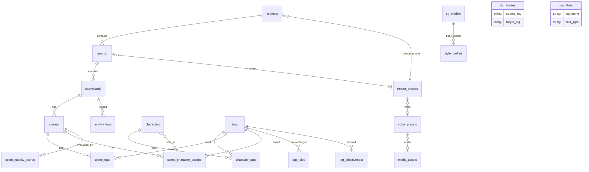

# Database Schema (v3.5)

Shorts Producer의 PostgreSQL 데이터베이스 스키마입니다.
SQLAlchemy ORM + Alembic 마이그레이션으로 관리합니다.

## 📝 변경 이력

| 버전 | 날짜 | 주요 변경사항 |
|------|------|--------------|
| v3.5 | 2026-02-04 | `characters.default_voice_preset_id`, `storyboards.narrator_voice_preset_id` FK 추가. `render_presets`에서 `narrator_voice`, `tts_engine`, `voice_design_prompt` 제거 (voice_preset_id로 대체). Soft Delete (`deleted_at`) 추가 |
| v3.4 | 2026-02-02 | `render_presets`, `voice_presets` 테이블 추가. `projects`에 Cascading Config FK 추가 (`render_preset_id`, `character_id`, `style_profile_id`). `groups`에서 `default_bgm_file`/`default_narrator_voice`/`character_id` 제거, `style_profile_id` 추가 |
| v3.3 | 2026-02-02 | `projects`, `groups`, `scene_quality_scores` 테이블 추가, `activity_logs`에 Gemini 트래킹 컬럼 추가, `media_assets`에 `is_temp`/`checksum` 추가, `storyboards`에 `default_caption` 반영 |
| v3.2 | 2026-02-01 | scenes 테이블 누락 컬럼 보완 (prompt, SD params, IP-Adapter, context_tags), characters에 preview_locked 추가, is_permanent/default_layer 상호작용 문서화, 12-Layer 매핑 테이블 추가 |
| v3.1 | 2026-01-31 | **Media Asset 시스템**: 폴리모픽 참조, Legacy URL 컬럼 삭제, S3/Local 통합, Video Asset 생성 활성화 |
| v3.0 | 2026-01-30 | V3 아키텍처: Storyboard-Centric, Relational Tags, Activity Logs, Tag Aliases/Filters |
| v2.0 | 2026-01-27 | Characters, LoRAs, Style Profiles, Tag System |

---

## 🗺️ ER Diagram



---

## 📦 Core: Channel & Storyboard System

### `projects`
YouTube 채널 단위. 채널별 설정 및 Cascading Config 최상위 레벨.

| Column | Type | Description |
|--------|------|-------------|
| `id` | Integer (PK) | |
| `name` | String(200) | 채널/프로젝트 이름 |
| `description` | Text | 설명 |
| `avatar_asset_id` | Integer (FK → media_assets, SET NULL) | 아바타 이미지 |
| `handle` | String(100) | 채널 핸들 (@...) |
| `avatar_key` | String(100) | 아바타 키 (localStorage 마이그레이션용) |
| `render_preset_id` | Integer (FK → render_presets, SET NULL) | 기본 렌더 프리셋 |
| `character_id` | Integer (FK → characters, SET NULL) | 기본 캐릭터 |
| `style_profile_id` | Integer (FK → style_profiles, SET NULL) | 기본 스타일 프로파일 |
| `created_at`, `updated_at` | DateTime | 타임스탬프 |

**Read-only 속성**:
- `avatar_url` (`@property`): `avatar_asset.url` 반환

**Cascading Config 상속 순서**: Project → Group → Storyboard (하위가 상위를 오버라이드)

### `groups`
프로젝트 내의 개별 시리즈 또는 카테고리. Cascading Config으로 프로젝트 설정을 상속/오버라이드.

| Column | Type | Description |
|--------|------|-------------|
| `id` | Integer (PK) | |
| `project_id` | Integer (FK → projects, RESTRICT) | 소속 프로젝트 |
| `name` | String(200) | 시리즈 이름 |
| `description` | Text | 설명 |
| `render_preset_id` | Integer (FK → render_presets, SET NULL) | 렌더 프리셋 |
| `style_profile_id` | Integer (FK → style_profiles, SET NULL) | 기본 스타일 프로파일 |
| `created_at`, `updated_at` | DateTime | 타임스탬프 |

> v3.4 변경: `default_bgm_file`, `default_narrator_voice` 제거 → `render_presets` 테이블로 이관
> v3.6 변경: `default_character_id` 삭제 (DROP), `default_style_profile_id` → `style_profile_id` 리네이밍

### `storyboards`
YouTube Shorts 프로젝트 단위. 개별 에피소드를 의미합니다.

| Column | Type | Description |
|--------|------|-------------|
| `id` | Integer (PK) | |
| `group_id` | Integer (FK → groups, RESTRICT) | 소속 그룹 |
| `title` | String(200) | 스토리보드 제목 |
| `description` | Text | 설명 |
| `character_id` | Integer | 기본 캐릭터 |
| `style_profile_id` | Integer | 기본 스타일 프로파일 |
| `default_caption` | Text | 기본 캡션 텍스트 (Post Layout용) |
| `narrator_voice_preset_id` | Integer (FK → voice_presets, SET NULL) | 나레이터 음성 프리셋 |
| `video_asset_id` | Integer (FK → media_assets, SET NULL) | 최신 렌더링 영상 |
| `recent_videos_json` | Text | 최근 렌더링 이력 (JSON 스트링) |
| `deleted_at` | DateTime | Soft Delete 타임스탬프 |
| `created_at`, `updated_at` | DateTime | 타임스탬프 |

**Read-only 속성**:
- `video_url` (`@property`): `video_asset.url` 반환

> v3.5 변경: `narrator_voice_preset_id` FK 추가, `deleted_at` Soft Delete 추가

### `scenes`
스토리보드의 개별 씬/샷.

| Column | Type | Description |
|--------|------|-------------|
| `id` | Integer (PK) | |
| `storyboard_id` | Integer (FK → storyboards) | 소속 스토리보드 |
| `order` | Integer | 씬 순서 (0-based) |
| `script` | Text | 나레이션/Scene Text |
| `description` | Text | LLM 생성 시각적 설명 |
| `speaker` | String(20) | 화자 (default: `"Narrator"`) |
| `duration` | Float | 씬 길이 초 (default: 3.0) |
| **Prompt** | | |
| `image_prompt` | Text | Gemini 생성 프롬프트 (V3 compose 입력) |
| `image_prompt_ko` | Text | 한국어 프롬프트 |
| `negative_prompt` | Text | 네거티브 프롬프트 |
| `context_tags` | JSONB | 씬 컨텍스트 태그 (아래 구조 참조) |
| **SD Parameters** | | |
| `steps` | Integer | 샘플링 스텝 |
| `cfg_scale` | Float | CFG 스케일 |
| `sampler_name` | String(50) | 샘플러 이름 |
| `seed` | BigInteger | 생성 시드 |
| `clip_skip` | Integer | CLIP Skip |
| `width` | Integer | 이미지 너비 (default: 512) |
| `height` | Integer | 이미지 높이 (default: 768) |
| **IP-Adapter** | | |
| `use_reference_only` | Integer (bool) | IP-Adapter 사용 여부 (default: 1) |
| `reference_only_weight` | Float | IP-Adapter 가중치 (default: 0.5) |
| `environment_reference_id` | Integer | 환경 참조 이미지 ID |
| `environment_reference_weight` | Float | 환경 참조 가중치 (default: 0.3) |
| **Generated** | | |
| `image_asset_id` | Integer (FK → media_assets) | 생성된 이미지 (폴리모픽 참조) |
| `candidates` | JSONB | 후보 이미지 목록 (image_url, match_rate 등) |
| `created_at`, `updated_at` | DateTime | 타임스탬프 |

**Read-only 속성**:
- `image_url` (`@property`): `image_asset.url` 반환

**`context_tags` JSONB 구조**:
```json
{
  "expression": ["expressionless"],
  "gaze": "looking_at_viewer",
  "pose": ["standing"],
  "action": ["adjusting_hair"],
  "camera": "upper_body",
  "environment": ["office", "indoors"],
  "mood": ["melancholic"]
}
```
> list 필드: `expression`, `pose`, `action`, `environment`, `mood`
> string 필드: `gaze`, `camera`

---

## 🔗 Association Tables (V3 Relational Tags)

### `character_tags`
캐릭터 ↔ 태그 연결.

| Column | Type | Description |
|--------|------|-------------|
| `character_id` | Integer (PK, FK → characters) | |
| `tag_id` | Integer (PK, FK → tags) | |
| `weight` | Float | 태그 가중치 (default: 1.0) |
| `is_permanent` | Boolean | 항상 포함 여부 (아래 참조) |

**`is_permanent`와 레이어 배치 규칙** (V3 Prompt Pipeline):
- `is_permanent=true` → **LAYER_IDENTITY(2)에 강제 배치**, `tag.default_layer` 무시
- `is_permanent=false` → `tag.default_layer` 사용

> **Known Issue**: `is_permanent`가 "항상 포함"과 "캐릭터 identity"를 혼용하고 있음.
> `anime_style`(스타일=L11), `solo`(subject=L1) 같은 비-identity 태그도 permanent로 등록되면
> LAYER_IDENTITY(2)에 강제 배치되어 의미론적 오분류 발생.
> → `PROMPT_PIPELINE_SPEC.md` Known Issue #2 참조

### `scene_tags`
씬 ↔ 태그 연결 (환경/분위기 태그).

| Column | Type | Description |
|--------|------|-------------|
| `scene_id` | Integer (PK, FK → scenes) | |
| `tag_id` | Integer (PK, FK → tags) | |
| `weight` | Float | 태그 가중치 (default: 1.0) |

### `scene_character_actions`
씬 내 캐릭터별 액션/표정 태그.

| Column | Type | Description |
|--------|------|-------------|
| `id` | Integer (PK) | |
| `scene_id` | Integer (FK → scenes) | |
| `character_id` | Integer (FK → characters) | |
| `tag_id` | Integer (FK → tags) | 액션/표정 태그 |
| `weight` | Float | 태그 가중치 (default: 1.0) |

---

## 🏷️ Tag System

### `tags`
프롬프트 키워드의 마스터 테이블 (12-Layer 시맨틱 데이터).

| Column | Type | Description |
|--------|------|-------------|
| `id` | Integer (PK) | |
| `name` | String(100) | Unique, 언더바 형식 (`brown_hair`) |
| `ko_name` | String(100) | 한국어 이름 |
| `category` | String(50) | `character`, `scene`, `meta` |
| `group_name` | String(50) | 의미론적 그룹 (`hair_color`, `expression`, `camera` 등 24종) |
| `description` | String(500) | 태그 설명 |
| `default_layer` | Integer | 12-Layer 위치 (0-11, 아래 매핑 참조) |
| `usage_scope` | String(20) | `PERMANENT`, `TRANSIENT`, `ANY` |
| `priority` | Integer | 정렬 우선순위 (default: 100) |
| `classification_source` | String(20) | `pattern`, `danbooru`, `llm`, `manual` |
| `classification_confidence` | Float | 분류 신뢰도 (0.0-1.0) |
| `wd14_count` | Integer | WD14 출현 횟수 |
| `wd14_category` | Integer | WD14 카테고리 코드 |
| `is_active` | Boolean | 태그 활성화 상태 (default: TRUE) |
| `deprecated_reason` | String(200) | 비활성화 이유 |
| `replacement_tag_id` | Integer | 대체 태그 ID (FK to tags.id) |

> **Removed**: `subcategory` 컬럼 (deprecated Phase 6-4.25, removed Phase 6-4.26)
> **Added** (Phase 6-4.15.8): `is_active`, `deprecated_reason`, `replacement_tag_id` - DB 기반 태그 비활성화 시스템

**`default_layer` 매핑** (V3 12-Layer System):

| 값 | 상수 | 용도 | 예시 태그 |
|----|------|------|-----------|
| 0 | LAYER_QUALITY | 품질 태그 | `masterpiece`, `best_quality`, `highres` |
| 1 | LAYER_SUBJECT | 주체 | `1boy`, `1girl`, `solo` |
| 2 | LAYER_IDENTITY | 캐릭터 LoRA/트리거 | (주로 character_tags에서 배치) |
| 3 | LAYER_BODY | 체형 | `super_deformed`, `tall`, `slim` |
| 4 | LAYER_MAIN_CLOTH | 주요 의상 | `blue_shirt`, `school_uniform` |
| 5 | LAYER_DETAIL_CLOTH | 의상 디테일 | `striped`, `frills` |
| 6 | LAYER_ACCESSORY | 악세서리 | `glasses`, `hat` |
| 7 | LAYER_EXPRESSION | 표정/시선 | `smile`, `looking_at_viewer` |
| 8 | LAYER_ACTION | 포즈/동작 | `standing`, `walking`, `adjusting_hair` |
| 9 | LAYER_CAMERA | 카메라 앵글 | `upper_body`, `close_up`, `from_above` |
| 10 | LAYER_ENVIRONMENT | 배경/장소 | `office`, `indoors`, `outdoors` |
| 11 | LAYER_ATMOSPHERE | 스타일/분위기/조명 | `anime_style`, `melancholic`, `day` |

> Fallback: DB에 없는 태그는 `LAYER_SUBJECT(1)`로 배치됨.
> 코드 위치: `backend/services/prompt/v3_composition.py` L12-23

### `tag_rules`
태그 간 충돌/의존성 규칙 (개별 태그 레벨).

| Column | Type | Description |
|--------|------|-------------|
| `id` | Integer (PK) | |
| `rule_type` | String(20) | `conflict` or `requires` |
| `source_tag_id` | Integer | 충돌 소스 태그 |
| `target_tag_id` | Integer | 충돌 대상 태그 |
| `message` | String(200) | 규칙 설명 |
| `priority` | Integer | 우선순위 |
| `active` | Boolean | 활성 여부 |
| `created_at`, `updated_at` | DateTime | 타임스탬프 |

> **Removed**: `source_category`, `target_category` (Phase 6-4.26)
> 카테고리 간 충돌은 논리적으로 불가능. 모든 충돌은 개별 태그 레벨에서만 발생.

### `tag_aliases`
위험/비표준 태그의 자동 치환 규칙.

| Column | Type | Description |
|--------|------|-------------|
| `id` | Integer (PK) | |
| `source_tag` | String(100) | 변환 전 (`medium shot`) |
| `target_tag` | String(100) | 변환 후 (`cowboy_shot`), NULL = 삭제 |
| `reason` | String(200) | 치환 사유 |
| `active` | Boolean | 활성 여부 |

### `tag_filters`
무시/스킵할 태그 관리.

| Column | Type | Description |
|--------|------|-------------|
| `id` | Integer (PK) | |
| `tag_name` | String(100) | Unique, 필터 대상 태그 |
| `filter_type` | String(20) | `ignore` or `skip` |
| `reason` | String(200) | 필터 사유 |
| `active` | Boolean | 활성 여부 |

### `classification_rules`
패턴 기반 태그 자동 분류 규칙.

| Column | Type | Description |
|--------|------|-------------|
| `id` | Integer (PK) | |
| `rule_type` | String(20) | `suffix`, `prefix`, `contains`, `exact` |
| `pattern` | String(100) | 매칭 패턴 (`_hair`, `eyes`) |
| `target_group` | String(50) | 대상 그룹 |
| `priority` | Integer | 평가 순서 |
| `active` | Boolean | 활성 여부 |

### `tag_effectiveness`
WD14 피드백 루프 데이터.

| Column | Type | Description |
|--------|------|-------------|
| `id` | Integer (PK) | |
| `tag_id` | Integer (FK → tags) | |
| `use_count` | Integer | 프롬프트 사용 횟수 |
| `match_count` | Integer | WD14 감지 횟수 |
| `effectiveness` | Float | `match_count / use_count` |

---

## 🎨 Asset System

### `media_assets` (V3.1)
통합 미디어 저장소. S3/Local 스토리지 폴리모픽 참조 시스템.

| Column | Type | Description |
|--------|------|-------------|
| `id` | Integer (PK) | |
| `owner_type` | String(50) | 폴리모픽 타입 (`character`, `scene`, `lora`, `sdmodel`, `storyboard`, `project`) |
| `owner_id` | Integer | 폴리모픽 ID |
| `file_name` | String(255) | 원본 파일명 |
| `file_type` | String(20) | `image`, `video`, `audio`, `cache`, `candidate` |
| `storage_key` | String(500) | 스토리지 경로 |
| `file_size` | BigInteger | 파일 크기 (bytes) |
| `mime_type` | String(100) | `image/png`, `video/mp4` 등 |
| `is_temp` | Boolean | 임시 파일 여부 (GC 대상) |
| `checksum` | String(64) | 파일 SHA-256 해시 |
| `created_at` | DateTime | 생성 시각 |

**특징**:
- **폴리모픽 연관**: `owner_type` + `owner_id`로 모든 엔티티 연결
- **URL 생성**: `url` property가 storage_key 기반 public URL 반환 (`http://minio:9000/shorts-producer/{storage_key}`)
- **S3/Local 통합**: LocalStorage/S3Storage 모두 지원
- **계층 구조**:
  - 영상: `projects/{p_id}/groups/{g_id}/storyboards/{s_id}/videos/{file}`
  - 씬 이미지: `projects/{p_id}/groups/{g_id}/storyboards/{s_id}/images/{file}`
  - 캐릭터: `characters/{id}/preview/{file}`
  - 공유 에셋: `shared/{type}/{file}` (audio, fonts, overlay, references, poses)

**마이그레이션**:
- `ca169902f4a4`: 모든 모델에 `*_asset_id` FK 추가
- `4249c8f1cd5c`: Legacy `*_url` 컬럼 삭제

**중요**: `storage_key`는 버킷명(`shorts-producer`)을 포함하지 않음. `get_storage().get_url(key)`가 버킷명을 자동 추가.

### `characters`
캐릭터 프리셋. V3에서는 `character_tags` 관계형 테이블로 태그 연결.

| Column | Type | Description |
|--------|------|-------------|
| `id` | Integer (PK) | |
| `name` | String(100) | Unique |
| `gender` | String(10) | `female`, `male` |
| `description` | String(500) | |
| **Prompt** | | |
| `loras` | JSONB | LoRA 설정 (아래 구조 참조) |
| `recommended_negative` | Text[] | 캐릭터별 네거티브 |
| `custom_base_prompt` | Text | V3 compose 입력: LAYER_IDENTITY(2)에 배치 |
| `custom_negative_prompt` | Text | Frontend `buildNegativePrompt()` 입력 |
| `reference_base_prompt` | Text | 레퍼런스 이미지 전용 (V3 compose 미사용) |
| `reference_negative_prompt` | Text | 레퍼런스 이미지 전용 |
| `prompt_mode` | String(20) | `auto`, `standard`, `lora` |
| **IP-Adapter** | | |
| `ip_adapter_weight` | Float | 0.0-1.0 |
| `ip_adapter_model` | String(50) | `clip`, `clip_face`, `faceid` |
| **Voice** | | |
| `default_voice_preset_id` | Integer (FK → voice_presets, SET NULL) | 캐릭터 고유 음성 프리셋 |
| **Display** | | |
| `preview_image_asset_id` | Integer (FK → media_assets) | 미리보기 이미지 (폴리모픽 참조) |
| `preview_locked` | Boolean | 미리보기 자동 갱신 잠금 (default: false) |
| `deleted_at` | DateTime | Soft Delete 타임스탬프 |
| `created_at`, `updated_at` | DateTime | 타임스탬프 |

**Read-only 속성**:
- `preview_image_url` (`@property`): `preview_image_asset.url` 반환

> v3.5 변경: `default_voice_preset_id` FK 추가, `deleted_at` Soft Delete 추가

**V3 Prompt Pipeline에서의 사용** (→ `PROMPT_PIPELINE_SPEC.md` 참조):
| 필드 | V3 compose 사용 | 용도 |
|------|:-:|------|
| `character.tags[]` (via character_tags) | O | `is_permanent` 기반 레이어 배치 |
| `custom_base_prompt` | O | comma split → LAYER_IDENTITY(2), 배경 태그 필터 |
| `loras` | O | trigger words + `<lora:>` → LAYER_IDENTITY(2) |
| `gender` | O | male → gender enhancement → LAYER_SUBJECT(1) |
| `prompt_mode` | O | `"standard"`이면 LoRA 주입 스킵 |
| `custom_negative_prompt` | X | Frontend 로컬 처리 |
| `reference_base_prompt` | X | 레퍼런스 이미지 전용 |
| `reference_negative_prompt` | X | 레퍼런스 이미지 전용 |

> V3 변경: `identity_tags Integer[]`, `clothing_tags Integer[]` 제거 → `character_tags` 테이블로 이관
> V3.1 변경: `preview_image_url` 제거 → `preview_image_asset_id` FK로 전환
> V3.1.1 변경: `preview_locked` 추가 (2026-02-01)

### `loras`
Stable Diffusion LoRA 모델.

| Column | Type | Description |
|--------|------|-------------|
| `id` | Integer (PK) | |
| `name` | String(100) | Unique, 파일명/키 |
| `display_name` | String(100) | 표시명 |
| `lora_type` | String(20) | `character`, `style`, `concept`, `pose` |
| `gender_locked` | String(10) | 성별 제한 |
| `civitai_id` | Integer | Civitai ID |
| `civitai_url` | String(500) | |
| `trigger_words` | Text[] | 트리거 키워드 |
| `default_weight` | Decimal(3,2) | 기본 가중치 |
| `optimal_weight` | Decimal(3,2) | 보정된 최적 가중치 |
| `calibration_score` | Integer | 최적 가중치 시 점수 |
| `weight_min`, `weight_max` | Decimal(3,2) | 가중치 범위 |
| `preview_image_asset_id` | Integer (FK → media_assets) | 미리보기 이미지 (폴리모픽 참조) |
| `created_at`, `updated_at` | DateTime | 타임스탬프 |

**Read-only 속성**:
- `preview_image_url` (`@property`): `preview_image_asset.url` 반환

### `sd_models`
Stable Diffusion 체크포인트.

| Column | Type | Description |
|--------|------|-------------|
| `id` | Integer (PK) | |
| `name` | String(200) | Unique |
| `display_name` | String(200) | |
| `model_type` | String(50) | `checkpoint`, `vae` |
| `base_model` | String(50) | `SD1.5`, `SDXL`, `Pony` |
| `civitai_id` | Integer | |
| `civitai_url` | String(500) | |
| `description` | Text | |
| `preview_image_asset_id` | Integer (FK → media_assets) | 미리보기 이미지 (폴리모픽 참조) |
| `is_active` | Boolean | |

**Read-only 속성**:
- `preview_image_url` (`@property`): `preview_image_asset.url` 반환

### `style_profiles`
Model + LoRAs + Embeddings 번들.

| Column | Type | Description |
|--------|------|-------------|
| `id` | Integer (PK) | |
| `name` | String(100) | Unique |
| `sd_model_id` | Integer (FK → sd_models) | 베이스 체크포인트 |
| `loras` | JSONB | LoRA 목록 |
| `positive_embeddings` | Integer[] | Embedding IDs |
| `negative_embeddings` | Integer[] | Embedding IDs |
| `default_positive` | Text | 기본 포지티브 |
| `default_negative` | Text | 기본 네거티브 |
| `is_default` | Boolean | |
| `is_active` | Boolean | |

### `render_presets`
재사용 가능한 렌더링 설정 프리셋. Project/Group에서 참조.

| Column | Type | Description |
|--------|------|-------------|
| `id` | Integer (PK) | |
| `name` | String(200) | 프리셋 이름 |
| `description` | Text | 설명 |
| `is_system` | Boolean | 시스템 프리셋 여부 (default: true) |
| `project_id` | Integer (FK → projects, CASCADE) | 소속 프로젝트 (NULL=글로벌) |
| **Audio** | | |
| `bgm_file` | String(255) | BGM 파일 경로 (`"random"` = 랜덤) |
| `bgm_volume` | Float | BGM 볼륨 (0.0~1.0) |
| `audio_ducking` | Boolean | 오디오 더킹 여부 |
| `voice_preset_id` | Integer (FK → voice_presets, SET NULL) | 글로벌 음성 프리셋 |
| `speed_multiplier` | Float | 재생 속도 배율 |
| **Visual** | | |
| `layout_style` | String(50) | 레이아웃 (`full`, `post`) |
| `frame_style` | String(255) | 프레임 스타일 |
| `scene_text_font` | String(255) | Scene Text 폰트 (파일명) |
| `transition_type` | String(50) | 전환 효과 |
| `ken_burns_preset` | String(50) | Ken Burns 프리셋 |
| `ken_burns_intensity` | Float | Ken Burns 강도 |
| `created_at`, `updated_at` | DateTime | 타임스탬프 |

> v3.5 변경: `narrator_voice`, `tts_engine`, `voice_design_prompt` 제거 → `voice_preset_id` FK로 대체

### `voice_presets`
재사용 가능한 음성 프리셋. TTS 렌더링 시 사용.

| Column | Type | Description |
|--------|------|-------------|
| `id` | Integer (PK) | |
| `name` | String(200) | 프리셋 이름 |
| `description` | Text | 설명 |
| `project_id` | Integer (FK → projects, SET NULL) | 소속 프로젝트 (NULL=글로벌) |
| `source_type` | String(20) | `generated` (VoiceDesign) 또는 `uploaded` (파일) |
| `tts_engine` | String(20) | TTS 엔진 (현재 `qwen`) |
| `audio_asset_id` | Integer (FK → media_assets, SET NULL) | 음성 파일 |
| `voice_design_prompt` | Text | VoiceDesign 프롬프트 |
| `language` | String(20) | 언어 (default: `korean`) |
| `sample_text` | Text | 샘플 텍스트 |
| `is_system` | Boolean | 시스템 프리셋 여부 (default: false) |
| `created_at`, `updated_at` | DateTime | 타임스탬프 |

**Read-only 속성**:
- `audio_url` (`@property`): `audio_asset.url` 반환

### `embeddings`
Textual Inversion 임베딩.

| Column | Type | Description |
|--------|------|-------------|
| `id` | Integer (PK) | |
| `name` | String(200) | Unique |
| `display_name` | String(200) | |
| `embedding_type` | String(50) | |
| `trigger_word` | String(100) | |
| `description` | Text | |
| `is_active` | Boolean | |

---

## 📊 Analytics & History

### `activity_logs`
생성 이력 로그 (Analytics & Tracking).

| Column | Type | Description |
|--------|------|-------------|
| `id` | Integer (PK) | |
| `storyboard_id` | Integer (nullable) | 소속 스토리보드 (FK 제거됨, NULL 허용) |
| `scene_id` | Integer | 씬 인덱스 |
| `character_id` | Integer | 캐릭터 ID |
| `prompt` | Text | 사용된 프롬프트 |
| `negative_prompt` | Text | 네거티브 프롬프트 |
| `sd_params` | JSONB | `{steps, cfg_scale, sampler, ...}` |
| `seed` | BigInteger | 생성 시드 |
| `image_storage_key` | String(500) | 생성 이미지 경로 |
| `match_rate` | Float | WD14 매치율 |
| `tags_used` | JSONB | 사용된 태그 배열 |
| `status` | String(20) | `success`, `fail` |
| `gemini_edited` | Boolean | Gemini 자동 편집 여부 |
| `gemini_cost_usd` | Float | Gemini 편집 비용 |
| `original_match_rate` | Float | 편집 전 매치율 |
| `final_match_rate` | Float | 편집 후 매치율 |
| `created_at`, `updated_at` | DateTime | 타임스탬프 |

**Read-only 속성**:
- `image_url` (`@property`): `image_storage_key` 기반 URL 반환

### `scene_quality_scores`
장면별 품질 점수 및 WD14 검증 결과 전용 스토어.

| Column | Type | Description |
|--------|------|-------------|
| `id` | Integer (PK) | |
| `storyboard_id` | Integer | 스토리보드 ID |
| `scene_id` | Integer | 씬 인덱스 |
| `image_storage_key` | String(500) | 이미지 경로 |
| `prompt` | Text | 사용된 프롬프트 |
| `match_rate` | Float | WD14 매치율 |
| `matched_tags`, `missing_tags`, `extra_tags` | JSONB | 상세 태그 분석 결과 |
| `validated_at` | DateTime | 검증 일시 |
| `created_at`, `updated_at` | DateTime | 타임스탬프 |

**Read-only 속성**:
- `image_url` (`@property`): `image_storage_key` 기반 URL 반환

> v3.0: `generation_logs` → `activity_logs`로 이름 변경 및 통합
> **Removed** (Phase 6-4.26): `is_favorite`, `name` - 즐겨찾기 기능 미구현 (0 usage, 0 data)

### `prompt_histories`
저장된 프롬프트 설정.

| Column | Type | Description |
|--------|------|-------------|
| `id` | Integer (PK) | |
| `name` | String(200) | |
| `positive_prompt` | Text | |
| `negative_prompt` | Text | |
| `steps`, `cfg_scale`, `seed`, `clip_skip` | Integer/Float | SD 파라미터 |
| `character_id` | Integer | |
| `lora_settings` | JSONB | |
| `context_tags` | JSONB | |
| `last_match_rate`, `avg_match_rate` | Float | |
| `validation_count` | Integer | |
| `is_favorite` | Boolean | |
| `use_count` | Integer | |

### `evaluation_runs`
프롬프트 모드 A/B 테스트 결과.

| Column | Type | Description |
|--------|------|-------------|
| `id` | Integer (PK) | |
| `batch_id` | String(50) | 배치 실행 그룹 |
| `test_name` | String(100) | 테스트명 |
| `mode` | String(20) | `standard`, `lora` |
| `character_id` | Integer | 캐릭터 ID |
| `character_name` | String(100) | 캐릭터명 |
| `prompt_used` | Text | 사용된 프롬프트 |
| `negative_prompt` | Text | 네거티브 프롬프트 |
| `seed` | Integer | 생성 시드 |
| `steps` | Integer | 샘플링 스텝 |
| `cfg_scale` | Float | CFG 스케일 |
| `match_rate` | Float | WD14 매치율 |
| `matched_tags`, `missing_tags`, `extra_tags` | JSONB | 태그 분석 결과 |
| `created_at`, `updated_at` | DateTime | 타임스탬프 |

---

## 📝 JSONB Structures

### `Character.loras`
```json
[
  {
    "lora_id": 5,
    "weight": 1.0,
    "name": "flat_color",
    "trigger_words": ["flat color"],
    "lora_type": "character"
  }
]
```

**V3 Pipeline 처리**: `lora_type`에 관계없이 현재 모두 LAYER_IDENTITY(2)에 배치.
→ Known Issue: `lora_type=style`은 LAYER_ATMOSPHERE(11)에 배치해야 함.

### `Scene.context_tags`
```json
{
  "expression": ["expressionless"],
  "gaze": "looking_at_viewer",
  "pose": ["standing"],
  "action": ["adjusting_hair"],
  "camera": "upper_body",
  "environment": ["office", "indoors"],
  "mood": ["melancholic"]
}
```

**V3 Pipeline 처리**: `_collect_context_tags()`에서 flat list로 변환 후 scene_tags에 병합.

### `ActivityLog.sd_params`
```json
{"steps": 20, "cfg_scale": 7, "sampler": "DPM++ 2M Karras", "width": 512, "height": 768}
```

---

## 🔑 Enums

| Enum | Values |
|------|--------|
| `Tag.usage_scope` | `PERMANENT`, `TRANSIENT`, `ANY` |
| `Tag.classification_source` | `pattern`, `danbooru`, `llm`, `manual` |
| `LoRA.lora_type` | `character`, `style`, `concept`, `pose` |
| `Character.prompt_mode` | `auto`, `standard`, `lora` |
| `TagRule.rule_type` | `conflict`, `requires` |
| `TagAlias.target_tag` | String or `NULL` (= remove tag) |
| `TagFilter.filter_type` | `ignore`, `skip` |
| `ActivityLog.status` | `success`, `fail` |

---

## 📐 Column Ordering Convention

모든 테이블의 ORM 모델(`models/*.py`)에서 컬럼 선언 순서를 아래 규칙으로 통일합니다.

```
1. PK          — id
2. Parent FK   — project_id, group_id, storyboard_id 등 (소속 관계)
3. Identity    — name, title 등 (사람이 식별하는 필드)
4. Metadata    — description, gender, is_system 등
5. Domain      — 도메인 고유 필드 (그룹별로 구분)
                 예: Render → Audio 그룹, Visual 그룹
                 예: Character → Prompt, IP-Adapter, Voice
6. Asset FK    — preview_image_asset_id, video_asset_id 등
7. Config FK   — voice_preset_id, render_preset_id 등
8. Flags       — preview_locked, is_active, deleted_at 등
9. Timestamps  — created_at, updated_at (TimestampMixin)
```

**참고**: PostgreSQL은 `ALTER TABLE DROP COLUMN` 후 ordinal_position에 구멍이 생길 수 있음.
물리적 컬럼 순서는 성능에 영향 없으므로, ORM 모델의 선언 순서를 기준으로 합니다.

---

**Last Updated:** 2026-02-04
**Schema Version:** v3.5
**ORM:** SQLAlchemy 2.0 (Mapped Columns)
**Migrations:** Alembic (V3 Baseline + Media Assets + Render/Voice Presets + Voice FK)
