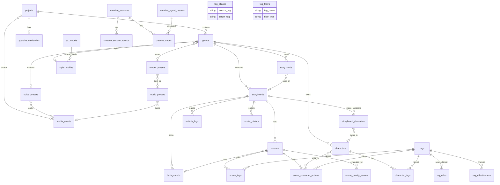

# Database Schema (v3.39)

Shorts Producer의 PostgreSQL 데이터베이스 스키마입니다.
SQLAlchemy ORM + Alembic 마이그레이션으로 관리합니다.

## 변경 이력

| 버전 | 날짜 | 주요 변경사항 |
|------|------|--------------|
| v3.39 | 2026-03-30 | PR #363 ORM CHECK 제약조건 선언 동기화: `tags`, `classification_rules`, `tag_rules`, `tag_filters`, `voice_presets`, `render_presets`, `embeddings` 7개 테이블 CHECK 제약조건 문서화 (DB 스키마 변경 없음, ORM 선언만 추가) |
| v3.38 | 2026-03-29 | SP-117: `sd_models`에 NoobAI-XL Epsilon 1.1 (`noobaiXL_epsPred11.safetensors`) 추가, v-pred 체크포인트 비활성화(`is_active=false`), `style_profiles` id=3을 epsilon 모델로 업데이트 + `default_cfg_scale=7.0` |
| v3.37 | 2026-03-24 | SP-075: `story_cards` 테이블 신규 추가. `groups`에 `story_cards` relationship 추가 |
| v3.36 | 2026-03-24 | SP-021 Speaker ID 정규화: `scenes.speaker` default `"Narrator"` → `"narrator"`, 데이터 변환 (`A`→`speaker_1`, `B`→`speaker_2`, `Narrator`→`narrator`). `storyboard_characters.speaker` 동일 변환 |
| v3.35 | 2026-03-23 | SP-073 Dead Feature Cleanup: `activity_logs`에서 Gemini 자동편집 4컬럼 제거(`gemini_edited`, `gemini_cost_usd`, `original_match_rate`, `final_match_rate`). `loras`에서 `gender_locked`, `optimal_weight`, `calibration_score`, `civitai_id` 컬럼 + `idx_loras_civitai` 인덱스 제거. `tags`에서 `thumbnail_asset_id` 컬럼 + `_thumbnail_asset` 관계 + `thumbnail_url` 프로퍼티 제거 |
| v3.34 | 2026-03-23 | 문서 최신화: `storyboards`에 `tone`/`bgm_prompt`/`bgm_mood` 추가, `scenes`에 `tts_asset_id` 추가 + `width`/`height` 기본값 수정, `scene_quality_scores`에 `identity_score`/`identity_tags_detected` 추가, `backgrounds` 인덱스명 수정, `lab_experiments` 삭제 테이블 문서 제거, `characters.reference_images` 잔존 기록 정리. 유령 항목 정리: `loras` Multi-Character 3컬럼 제거(DB DROP 완료), `storyboards.bgm_audio_url` @property 제거(미구현), `loras.is_active` 추가. `scenes.multi_gen_enabled` 설명 보강. MEDIUM 12건 수정: `groups` deleted_at+@property 추가, `scenes` FK/nullable/길이 보강, `storyboard_characters` UniqueConstraint+FK 명시, `tags`/`tag_effectiveness` timestamps 추가, `activity_logs` NOT NULL 명시, `style_profiles` default 명시, `youtube_credentials` nullable/default 명시 |
| v3.33 | 2026-03-02 | Character-Group 소유권: `characters.style_profile_id` 제거 → `characters.group_id` NOT NULL FK (RESTRICT). Group이 화풍 유일한 SSOT |
| v3.32 | 2026-02-28 | `group_config` 테이블 제거 → `groups` 통합 (render_preset_id, style_profile_id, narrator_voice_preset_id). `channel_dna` 컬럼 제거 |
| v3.31 | 2026-02-28 | DB Schema Cleanup: `characters.reference_source_type` DROP, `scenes.last_seed` DROP. `is_permanent` / `lora_type=style` Known Issue 해소 표기. `embeddings` 구현 완료 표기. `characters.prompt_mode` 문서 삭제 |
| v3.30 | 2026-02-26 | Phase 18 Stage Workflow: `backgrounds`에 `storyboard_id` FK(CASCADE) + `location_key` + partial unique index 추가. `storyboards`에 `stage_status` 추가 |
| v3.29 | 2026-02-22 | `scenes`에 `controlnet_pose` (String(50), nullable) 추가. Finalize `_flatten_tts_designs()` — tts_design dict → flat fields 분해 |
| v3.28 | 2026-02-22 | `render_presets.bgm_mode` NOT NULL 적용 (server_default="manual"). Dead 컬럼 DROP: `scenes.description`, `creative_traces.diff_summary`. `scenes`에 `clothing_tags` (JSONB) 추가 |
| v3.27 | 2026-02-22 | Seed Anchoring: `scenes.last_seed` (BigInteger), `storyboards.base_seed` (BigInteger) 추가 |
| v3.26 | 2026-02-22 | `characters`에 IP-Adapter 고도화 2컬럼 추가 (`ip_adapter_guidance_start/end`). ※ `reference_source_type`, `reference_images`는 이후 DROP됨 |

> v3.25 이전 이력: [DB_SCHEMA_CHANGELOG.md](DB_SCHEMA_CHANGELOG.md)

---

## ER Diagram



## Core: Channel & Storyboard System

### `projects`
YouTube 채널 단위. 채널별 설정 및 Cascading Config 최상위 레벨.

| Column | Type | Description |
|--------|------|-------------|
| `id` | Integer (PK) | |
| `name` | String(200) | 채널/프로젝트 이름 |
| `description` | Text | 설명 |
| `handle` | String(100) | 채널 핸들 (@...) |
| `avatar_media_asset_id` | Integer (FK → media_assets, SET NULL) | 아바타 이미지 |
| `created_at`, `updated_at` | DateTime | 타임스탬프 |

**Read-only 속성**:
- `avatar_key` (`@property`): `avatar_media_asset.storage_key` 반환
- `avatar_url` (`@property`): `avatar_media_asset.url` 반환

**Cascading Config 상속 순서**: System Default → Group (Group 값이 우선). Identity(채널명/아바타)는 Project → Group → Storyboard ORM 관계로 전달.

### `youtube_credentials`
프로젝트별 YouTube OAuth 인증 정보 (1:1).

| Column | Type | Description |
|--------|------|-------------|
| `id` | Integer (PK) | |
| `project_id` | Integer (FK → projects, CASCADE, UNIQUE) | 소속 프로젝트 |
| `channel_id` | String(100), nullable | YouTube Channel ID |
| `channel_title` | String(200), nullable | 채널명 |
| `encrypted_token` | Text, NOT NULL | 암호화된 OAuth 토큰 |
| `is_valid` | Boolean (default: true) | 토큰 유효 여부 |
| `created_at`, `updated_at` | DateTime | 타임스탬프 |

### `groups`
프로젝트 내의 개별 시리즈 또는 카테고리. 채널 설정(렌더/스타일/음성)을 직접 소유.

| Column | Type | Description |
|--------|------|-------------|
| `id` | Integer (PK) | |
| `project_id` | Integer (FK → projects, RESTRICT) | 소속 프로젝트 |
| `name` | String(200) | 시리즈 이름 |
| `description` | Text | 설명 |
| `render_preset_id` | Integer (FK → render_presets, SET NULL) | 렌더 프리셋 |
| `style_profile_id` | Integer (FK → style_profiles, SET NULL) | 기본 스타일 프로파일 |
| `narrator_voice_preset_id` | Integer (FK → voice_presets, SET NULL) | 나레이터 음성 |
| `deleted_at` | DateTime | Soft Delete 타임스탬프 |
| `created_at`, `updated_at` | DateTime | 타임스탬프 |

**Read-only 속성**:
- `render_preset_name` (`@property`): 렌더 프리셋명
- `style_profile_name` (`@property`): 스타일 프로파일명
- `voice_preset_name` (`@property`): 나레이터 음성 프리셋명
- `character_count` (`@property`): 소속 캐릭터 수

**Relationships**: `storyboards`, `characters`, `story_cards`, `render_preset`, `style_profile`, `narrator_voice_preset`

### `story_cards`
시리즈(Group)별 대본 소재 풀. Research 노드가 수집한 미사용 소재를 Writer 노드에 주입하여 대본 품질을 향상시킨다.

| Column | Type | Description |
|--------|------|-------------|
| `id` | Integer (PK) | |
| `group_id` | Integer (FK → groups, RESTRICT), NOT NULL | 소속 시리즈 |
| `cluster` | String(100), nullable | 소재 클러스터 분류 (예: "직장 갈등", "가족 관계") |
| `title` | String(300), NOT NULL | 소재 제목 |
| `status` | String(20), NOT NULL, default: `"unused"` | 사용 상태. `unused` / `used` / `retired`. CHECK 제약 있음 |
| **소재 본문** | | |
| `situation` | Text, nullable | 핵심 상황 설명 |
| `hook_angle` | Text, nullable | 훅 포인트 각도 |
| `key_moments` | JSONB, nullable | 핵심 전개 포인트 목록 |
| `emotional_arc` | JSONB, nullable | 감정 변화 흐름 `{"start": "...", "peak": "...", "end": "..."}` |
| `empathy_details` | JSONB, nullable | 공감 포인트 상세 목록 |
| `characters_hint` | JSONB, nullable | 등장인물 힌트 `{"main": "...", "sub": "..."}` |
| **메타** | | |
| `hook_score` | Float, nullable | AI 평가 훅 점수 (0.0~1.0) |
| `used_in_storyboard_id` | Integer (FK → storyboards, SET NULL), nullable | 실제 사용된 스토리보드 |
| `used_at` | DateTime, nullable | 사용된 시각 |
| `deleted_at` | DateTime | Soft Delete 타임스탬프 |
| `created_at`, `updated_at` | DateTime | 타임스탬프 |

**인덱스**: `group_id` (btree), `status` (btree), `used_in_storyboard_id` (btree), `deleted_at` (btree)

**FK 정책**:
- `group_id → groups`: RESTRICT (그룹 삭제 전 소재 카드 먼저 정리 필요)
- `used_in_storyboard_id → storyboards`: SET NULL (스토리보드 삭제 시 참조만 해제, 소재 카드는 보존)

### `storyboards`
YouTube Shorts 프로젝트 단위. 개별 에피소드를 의미합니다.

| Column | Type | Description |
|--------|------|-------------|
| `id` | Integer (PK) | |
| `group_id` | Integer (FK → groups, RESTRICT) | 소속 그룹 |
| `title` | String(200) | 스토리보드 제목 |
| `description` | Text | 설명 |
| `caption` | Text | 캡션 텍스트 (Post Layout용) |
| `structure` | String(50) | 구조 설정 (default: `"Monologue"`) |
| `tone` | String(30), NOT NULL | 톤 설정 (default: `"intimate"`, server_default: `"intimate"`) |
| `duration` | Integer | 목표 길이 (초), 콘텐츠 엔티티 고유 필드 |
| `language` | String(20) | 언어 설정, 콘텐츠 엔티티 고유 필드 |
| `version` | Integer, NOT NULL, default 1 | Optimistic Locking 버전. PUT/PATCH 시 검증, 성공 시 +1 증분. 불일치 시 409 Conflict |
| **AI BGM** | | |
| `bgm_prompt` | Text, nullable | AI BGM 생성 프롬프트 (Phase 12-C) |
| `bgm_mood` | String(100), nullable | BGM 분위기 키워드 (Phase 12-C) |
| **Seed** | | |
| `base_seed` | BigInteger, nullable | Seed Anchoring 기준 시드. 씬별 seed = `base_seed + order * SEED_ANCHOR_OFFSET` |
| `stage_status` | String(20), nullable | Stage 파이프라인 상태: `pending`, `staging`, `staged`, `failed`. NULL = 미사용 |
| `casting_recommendation` | JSONB, nullable | AI 캐스팅 추천 (character_id, structure, reasoning 등). Phase 20-C |
| `bgm_audio_asset_id` | Integer (FK → media_assets, SET NULL), nullable | BGM 오디오 에셋 참조 |
| `deleted_at` | DateTime | Soft Delete 타임스탬프 |
| `created_at`, `updated_at` | DateTime | 타임스탬프 |

**Read-only 속성**:
- `video_url` (`@property`): `render_history[0].media_asset.url` 반환

### `scenes`
스토리보드의 개별 씬/샷.

| Column | Type | Description |
|--------|------|-------------|
| `id` | Integer (PK) | |
| `client_id` | String(36), UNIQUE, NOT NULL | Client-side UUID (생성 시 확정, 불변). Frontend 안정 식별자 |
| `storyboard_id` | Integer (FK → storyboards, CASCADE) | 소속 스토리보드 |
| `order` | Integer | 씬 순서 (0-based) |
| `script` | Text | 나레이션/Scene Text |
| `speaker` | String(20) | 화자 (default: `"narrator"`) — `speaker_1`, `speaker_2`, `narrator` |
| `duration` | Float | 씬 길이 초 (default: 3.0) |
| **Prompt** | | |
| `image_prompt` | Text | Gemini 생성 프롬프트 (V3 compose 입력) |
| `image_prompt_ko` | Text | 한국어 프롬프트 |
| `negative_prompt` | Text | 네거티브 프롬프트 |
| `context_tags` | JSONB | 씬 컨텍스트 태그 (expression, gaze, pose, action, camera, environment, mood) |
| `clothing_tags` | JSONB, nullable | 씬별 의상 오버라이드 `{"<character_id>": ["tag1", "tag2"]}`. null = 캐릭터 기본 의상 사용 |
| **TTS & Pacing** | | |
| `voice_design_prompt` | Text | Context-Aware TTS Designer 출력 |
| `head_padding` | Float | 씬 시작 전 무음 간격 (default: 0.0) |
| `tail_padding` | Float | 씬 종료 후 무음 간격 (default: 0.0) |
| `tts_asset_id` | Integer (FK → media_assets, SET NULL), nullable | TTS 프리뷰 오디오 에셋 (최종 렌더 재사용) |
| **Size** | | |
| `width` | Integer | 이미지 너비 (default: 832) |
| `height` | Integer | 이미지 높이 (default: 1216) |
| **Background** | | |
| `background_id` | Integer (FK → backgrounds, SET NULL) | 배경 에셋 참조 (태그 자동 주입 + ControlNet Canny) |
| **IP-Adapter / Reference** | | |
| `use_reference_only` | Boolean | IP-Adapter 사용 여부 (default: true) |
| `reference_only_weight` | Float | IP-Adapter 가중치 (default: 0.5) |
| `environment_reference_id` | Integer (FK → media_assets, SET NULL) | 환경 참조 이미지 ID |
| `environment_reference_weight` | Float | 환경 참조 가중치 (default: 0.3) |
| `use_ip_adapter` | Boolean, nullable | IP-Adapter 사용 여부 (씬별 오버라이드) |
| `ip_adapter_reference` | String(255) | IP-Adapter 참조 이미지 경로 |
| `ip_adapter_weight` | Float | IP-Adapter 가중치 (씬별 오버라이드) |
| **ControlNet** | | |
| `use_controlnet` | Boolean, nullable | ControlNet 사용 여부 |
| `controlnet_weight` | Float | ControlNet 가중치 |
| `controlnet_pose` | String(50), nullable | 선택된 ControlNet 포즈 이름 (None = 자동 감지) |
| **Generation** | | |
| `scene_mode` | String(10) | 씬 모드: `"single"` (1인) or `"multi"` (2인 동시 출연, default: `"single"`) |
| `multi_gen_enabled` | Boolean, nullable | 씬별 멀티 후보 생성 활성화 (NULL=전역 기본값 사용). Agent finalize 노드에서 자동 할당 |
| `image_asset_id` | Integer (FK → media_assets, SET NULL) | 생성된 이미지 (폴리모픽 참조) |
| `candidates` | JSONB | 후보 이미지 목록 (`media_asset_id`, `match_rate`) |
| `deleted_at` | DateTime | Soft Delete 타임스탬프 |
| `created_at`, `updated_at` | DateTime | 타임스탬프 |

**Read-only 속성**:
- `image_url` (`@property`): `image_asset.url` 반환

**`context_tags` JSONB 구조**:
```json
{
  "expression": ["expressionless"],
  "gaze": "looking_at_viewer",
  "pose": ["standing"],
  "action": ["adjusting_hair"],
  "camera": "upper_body",
  "environment": ["office", "indoors"],
  "mood": ["melancholic"]
}
```
> list 필드: `expression`, `pose`, `action`, `environment`, `mood`
> string 필드: `gaze`, `camera`

---

## Creative Engine (Agents)

> 분리 문서: [DB_SCHEMA_CREATIVE.md](DB_SCHEMA_CREATIVE.md)

## Association Tables (V3 Relational Tags)

### `storyboard_characters`
스토리보드 내 화자(Speaker)와 캐릭터 매핑 (Dialogue).

| Column | Type | Description |
|--------|------|-------------|
| `id` | Integer (PK) | |
| `storyboard_id` | Integer (FK → storyboards, CASCADE), NOT NULL | |
| `speaker` | String(10) | 화자 라벨 (`speaker_1`, `speaker_2`) |
| `character_id` | Integer (FK → characters, CASCADE), NOT NULL | 매핑된 캐릭터 |

**Unique**: `uq_storyboard_speaker` (`storyboard_id`, `speaker`)

### `character_tags`
캐릭터 ↔ 태그 연결.

| Column | Type | Description |
|--------|------|-------------|
| `character_id` | Integer (PK, FK → characters) | |
| `tag_id` | Integer (PK, FK → tags) | |
| `weight` | Float | 태그 가중치 (default: 1.0) |
| `is_permanent` | Boolean | 항상 포함 여부 (아래 참조) |

**`is_permanent`와 레이어 배치 규칙** (V3 Prompt Pipeline):
- `is_permanent=true` → **weight boost** 적용 (기본 가중치 1.2), `tag.default_layer`는 그대로 사용
- `is_permanent=false` → 일반 가중치 (1.0)

> **Resolved** (Phase 15): `is_permanent`는 "항상 포함 + weight boost" 용도로만 사용.
> 레이어 강제 배치(LAYER_IDENTITY 고정)는 제거되었으며, 각 태그는 자신의 `default_layer`에 정상 배치됨.

### `scene_tags`
씬 ↔ 태그 연결 (환경/분위기 태그).

| Column | Type | Description |
|--------|------|-------------|
| `scene_id` | Integer (PK, FK → scenes) | |
| `tag_id` | Integer (PK, FK → tags) | |
| `weight` | Float | 태그 가중치 (default: 1.0) |

### `scene_character_actions`
씬 내 캐릭터별 액션/표정 태그.

| Column | Type | Description |
|--------|------|-------------|
| `id` | Integer (PK) | |
| `scene_id` | Integer (FK → scenes) | |
| `character_id` | Integer (FK → characters) | |
| `tag_id` | Integer (FK → tags) | 액션/표정 태그 |
| `weight` | Float | 태그 가중치 (default: 1.0) |

## Tag System

### `tags`
프롬프트 키워드의 마스터 테이블 (12-Layer 시맨틱 데이터).

| Column | Type | Description |
|--------|------|-------------|
| `id` | Integer (PK) | |
| `name` | String(100) | Unique, 언더바 형식 (`brown_hair`) |
| `ko_name` | String(100) | 한국어 이름 |
| `category` | String(50) | `character`, `scene`, `meta` |
| `group_name` | String(50) | 의미론적 그룹 (`hair_color`, `expression`, `camera` 등 24종) |
| `description` | String(500) | 태그 설명 |
| `default_layer` | Integer | 12-Layer 위치 (0-11, 아래 매핑 참조) |
| `usage_scope` | String(20) | `PERMANENT`, `TRANSIENT`, `ANY` |
| `priority` | Integer | 정렬 우선순위 (default: 100) |
| `classification_source` | String(20) | `pattern`, `danbooru`, `llm`, `manual` |
| `classification_confidence` | Float | 분류 신뢰도 (0.0-1.0) |
| `wd14_count` | Integer | WD14 출현 횟수 |
| `wd14_category` | Integer | WD14 카테고리 코드 |
| `valence` | String(10), nullable, indexed | 감성 분류 (`positive`, `negative`, `neutral`, NULL). expression ↔ mood 간 cross-group conflict 감지용 |
| `is_active` | Boolean | 태그 활성화 상태 (default: TRUE) |
| `deprecated_reason` | String(200) | 비활성화 이유 |
| `replacement_tag_id` | Integer (FK → tags, SET NULL) | 대체 태그 ID |
| `created_at`, `updated_at` | DateTime | 타임스탬프 |

**CHECK 제약조건**:
- `ck_tags_usage_scope`: `usage_scope IN ('PERMANENT', 'TRANSIENT', 'ANY')`

**`default_layer` 매핑** (12-Layer System):

| 값 | 상수 | 용도 | 예시 태그 |
|----|------|------|-----------|
| 0 | LAYER_QUALITY | 품질 태그 | `masterpiece`, `best_quality`, `highres` |
| 1 | LAYER_SUBJECT | 주체 | `1boy`, `1girl`, `solo` |
| 2 | LAYER_IDENTITY | 캐릭터 LoRA/트리거 | (주로 character_tags에서 배치) |
| 3 | LAYER_BODY | 체형 | `super_deformed`, `tall`, `slim` |
| 4 | LAYER_MAIN_CLOTH | 주요 의상 | `blue_shirt`, `school_uniform` |
| 5 | LAYER_DETAIL_CLOTH | 의상 디테일 | `striped`, `frills` |
| 6 | LAYER_ACCESSORY | 악세서리 | `glasses`, `hat` |
| 7 | LAYER_EXPRESSION | 표정/시선 | `smile`, `looking_at_viewer` |
| 8 | LAYER_ACTION | 포즈/동작 | `standing`, `walking`, `adjusting_hair` |
| 9 | LAYER_CAMERA | 카메라 앵글 | `upper_body`, `close_up`, `from_above` |
| 10 | LAYER_ENVIRONMENT | 배경/장소 | `office`, `indoors`, `outdoors` |
| 11 | LAYER_ATMOSPHERE | 스타일/분위기/조명 | `anime_style`, `melancholic`, `day` |

> Fallback: DB에 없는 태그는 `LAYER_SUBJECT(1)`로 배치됨.
> 코드 위치: `backend/services/prompt/composition.py` L12-23

### `tag_rules`
태그 간 충돌/의존성 규칙 (개별 태그 레벨).

| Column | Type | Description |
|--------|------|-------------|
| `id` | Integer (PK) | |
| `rule_type` | String(20) | `conflict` or `requires` |
| `source_tag_id` | Integer | 충돌 소스 태그 |
| `target_tag_id` | Integer | 충돌 대상 태그 |
| `message` | String(200) | 규칙 설명 |
| `priority` | Integer | 우선순위 |
| `is_active` | Boolean | 활성 여부 |
| `created_at`, `updated_at` | DateTime | 타임스탬프 |

**CHECK 제약조건**:
- `ck_tag_rules_rule_type`: `rule_type IN ('conflict', 'requires')`

> **Removed**: `source_category`, `target_category` (Phase 6-4.26)
> 카테고리 간 충돌은 논리적으로 불가능. 모든 충돌은 개별 태그 레벨에서만 발생.

### `tag_aliases`
위험/비표준 태그의 자동 치환 규칙.

| Column | Type | Description |
|--------|------|-------------|
| `id` | Integer (PK) | |
| `source_tag` | String(100) | 변환 전 (`medium shot`) |
| `target_tag` | String(100), nullable | 변환 후 (`cowboy_shot`), NULL = 삭제 |
| `reason` | String(200) | 치환 사유 |
| `is_active` | Boolean | 활성 여부 |
| `created_at`, `updated_at` | DateTime | 타임스탬프 |

### `tag_filters`
무시/스킵할 태그 관리.

| Column | Type | Description |
|--------|------|-------------|
| `id` | Integer (PK) | |
| `tag_name` | String(100) | Unique, 필터 대상 태그 |
| `filter_type` | String(20) | `ignore`, `skip`, `restricted` |
| `reason` | String(200) | 필터 사유 |
| `is_active` | Boolean | 활성 여부 |
| `created_at`, `updated_at` | DateTime | 타임스탬프 |

**CHECK 제약조건**:
- `ck_tag_filters_filter_type`: `filter_type IN ('ignore', 'skip', 'restricted')`

### `classification_rules`
패턴 기반 태그 자동 분류 규칙.

| Column | Type | Description |
|--------|------|-------------|
| `id` | Integer (PK) | |
| `rule_type` | String(20) | `exact`, `prefix`, `suffix`, `contains` |
| `pattern` | String(100) | 매칭 패턴 (`_hair`, `eyes`) |
| `target_group` | String(50) | 대상 그룹 |
| `priority` | Integer | 평가 순서 |
| `is_active` | Boolean | 활성 여부 |
| `created_at`, `updated_at` | DateTime | 타임스탬프 |

**CHECK 제약조건**:
- `ck_classification_rules_rule_type`: `rule_type IN ('exact', 'prefix', 'suffix', 'contains')`

### `tag_effectiveness`
WD14 피드백 루프 데이터.

| Column | Type | Description |
|--------|------|-------------|
| `id` | Integer (PK) | |
| `tag_id` | Integer (FK → tags, CASCADE), UNIQUE | |
| `use_count` | Integer | 프롬프트 사용 횟수 |
| `match_count` | Integer | WD14 감지 횟수 |
| `effectiveness` | Float | `match_count / use_count` |
| `created_at`, `updated_at` | DateTime | 타임스탬프 |

## Asset System

### `backgrounds`
배경 프리셋. ControlNet Canny 참조 이미지 + 환경 태그 관리. Phase 18에서 스토리보드별 location 배경 지원 추가.

| Column | Type | Description |
|--------|------|-------------|
| `id` | Integer (PK) | |
| `name` | String(200) NOT NULL | 배경 이름 |
| `description` | Text | 설명 |
| `image_asset_id` | Integer (FK → media_assets, SET NULL) | 참조 이미지 |
| `tags` | JSONB | 환경 태그 `["classroom", "desk"]` |
| `category` | String(50) | 분류 (indoor, outdoor, school...) |
| `weight` | Float (default: 0.3) | ControlNet Canny 기본 가중치 |
| `is_system` | Boolean (default: false) | 시스템 프리셋 여부 |
| `style_profile_id` | Integer (FK → style_profiles, SET NULL), nullable | 연결된 스타일 프로파일 |
| `storyboard_id` | Integer (FK → storyboards, CASCADE), nullable | 소유 스토리보드. NULL = 공용 |
| `location_key` | String(100), nullable | Writer Plan의 location 식별자 |
| `created_at`, `updated_at` | DateTime | TimestampMixin |
| `deleted_at` | DateTime | SoftDeleteMixin |

**Indexes**: `ix_backgrounds_category`, `ix_backgrounds_deleted_at`, `ix_backgrounds_storyboard_id`
**Unique**: `ix_backgrounds_storyboard_location_style` (partial, `storyboard_id` + `location_key` + `style_profile_id` 3컬럼 복합, `deleted_at IS NULL AND storyboard_id IS NOT NULL AND location_key IS NOT NULL`)

### `media_assets` (V3.1)
통합 미디어 저장소. S3/Local 스토리지 폴리모픽 참조 시스템.

| Column | Type | Description |
|--------|------|-------------|
| `id` | Integer (PK) | |
| `owner_type` | String(50) | 폴리모픽 타입 (`character`, `scene`, `lora`, `sdmodel`, `storyboard`, `project`) |
| `owner_id` | Integer | 폴리모픽 ID |
| `file_name` | String(255) | 원본 파일명 |
| `file_type` | String(20) | `image`, `video`, `audio`, `cache`, `candidate` |
| `storage_key` | String(500) | 스토리지 경로 |
| `file_size` | BigInteger | 파일 크기 (bytes) |
| `mime_type` | String(100) | `image/png`, `video/mp4` 등 |
| `is_temp` | Boolean | 임시 파일 여부 (GC 대상) |
| `checksum` | String(64) | 파일 SHA-256 해시 |
| `created_at`, `updated_at` | DateTime | 타임스탬프 |

**특징**:
- **폴리모픽 연관**: `owner_type` + `owner_id`로 모든 엔티티 연결
- **URL 생성**: `url` property가 storage_key 기반 public URL 반환 (`http://minio:9000/shorts-producer/{storage_key}`)
- **S3/Local 통합**: LocalStorage/S3Storage 모두 지원
- **계층 구조**:
  - 영상: `projects/{p_id}/groups/{g_id}/storyboards/{s_id}/videos/{file}`
  - 씬 이미지: `projects/{p_id}/groups/{g_id}/storyboards/{s_id}/images/{file}`
  - 캐릭터: `characters/{id}/preview/{file}`
  - 공유 에셋: `shared/{type}/{file}` (audio, fonts, overlay, references, poses)

**중요**: `storage_key`는 버킷명(`shorts-producer`)을 포함하지 않음. `get_storage().get_url(key)`가 버킷명을 자동 추가.

### `characters`
캐릭터 프리셋. Group에 소속되며 화풍은 Group에서 상속. V3에서는 `character_tags` 관계형 테이블로 태그 연결.

| Column | Type | Description |
|--------|------|-------------|
| `id` | Integer (PK) | |
| `group_id` | Integer (FK → groups, RESTRICT, NOT NULL) | 소속 시리즈 (화풍은 Group에서 자동 상속) |
| `name` | String(100) | Unique |
| `gender` | String(10) | `female`, `male` |
| `description` | String(500) | |
| **Prompt** | | |
| `loras` | JSONB | LoRA 설정 (아래 구조 참조) |
| `positive_prompt` | Text | 씬·레퍼런스 공용 긍정 프롬프트 — 캐릭터 특화 보정 태그만 (공통 태그는 config 상수 자동 주입) |
| `negative_prompt` | Text | 씬·레퍼런스 공용 부정 프롬프트 — 캐릭터 특화 억제만 (공통은 DEFAULT 상수 머지) |
| **IP-Adapter** | | |
| `ip_adapter_weight` | Float | 0.0-1.0 |
| `ip_adapter_model` | String(50) | `clip`, `clip_face`, `faceid` |
| `ip_adapter_guidance_start` | Float, nullable | IP-Adapter guidance 시작점 (기본: 0.0) |
| `ip_adapter_guidance_end` | Float, nullable | IP-Adapter guidance 종료점 (faceid: 0.85, clip: 1.0) |
| **Voice** | | |
| `voice_preset_id` | Integer (FK → voice_presets, SET NULL) | 캐릭터 고유 음성 프리셋 |
| **Display** | | |
| `reference_image_asset_id` | Integer (FK → media_assets, SET NULL) | IP-Adapter 참조 이미지 (얼굴 일관성용) |
| `deleted_at` | DateTime | Soft Delete 타임스탬프 |
| `created_at`, `updated_at` | DateTime | 타임스탬프 |

**Read-only 속성**:
- `reference_image_url` (`@property`): `reference_image_asset.url` 반환
- `reference_key` (`@property`): `reference_image_asset.storage_key` 반환


### `loras`
Stable Diffusion LoRA 모델.

| Column | Type | Description |
|--------|------|-------------|
| `id` | Integer (PK) | |
| `name` | String(100) | Unique, 파일명/키 |
| `display_name` | String(100) | 표시명 |
| `lora_type` | String(20) | `character`, `style`, `concept`, `pose` |
| `civitai_url` | String(500) | |
| `trigger_words` | Text[] | 트리거 키워드 |
| `default_weight` | Decimal(3,2) | 기본 가중치 |
| `weight_min`, `weight_max` | Decimal(3,2) | 가중치 범위 |
| `preview_image_asset_id` | Integer (FK → media_assets) | 미리보기 이미지 (폴리모픽 참조) |
| `is_active` | Boolean (default: true) | 활성 여부 |
| `created_at`, `updated_at` | DateTime | 타임스탬프 |

**Read-only 속성**:
- `preview_image_url` (`@property`): `preview_image_asset.url` 반환

### `sd_models`
Stable Diffusion 체크포인트.

| Column | Type | Description |
|--------|------|-------------|
| `id` | Integer (PK) | |
| `name` | String(200) | Unique |
| `display_name` | String(200) | |
| `model_type` | String(50) | `checkpoint`, `vae` |
| `base_model` | String(50) | `SD1.5`, `SDXL`, `Pony` |
| `civitai_id` | Integer | |
| `civitai_url` | String(500) | |
| `description` | Text | |
| `preview_image_asset_id` | Integer (FK → media_assets, SET NULL) | 미리보기 이미지 (폴리모픽 참조) |
| `is_active` | Boolean | |
| `created_at`, `updated_at` | DateTime | 타임스탬프 |

**Read-only 속성**:
- `preview_image_url` (`@property`): `preview_image_asset.url` 반환

### `style_profiles`
Model + LoRAs + Embeddings 번들.

| Column | Type | Description |
|--------|------|-------------|
| `id` | Integer (PK) | |
| `name` | String(100) | Unique |
| `display_name` | String(200) | 표시명 |
| `description` | Text | 설명 |
| `sd_model_id` | Integer (FK → sd_models, SET NULL) | 베이스 체크포인트 |
| `loras` | JSONB | LoRA 목록 |
| `positive_embeddings` | Integer[] | Embedding IDs |
| `negative_embeddings` | Integer[] | Embedding IDs |
| `default_positive` | Text | 기본 포지티브 |
| `default_negative` | Text | 기본 네거티브 |
| `default_ip_adapter_model` | String(20) | IP-Adapter 기본 모델 (`clip`=NOOB-IPA-MARK1 / `clip_face`=ViT-H) |
| `default_steps` | Integer | 화풍별 기본 스텝 수 |
| `default_cfg_scale` | Float | 화풍별 기본 CFG Scale |
| `default_sampler_name` | String(50) | 화풍별 기본 샘플러 |
| `default_clip_skip` | Integer | 화풍별 기본 CLIP Skip |
| `default_enable_hr` | Boolean | 화풍별 Hi-Res(Hires Fix) 기본 ON/OFF |
| `reference_env_tags` | JSONB | 레퍼런스 이미지 배경 태그 (NULL=전역 폴백, []=비활성화) |
| `reference_camera_tags` | JSONB | 레퍼런스 이미지 카메라 태그 (NULL=전역 폴백, []=비활성화) |
| `is_default` | Boolean (default: false) | |
| `is_active` | Boolean (default: true) | |
| `created_at`, `updated_at` | DateTime | 타임스탬프 |

### `render_presets`
재사용 가능한 렌더링 설정 프리셋. Project/Group에서 참조.

| Column | Type | Description |
|--------|------|-------------|
| `id` | Integer (PK) | |
| `name` | String(200) | 프리셋 이름 |
| `description` | Text | 설명 |
| `is_system` | Boolean | 시스템 프리셋 여부 (default: true) |
| **Audio** | | |
| `bgm_mode` | String(20), NOT NULL | BGM 모드 (`"file"` = 파일 선택, `"ai"` = AI 생성, server_default: `"file"`) |
| `bgm_file` | String(255) | BGM 파일 경로 (`"random"` = 랜덤, `bgm_mode="file"` 시 폴백) |
| `music_preset_id` | Integer (FK → music_presets, SET NULL) | Music Preset (`bgm_mode="file"` 시 우선 사용) |
| `bgm_volume` | Float | BGM 볼륨 (0.0~1.0) |
| `audio_ducking` | Boolean | 오디오 더킹 여부 |
| `speed_multiplier` | Float | 재생 속도 배율 |
| **Visual** | | |
| `layout_style` | String(50) | 레이아웃 (`full`, `post`) |
| `frame_style` | String(255) | 프레임 스타일 |
| `scene_text_font` | String(255) | Scene Text 폰트 (파일명) |
| `transition_type` | String(50) | 전환 효과 |
| `ken_burns_preset` | String(50) | Ken Burns 프리셋 |
| `ken_burns_intensity` | Float | Ken Burns 강도 |
| `created_at`, `updated_at` | DateTime | 타임스탬프 |

**CHECK 제약조건**:
- `ck_render_presets_bgm_mode`: `bgm_mode IN ('file', 'ai')`

### `voice_presets`
재사용 가능한 음성 프리셋. TTS 렌더링 시 사용.

| Column | Type | Description |
|--------|------|-------------|
| `id` | Integer (PK) | |
| `name` | String(200) | 프리셋 이름 |
| `description` | Text | 설명 |
| `source_type` | String(20) | `generated` (VoiceDesign) 또는 `uploaded` (파일) |
| `tts_engine` | String(20) | TTS 엔진 (현재 `qwen`) |
| `audio_asset_id` | Integer (FK → media_assets, SET NULL) | 음성 파일 |
| `voice_design_prompt` | Text | VoiceDesign 프롬프트 |
| `language` | String(20) | 언어 (default: `korean`) |
| `sample_text` | Text | 샘플 텍스트 |
| `voice_seed` | Integer | 음성 시드 (VoiceDesign 재현용) |
| `is_system` | Boolean | 시스템 프리셋 여부 (default: false) |
| `created_at`, `updated_at` | DateTime | 타임스탬프 |

**CHECK 제약조건**:
- `ck_voice_presets_source_type`: `source_type IN ('generated', 'uploaded')`

**Read-only 속성**:
- `audio_url` (`@property`): `audio_asset.url` 반환

### `music_presets`
재사용 가능한 AI BGM 생성 프리셋. `render_presets`에서 참조.

| Column | Type | Description |
|--------|------|-------------|
| `id` | Integer (PK) | |
| `name` | String(200) | 프리셋 이름 |
| `description` | Text | 설명 |
| `prompt` | Text | AI 음악 생성 프롬프트 |
| `duration` | Float | 음악 길이 (초) |
| `seed` | Integer | 생성 시드 |
| `audio_asset_id` | Integer (FK → media_assets, SET NULL) | 생성된 오디오 파일 |
| `is_system` | Boolean | 시스템 프리셋 여부 (default: false) |
| `created_at`, `updated_at` | DateTime | 타임스탬프 |

### `embeddings`
Textual Inversion 임베딩. 구현 완료 (현재 4건 데이터, CRUD + StyleContext 활성).

| Column | Type | Description |
|--------|------|-------------|
| `id` | Integer (PK) | |
| `name` | String(200) | Unique |
| `display_name` | String(200) | |
| `embedding_type` | String(50) | `negative`, `positive`, `style` |
| `trigger_word` | String(100) | |
| `base_model` | String(50) | SD1.5, SDXL 등 |
| `description` | Text | |
| `is_active` | Boolean | |
| `created_at`, `updated_at` | DateTime | 타임스탬프 |

**CHECK 제약조건**:
- `ck_embeddings_embedding_type`: `embedding_type IN ('negative', 'positive', 'style')`

## Analytics & History

### `activity_logs`
생성 이력 로그 (Analytics & Tracking).

| Column | Type | Description |
|--------|------|-------------|
| `id` | Integer (PK) | |
| `storyboard_id` | Integer (FK → storyboards, SET NULL) | 소속 스토리보드 |
| `scene_id` | Integer (FK → scenes, SET NULL) | 소속 씬 |
| `character_id` | Integer (FK → characters, SET NULL) | 캐릭터 ID |
| `prompt` | Text, NOT NULL | 사용된 프롬프트 |
| `negative_prompt` | Text | 네거티브 프롬프트 |
| `sd_params` | JSONB | `{steps, cfg_scale, sampler, ...}` |
| `seed` | BigInteger | 생성 시드 |
| `media_asset_id` | Integer (FK → media_assets, SET NULL) | 생성된 이미지 |
| `match_rate` | Float | WD14 매치율 |
| `tags_used` | JSONB | 사용된 태그 배열 |
| `status` | String(20) | `success`, `fail` |
| `created_at`, `updated_at` | DateTime | 타임스탬프 |

**Read-only 속성**:
- `image_url` (`@property`): `media_asset.url` 반환

### `render_history`
영상 렌더링 및 YouTube 업로드 이력.

| Column | Type | Description |
|--------|------|-------------|
| `id` | Integer (PK) | |
| `storyboard_id` | Integer (FK → storyboards, CASCADE) | 소속 스토리보드 |
| `media_asset_id` | Integer (FK → media_assets, CASCADE) | 렌더링된 영상 파일 |
| `label` | String(20) | 버전/라벨 |
| `youtube_video_id` | String(20) | 업로드된 영상 ID |
| `youtube_upload_status` | String(20) | 업로드 상태 |
| `youtube_uploaded_at` | DateTime | 업로드 시각 |
| `created_at`, `updated_at` | DateTime | 타임스탬프 |

### `scene_quality_scores`
장면별 품질 점수 및 WD14 검증 결과 전용 스토어.

| Column | Type | Description |
|--------|------|-------------|
| `id` | Integer (PK) | |
| `storyboard_id` | Integer | 스토리보드 ID (index-only, 히스토리 보존을 위해 FK 의도적 미설정) |
| `scene_id` | Integer (FK → scenes, CASCADE) | 씬 ID |
| `prompt` | Text | 사용된 프롬프트 |
| `match_rate` | Float | WD14 매치율 |
| `matched_tags`, `missing_tags`, `extra_tags` | JSONB | 상세 태그 분석 결과 |
| `identity_score` | Float, nullable | 캐릭터 일관성 점수 (Phase 16-D) |
| `identity_tags_detected` | JSONB, nullable | 감지된 캐릭터 태그 목록 (Phase 16-D) |
| `evaluation_details` | JSONB (nullable) | Hybrid 평가 상세 (Phase 33) — 구조: 아래 참조 |
| `validated_at` | DateTime, NOT NULL | 검증 일시 |
| `created_at`, `updated_at` | DateTime | 타임스탬프 |

**Read-only 속성**:
- `image_url` (`@property`): `scene.image_asset.url` 반환

---

## JSONB Structures

### `SceneQualityScore.evaluation_details`
```json
{
  "mode": "hybrid",
  "wd14": { "matched": 8, "total": 12 },
  "gemini": { "matched": 3, "total": 5, "tags": ["sunset", "cloudy_sky", "dramatic_lighting"] }
}
```

### `Character.loras`
```json
[
  {
    "lora_id": 5,
    "weight": 1.0,
    "name": "flat_color",
    "trigger_words": ["flat color"],
    "lora_type": "character"
  }
]
```

**V3 Pipeline 처리**: `lora_type`에 따라 레이어 분리 배치.
- `lora_type=character` → LAYER_IDENTITY(2)
- `lora_type=style` → LAYER_ATMOSPHERE(11) (**Resolved**: Phase 15에서 수정 완료)

### `ActivityLog.sd_params`
```json
{"steps": 20, "cfg_scale": 7, "sampler": "DPM++ 2M Karras", "width": 512, "height": 768}
```

---

## Enums

| Enum | Values | CHECK 제약조건 |
|------|--------|--------------|
| `Tag.usage_scope` | `PERMANENT`, `TRANSIENT`, `ANY` | `ck_tags_usage_scope` |
| `Tag.classification_source` | `pattern`, `danbooru`, `llm`, `manual` | — |
| `LoRA.lora_type` | `character`, `style`, `concept`, `pose` | — |
| `Scene.scene_mode` | `single`, `multi` | — |
| `ClassificationRule.rule_type` | `exact`, `prefix`, `suffix`, `contains` | `ck_classification_rules_rule_type` |
| `TagRule.rule_type` | `conflict`, `requires` | `ck_tag_rules_rule_type` |
| `TagAlias.target_tag` | String(100) or `NULL` (= remove tag) | — |
| `TagFilter.filter_type` | `ignore`, `skip`, `restricted` | `ck_tag_filters_filter_type` |
| `VoicePreset.source_type` | `generated`, `uploaded` | `ck_voice_presets_source_type` |
| `RenderPreset.bgm_mode` | `file`, `ai` | `ck_render_presets_bgm_mode` |
| `Embedding.embedding_type` | `negative`, `positive`, `style` | `ck_embeddings_embedding_type` |
| `ActivityLog.status` | `success`, `fail` | — |
| `CreativeSession.status` | `pending`, `running`, `completed`, `failed` | — |
| `CreativeSessionRound.round_decision` | `revise`, `approve`, `reject` | — |
| `CreativeTrace.trace_type` | `thought`, `action`, `observation` | — |
| `RenderHistory.youtube_upload_status` | `pending`, `uploaded`, `failed` | — |

---

## Column Ordering Convention

ORM 모델 컬럼 선언 순서: PK → Parent FK → Identity(name) → Metadata → Domain → Asset FK → Config FK → Flags → Timestamps

---

**Last Updated:** 2026-03-30
**Schema Version:** v3.39
**ORM:** SQLAlchemy 2.0 (Mapped Columns)
**Migrations:** Alembic
