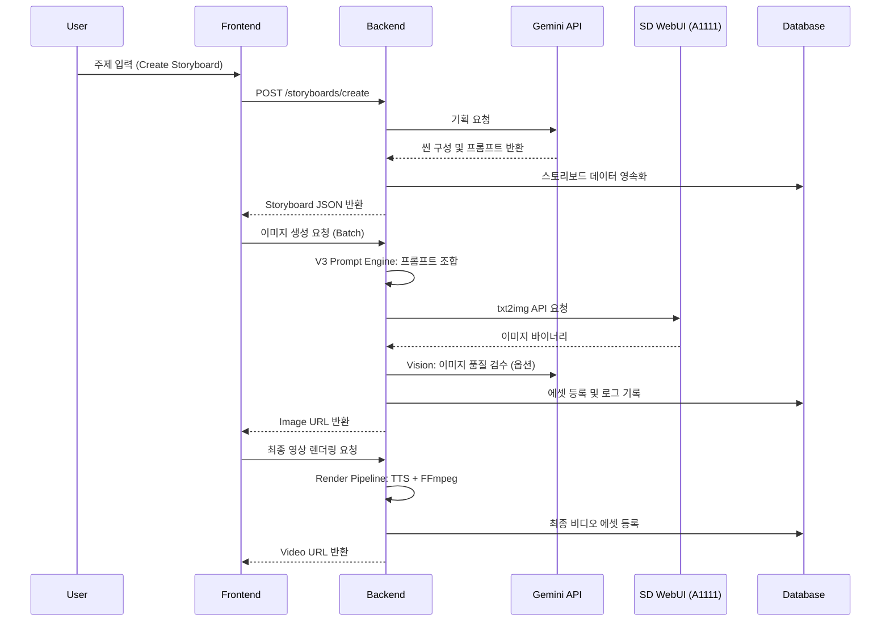

# System Overview

## Abstract
Shorts Producer 시스템의 고수준 아키텍처 다이어그램 및 컴포넌트 간 상호작용 흐름을 다룹니다.

- **API 명세**: [REST API Specification](../api/REST_API.md)
- **개발 로드맵**: [Project Roadmap](../../01_product/ROADMAP.md)

## 1. Architectural Diagram

시스템은 프론트엔드, 백엔드, 로컬 AI(SD WebUI), 클라우드 AI(Gemini), 그리고 Observability 계층으로 구성됩니다.

```mermaid
graph TB
    subgraph Client ["Client Side"]
        User([User])
        UI["Web UI (Next.js/React)"]
        Store["State Management (Zustand 4-Store)"]
    end

    subgraph Backend ["Backend (FastAPI)"]
        Router["API Router (Endpoints)"]

        subgraph AgentLayer ["Agentic Pipeline (LangGraph)"]
            AgentSvc["Script Graph<br/>(Draft→Review→Revise→Finalize)"]
            DebateNode["Debate Node"]
            ResearchNode["Research Node"]
            LearnNode["Learn Node"]
            HumanGate["Human Gate"]
        end

        subgraph Services ["Core Services"]
            StorySvc["Storyboard Service"]
            PromptSvc["V3 Prompt Engine"]
            ImageSvc["Image Generation Service"]
            CreativeSvc["Creative Engine (Multi-Agent)"]
            VideoSvc["Video Render Pipeline"]
            TTSSvc["TTS Service (Qwen3-TTS)"]
            MusicSvc["Music Service (Stable Audio Open)"]
            ValidationSvc["Validation (WD14/Vision)"]
        end

        subgraph Data ["Data & Persistence"]
            DB[("PostgreSQL")]
            MinIO[("MinIO (Object Storage)")]
            FS["Local FS (Temporary)"]
            Checkpointer["AsyncPostgresSaver<br/>(LangGraph Checkpoint)"]
            MemoryStore["AsyncPostgresStore<br/>(LangGraph Memory)"]
        end
    end

    subgraph Observability ["Observability (Optional)"]
        LangFuse["LangFuse v3<br/>(Trace/Span/Score)"]
        LF_PG[("LangFuse PostgreSQL")]
        LF_CH[("ClickHouse")]
        LF_Redis["Redis"]
    end

    subgraph CloudAI ["Cloud AI (External)"]
        Gemini["<b>Google Gemini API</b><br/>(Text/Vision/Translation)"]
    end

    subgraph LocalAI ["Local AI (Self-Hosted)"]
        SD["<b>Stable Diffusion WebUI</b><br/>(A1111 API)"]
        CN["ControlNet / IP-Adapter"]
        WD14["WD14 ONNX Tagger"]
        Qwen["Qwen3-TTS Engine"]
    end

    %% Client Flows
    User --> UI
    UI <--> Router
    Router --> AgentLayer
    Router --> Services

    %% Agent Pipeline
    AgentSvc <--> Gemini
    AgentSvc --> Checkpointer
    AgentSvc --> MemoryStore
    AgentSvc -.-> LangFuse
    DebateNode <--> Gemini
    ResearchNode <--> Gemini
    LearnNode --> MemoryStore

    %% Core Services
    StorySvc <--> Gemini
    CreativeSvc <--> Gemini
    PromptSvc --> ImageSvc
    ImageSvc <--> SD
    SD <--> CN
    VideoSvc --> FS
    VideoSvc --> MinIO
    VideoSvc --> Qwen
    MusicSvc --> FS

    ValidationSvc <--> WD14
    ValidationSvc <--> Gemini

    Services <--> DB
    Services <--> MinIO

    %% Observability
    LangFuse --> LF_PG
    LangFuse --> LF_CH
    LangFuse --> LF_Redis
```



## 2. 핵심 데이터 흐름 (System Data Flow)

서비스의 주요 워크플로우를 관통하는 데이터 흐름도입니다. 외부 API 연동 부위가 Gemini와 WebUI로 명확히 분리됩니다.



## 3. 아키텍처 패턴 (Architecture Patterns)

### 3.1 Backend: Layered Architecture + SSOT

Python/FastAPI 생태계의 표준 패턴인 **Layered Architecture**를 채택합니다.

```
Router (API 엔드포인트)
  → Service (비즈니스 로직)
    → Repository/ORM (데이터 접근)
```

**선택 근거**: 현재 서비스 규모(라우터 34개, 서비스 40개+)에서 DDD나 Hexagonal은 오버엔지니어링. Layered는 학습 비용이 낮고, FastAPI 공식 가이드와 일치하며, 단일 팀 운영에 최적.

**계층별 역할**:

| 계층 | 디렉토리 | 책임 | 금지 사항 |
|------|----------|------|-----------|
| Router | `routers/` | 요청 검증, 라우팅, 응답 포맷 | 비즈니스 로직 포함 |
| Service | `services/` | 핵심 비즈니스 로직, 외부 API 호출 | 직접 HTTP 응답 생성 |
| Model | `models/` | ORM 정의, 관계 매핑 | 로직 포함 |
| Schema | `schemas.py` | 요청/응답 DTO (Pydantic) | DB 모델 직접 참조 |
| Config | `config.py` | 모든 상수/환경변수 (SSOT) | 개별 파일 하드코딩 |

**SSOT (Single Source of Truth) 원칙**:
- 설정값: `config.py` 단일 관리
- 태그 비즈니스 로직: `services/keywords/` 패키지
- 태그 규칙/별칭/필터: DB 테이블 (`tag_rules`, `tag_aliases`, `tag_filters`)
- 런타임 캐시: startup 시 DB 로드, `/admin/refresh-caches`로 갱신

```
backend/
├── routers/              # API 엔드포인트 (34개)
├── services/
│   ├── agent/            # LangGraph Agentic Pipeline (Phase 9)
│   │   ├── nodes/        # 그래프 노드 (draft, review, revise, finalize, debate, research, learn, human_gate)
│   │   ├── script_graph.py    # LangGraph 그래프 정의
│   │   ├── state.py           # 그래프 상태 스키마
│   │   ├── routing.py         # 조건부 라우팅
│   │   ├── checkpointer.py    # AsyncPostgresSaver 싱글턴
│   │   ├── store.py           # AsyncPostgresStore 싱글턴 (Memory)
│   │   └── observability.py   # LangFuse 콜백 핸들러
│   ├── storyboard/       # 스토리보드 서비스 (패키지)
│   │   ├── crud.py            # CRUD 작업
│   │   ├── scene_builder.py   # 씬 빌드
│   │   └── helpers.py         # 유틸리티
│   ├── script/           # 대본 생성 (Gemini 연동)
│   │   └── gemini_generator.py
│   ├── keywords/         # 태그 시스템 (core, db, cache, validation)
│   ├── prompt/           # V3 12-Layer Prompt Builder
│   ├── creative_tasks/   # Creative Lab 작업 (character, dialogue, scenario, visual)
│   ├── video/            # FFmpeg 렌더링 파이프라인 (builder, effects, filters, encoding)
│   ├── audio/            # TTS + Music 생성 (Stable Audio Open)
│   ├── characters/       # 캐릭터 서비스
│   ├── youtube/          # YouTube OAuth + 업로드
│   ├── image_generation_core.py  # SD WebUI 이미지 생성
│   ├── creative_*.py     # Creative Engine (agents, debate, studio, pipeline, qc)
│   └── rendering.py      # 렌더링 오케스트레이션
├── models/               # SQLAlchemy ORM (27개)
├── schemas.py            # Pydantic DTO
├── config.py             # SSOT 설정
└── templates/            # Jinja2 (Gemini 프롬프트)
```

**향후 전환 시점**: 멀티 테넌트, 마이크로서비스 분리, 외부 API 어댑터 교체(Gemini→GPT 등)가 빈번해지면 Hexagonal 부분 도입 고려.

**서비스 패키지 구조**:
```
services/{domain}/
├── core.py          # 핵심 로직
├── db.py            # DB 쿼리
├── db_cache.py      # 런타임 캐시
├── validation.py    # 입력 검증
└── utils.py         # 헬퍼
```

### 3.2 Frontend: Component-Based + Zustand Flux

React/Next.js 생태계의 표준 패턴인 **Component-Based Architecture**에 **Zustand Flux 패턴**을 결합합니다.

```
User Action → Action (API 호출) → Store 업데이트 → Component 리렌더
```

**선택 근거**: 페이지 4개(Home, Studio, Library, Settings), 독립 스토어 4개 규모에서 FSD(Feature-Sliced Design)나 Clean Architecture는 과도. Zustand는 보일러플레이트가 적고, Redux DevTools 호환.

**상태 관리 구조**:

| 레이어 | 디렉토리 | 책임 |
|--------|----------|------|
| Stores | `store/use*Store.ts` | 독립 스토어 4개 (UI, Context, Storyboard, Render) |
| Actions | `store/actions/` | 비동기 워크플로우, API 호출 |
| Selectors | `store/selectors/` | 파생 상태 계산 |
| Hooks | `hooks/` | 서버 데이터 동기화 (React Query 미사용) |
| Components | `components/` | 프레젠테이션 (UI 렌더링) |

**데이터 흐름 (단방향)**:
```
components/studio/ScriptTab.tsx   ← UI 이벤트 발생
  → store/actions/storyboardActions.ts ← API 호출 + 비즈니스 로직
    → store/useStoryboardStore.ts      ← 상태 변경
      → components/ 리렌더             ← 구독한 컴포넌트만 업데이트
```

**서버 동기화 패턴** (Custom Hooks, TanStack Query 미사용):
```
hooks/useCharacters.ts       → axios GET → 로컬 state + Store 업데이트
hooks/useTags.ts             → axios GET → 캐싱 + 필터링
hooks/useAutopilot.ts        → 단계별 API 호출 조율
hooks/useYouTubeUpload.ts    → YouTube OAuth + 업로드 워크플로우
hooks/useProjectGroups.ts    → Project/Group CRUD + 선택
hooks/useBackendHealth.ts    → Backend 연결 상태 polling (ConnectionGuard 연동)
hooks/useScriptEditor.ts     → 대본 에디터 상태 관리
hooks/useStudioKanban.ts     → 스튜디오 칸반 뷰 관리
```

```
frontend/app/
├── (app)/
│   ├── page.tsx            # Home 대시보드 (랜딩)
│   ├── studio/             # 스튜디오 페이지 (메인 워크플로우)
│   ├── library/            # 라이브러리 (캐릭터, 태그, 스타일 프로필 관리)
│   ├── settings/           # 설정 (프리셋, 모델, 시스템 설정)
│   ├── storyboards/        # 스토리보드 목록/상세
│   ├── scripts/            # 대본 관리
│   ├── backgrounds/        # 배경 에셋
│   ├── characters/         # 캐릭터 상세
│   ├── voices/             # 음성 프리셋
│   ├── music/              # BGM 관리
│   ├── lab/                # Creative Lab (비활성)
│   └── pipeline-demo/      # 파이프라인 데모
├── store/
│   ├── useUIStore.ts         # UI 상태 (탭, 모달, 사이드바)
│   ├── useContextStore.ts    # 컨텍스트 (프로젝트, 그룹 선택)
│   ├── useStoryboardStore.ts # 스토리보드 데이터
│   ├── useRenderStore.ts     # 렌더링 상태
│   ├── resetAllStores.ts     # 전체 스토어 리셋
│   ├── actions/              # 비동기 액션 (15개)
│   └── selectors/            # 파생 상태
├── components/
│   ├── home/             # Home 대시보드 (VideoFeed, QuickStats, Showcase 등)
│   ├── studio/           # 3탭 컨테이너 (ScriptTab, ScenesTab, PublishTab)
│   ├── storyboard/       # 씬 편집 UI
│   ├── video/            # 렌더링 설정 + VideoPreviewHero
│   ├── setup/            # 캐릭터/스타일 설정
│   ├── lab/              # Creative Lab 컴포넌트
│   ├── shell/            # 앱 레이아웃 (AppShell, ConnectionGuard)
│   ├── context/          # 프로젝트/그룹 관리
│   └── ui/               # 공통 컴포넌트 (Toast, Modal 등)
├── hooks/                # 서버 동기화 훅 (25개+)
├── constants/            # 상수 정의
├── types/                # TypeScript 타입
└── utils/                # 유틸리티 함수
```

**향후 전환 시점**: 페이지/기능이 크게 증가하면 Module-Based 도메인 분리 또는 FSD 고려.

### 3.3 공통 설계 원칙

| 원칙 | 기준 |
|------|------|
| 함수/메서드 | 30줄 권장, 50줄 최대 |
| 클래스/컴포넌트 | 150줄 권장, 200줄 최대 |
| 코드 파일 | 300줄 권장, 400줄 최대 |
| 중첩 깊이 | 3단계 이하 |
| 매개변수 | 4개 이하 |
| 테스트 커버리지 | Backend 80%, Frontend 70% |

**TDD**: 서비스/코어 로직은 테스트 먼저 작성 (Red → Green → Refactor)
**API 스펙 = 진실**: API/스키마 변경 시 문서 즉시 업데이트 (drift = 버그 취급)
**Main 브랜치 항상 배포 가능**: 실험적 코드는 feature 브랜치에서 진행

## 4. 기술 스택 (Tech Stack)

### Core
- **Frontend**: Next.js 15 (Turbopack), React 19, TypeScript, Tailwind CSS, Zustand 5
- **Backend**: FastAPI, Python 3.12, SQLAlchemy 2.0 (ORM)
- **Pages**: 4개 (Home, Studio, Library, Settings)

### AI & Media
- **LLM/LVM**: Google Gemini 2.0 Flash (Storyboard, Prompt, Vision), Gemini 2.5 Flash (Image Generation)
- **Workflow**: LangGraph (Agentic Pipeline: Draft → Review → Revise → Finalize)
- **Checkpointer**: AsyncPostgresSaver (psycopg v3, LangGraph 체크포인트)
- **Memory**: AsyncPostgresStore (LangGraph Memory Store)
- **Image**: Stable Diffusion WebUI (A1111) + ControlNet v1.1 + IP-Adapter Plus
- **TTS**: Qwen3-TTS (12Hz-1.7B-VoiceDesign)
- **Music**: Stable Audio Open 1.0 (AI BGM 생성)
- **Validation**: WD14 (Waifu Diffusion v1.4) Vit-Tagger-v2 (ONNX)
- **Video**: FFmpeg (Filter complex, Ken Burns effect)

### Infrastructure
- **Database**: PostgreSQL (Relational Data)
- **Storage**: MinIO (S3 Compatible Object Storage) / Local (개발 모드)
- **Observability**: LangFuse v3 (셀프호스팅, Docker Compose: PostgreSQL + ClickHouse + Redis + MinIO + Web + Worker)
- **YouTube**: OAuth 2.0 (영상 업로드)
- **Environment**: Docker, uv (Python Package Manager)
