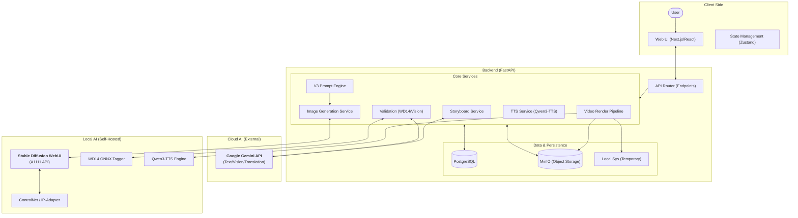
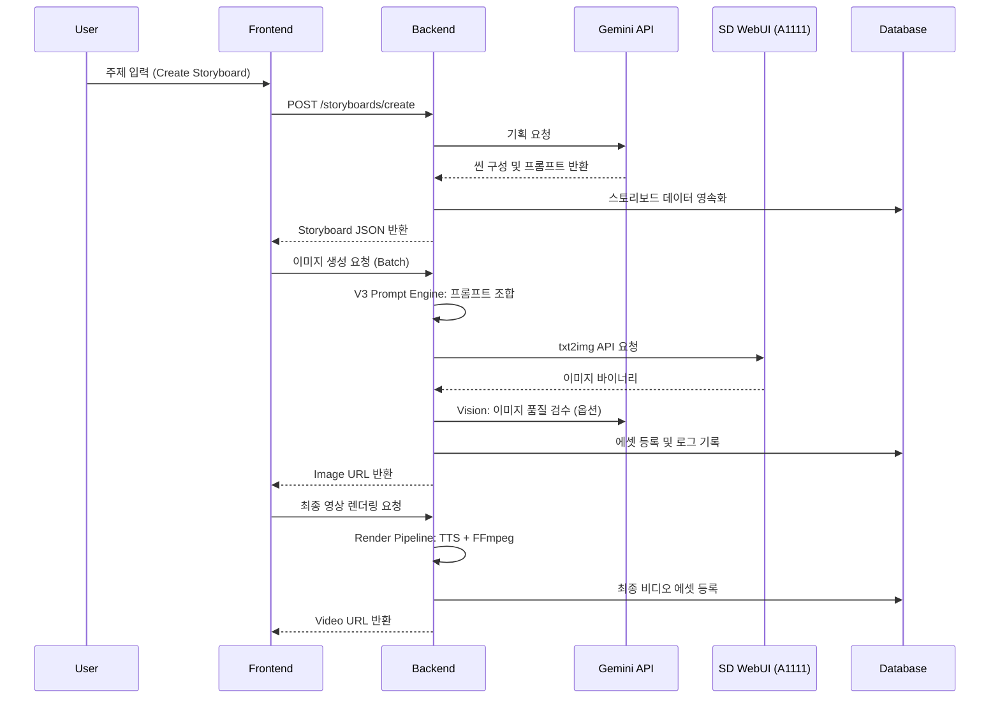

# System Overview

## Abstract
Shorts Producer 시스템의 고수준 아키텍처 다이어그램 및 컴포넌트 간 상호작용 흐름을 다룹니다.

## 1. Architectural Diagram

시스템은 프론트엔드, 백엔드, 그리고 수동 구축되는 로컬 AI(SD WebUI)와 클라우드 AI(Gemini) 계층으로 세분화됩니다.

## 2. 핵심 데이터 흐름 (System Data Flow)

서비스의 주요 워크플로우를 관통하는 데이터 흐름도입니다. 외부 API 연동 부위가 Gemini와 WebUI로 명확히 분리됩니다.

## 3. 기술 스택 (Tech Stack)

### Core
- **Frontend**: Next.js 14, TypeScript, Tailwind CSS, Zustand
- **Backend**: FastAPI, Python 3.12, SQLModel (SQLAlchemy)

### AI & Media
- **LLM/LVM**: Google Gemini 2.0 Flash (Storyboard, Prompt, Vision)
- **Image**: Stable Diffusion WebUI (A1111) + ControlNet v1.1 + IP-Adapter Plus
- **TTS**: Qwen3-TTS (12Hz-1.7B-VoiceDesign)
- **Validation**: WD14 (Waifu Diffusion v1.4) Vit-Tagger-v2 (ONNX)
- **Video**: FFmpeg (Filter complex, Ken Burns effect)

### Infrastructure
- **Database**: PostgreSQL (Relational Data)
- **Storage**: MinIO (S3 Compatible Object Storage)
- **Environment**: Docker, uv (Python Package Manager)
