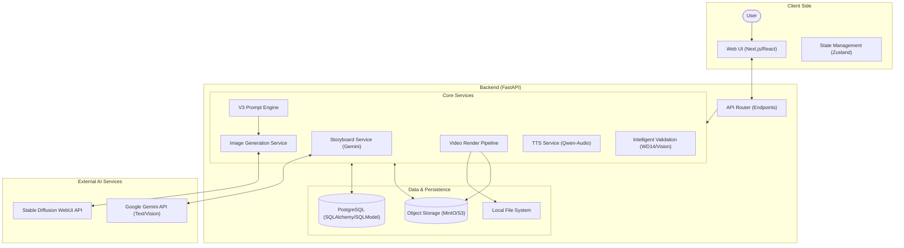
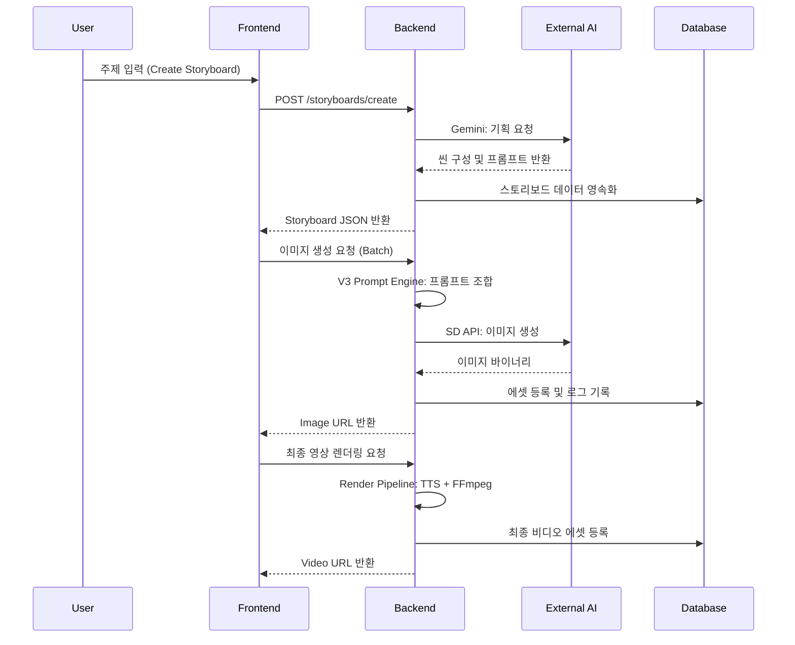

# System Overview

## Abstract
Shorts Producer 시스템의 고수준 아키텍처 다이어그램 및 컴포넌트 간 상호작용 흐름을 다룹니다.

## 1. Architectural Diagram

시스템은 크게 사용자와 소통하는 **Frontend**, 핵심 비즈니스 로직을 수행하는 **Backend**, 그리고 외부 AI 서비스 계층으로 구성됩니다.

## 2. 핵심 데이터 흐름 (System Data Flow)

서비스의 주요 워크플로우를 관통하는 데이터 흐름도입니다.

