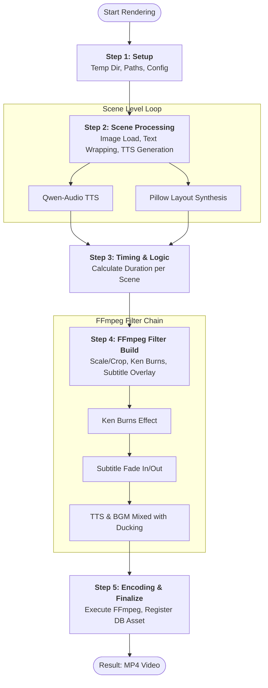
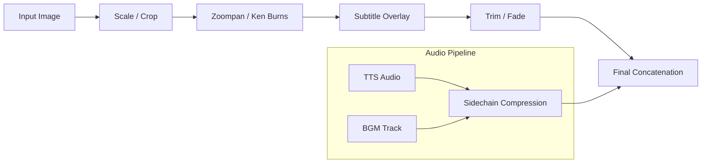

# Render Pipeline Specification

## Abstract
본 문서는 `backend/services/video.py`의 `VideoBuilder` 클래스를 통해 수행되는 영상 렌더링 파이프라인의 명세를 다룹니다. FFmpeg 필터 구성, Ken Burns 효과, 자막 렌더링 및 레이아웃 관리 로직을 포함합니다.

## 1. Pipeline Workflow

영상 생성은 설정(Setup)부터 인코딩(Encoding)까지 총 5단계의 파이프라인 프로세스를 거칩니다.

## 2. FFmpeg 필터 체인 (Filter Chain) 기술 명세

각 씬의 비디오 트랙은 다음과 같은 순서로 필터링됩니다.

-   **Full Layout 크롭 전략**: 2:3 해상도 이미지를 9:16으로 변환 시, 캐릭터의 머리 부분을 보존하기 위해 상단에서 30% 지점을 기준으로 크롭합니다 (`ih-oh)*0.3`).
-   **자막 오버레이**: 자막은 0.3초의 Fade In/Out 애니메이션을 포함하며, 영상 모션과 독립적으로 유지하기 위해 Ken Burns 효과 이후에 합성됩니다.

## 3. 레이아웃 관리 및 효과 구현 상세
*(기능 상세 설명 생략 - 기존 문서 내용 유지)*
...
