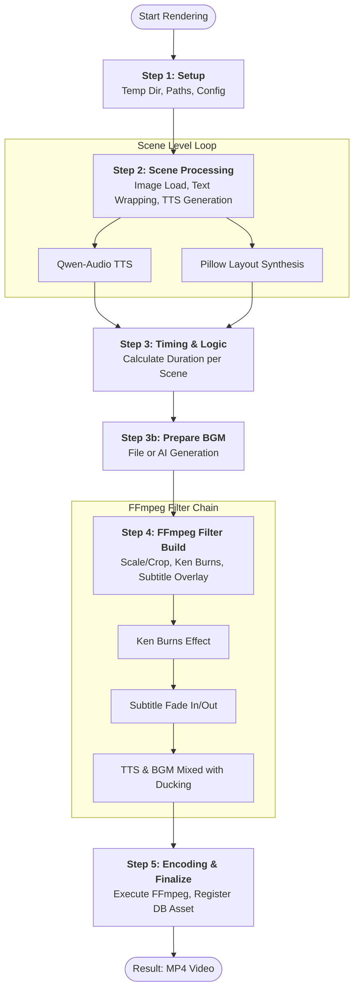
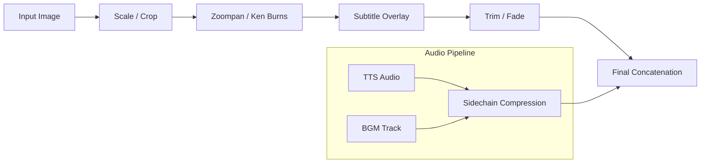

# Render Pipeline Specification

## Abstract
본 문서는 `backend/services/video.py`의 `VideoBuilder` 클래스를 통해 수행되는 영상 렌더링 파이프라인의 명세를 다룹니다. FFmpeg 필터 구성, Ken Burns 효과, 자막 렌더링 및 레이아웃 관리 로직을 포함합니다.

## 1. Pipeline Workflow

영상 생성은 설정(Setup)부터 인코딩(Encoding)까지 총 5단계의 파이프라인 프로세스를 거칩니다.

## 2. FFmpeg 필터 체인 (Filter Chain) 기술 명세

각 씬의 비디오 트랙은 다음과 같은 순서로 필터링됩니다.

-   **Full Layout 크롭 전략**: 2:3 해상도 이미지를 9:16으로 변환 시, 캐릭터의 머리 부분을 보존하기 위해 상단에서 30% 지점을 기준으로 크롭합니다 (`ih-oh)*0.3`).
-   **자막 오버레이**: 자막은 0.3초의 Fade In/Out 애니메이션을 포함하며, 영상 모션과 독립적으로 유지하기 위해 Ken Burns 효과 이후에 합성됩니다. **피사체(얼굴) 보호 및 플랫폼 UI 가독성을 위해 하단 Safe Zone(약 70% 지점)에 배치됩니다.**

## 3. 레이아웃 관리 및 효과 구현 상세
*(기능 상세 설명 생략 - 기존 문서 내용 유지)*
...

## 4. BGM Pipeline

배경음악 처리는 `bgm_mode` 설정에 따라 두 가지 경로로 나뉩니다.

### 4.1. File Mode vs AI Mode

1.  **File Mode (`bgm_mode="file"`)**:
    -   `bgm_file` 필드에 지정된 정적 오디오 파일을 사용합니다.
    -   `assets/audio/` 디렉토리 내의 파일을 참조합니다.
    -   `"random"` 값일 경우, 해당 디렉토리에서 무작위로 파일을 선택합니다.

2.  **AI Mode (`bgm_mode="ai"`)**:
    -   `music_preset_id`를 통해 `MusicPreset` 정보를 조회합니다.
    -   **캐시 확인**: 프리셋에 연결된 `audio_asset_id`가 있고 해당 파일이 로컬에 존재하면 즉시 사용합니다.
    -   **실시간 생성**: 캐시가 없을 경우, `Stable Audio Open` 모델을 통해 즉석에서 BGM을 생성합니다 (약 10-20초 소요).
    -   생성된 파일은 임시 디렉토리에 저장되어 렌더링에 사용됩니다.

### 4.2. Audio Ducking (Sidechain Compression)

나레이션(TTS)이 나올 때 배경음악의 볼륨을 자동으로 줄여 목소리를 명확하게 전달합니다.

-   **Threshold**: 0.01 (TTS 신호 감지 임계값)
-   **Ratio**: `bgm_volume` 설정값 비례 (보통 0.2~0.3 수준으로 감소)
-   **Release**: TTS 종료 후 즉시 볼륨 복귀
