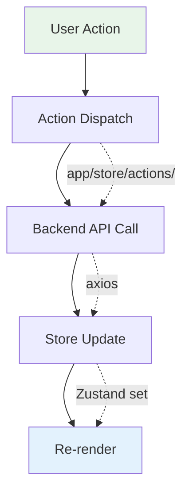
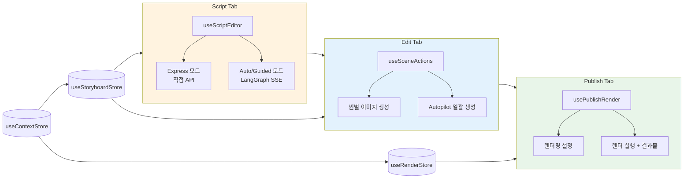
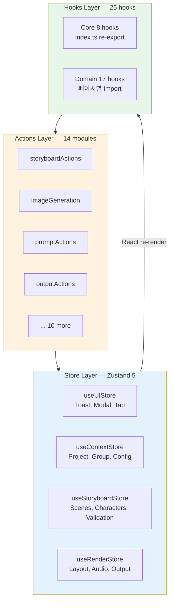

# Frontend State Management

**최종 업데이트**: 2026-02-27

> Shorts Producer 프론트엔드(Next.js 16, React 19)의 상태 관리 전략. Zustand 5 기반 4-Store 구조와 커스텀 훅을 통한 서버 데이터 연동.

---

## 1. 전역 상태 관리 (Zustand 4-Store 구조)

관심사별 4개 독립 스토어. 각 스토어는 독립적인 persistence 정책을 가지며, `resetAllStores()` 유틸리티를 통해 일괄 초기화됩니다.

### Store 구조 개요

| Store | 파일 | 역할 | Persistence |
|-------|------|------|-------------|
| **`useUIStore`** | `store/useUIStore.ts` | Toast, Modal, 탭 상태, 전역 UI 상태 | 없음 (메모리만) |
| **`useContextStore`** | `store/useContextStore.ts` | Project/Group 컨텍스트, Cascading Config | 부분 (`projectId`, `groupId`, `storyboardId`, `storyboardTitle`) |
| **`useStoryboardStore`** | `store/useStoryboardStore.ts` | Storyboard + Scenes 데이터, 편집 상태 | 부분 (transient 필드 제외) |
| **`useRenderStore`** | `store/useRenderStore.ts` | 렌더링 설정, 결과물, Style Profile | 부분 (transient 필드 제외) |

### `useUIStore` 상세

Toast 큐, 네비게이션 탭, 모달/프리뷰 상태 등 순수 UI 상태를 관리합니다. Persistence 없음.

```typescript
interface UIState {
  // Toast queue
  toasts: ToastItem[];
  // Navigation
  activeTab: StudioTab;         // "script" | "edit" | "publish"
  rightPanelTab: RightPanelTab; // "image" | "tools" | "insight"
  // Modals / Previews
  imagePreviewSrc: string | null;
  imagePreviewCandidates: string[] | null;
  videoPreviewSrc: string | null;
  showResumeModal: boolean;
  resumableCheckpoint: AutopilotCheckpoint | null;
  showPreflightModal: boolean;
  isHelperOpen: boolean;
  // Prompt helper
  examplePrompt: string;
  suggestedBase: string;
  suggestedScene: string;
  isSuggesting: boolean;
  copyStatus: string;
  // Setup wizard
  showSetupWizard: boolean;
  setupWizardInitialStep: 1 | 2;
  // New storyboard mode
  isNewStoryboardMode: boolean;
  // Autopilot lock
  isAutoRunning: boolean;
  pendingAutoRun: boolean;
  // Preferences
  showAdvancedSettings: boolean;
  showLabMenu: boolean;
}
```

### `useContextStore` 상세

Cascading Config 시스템의 프론트엔드 상태를 관리합니다. `projectId`/`groupId`/`storyboardId`/`storyboardTitle`만 localStorage에 영속화하고, effective 설정은 런타임에 API에서 재로드합니다.

```typescript
interface ContextState {
  // Persisted
  projectId: number | null;
  groupId: number | null;
  storyboardId: number | null;
  storyboardTitle: string;
  // Transient (re-fetched on mount)
  projects: ProjectItem[];
  groups: GroupItem[];
  isLoadingProjects: boolean;
  isLoadingGroups: boolean;
  // Effective config (runtime-derived from group/project)
  effectivePresetName: string | null;
  effectivePresetSource: string | null;  // "project" | "group" | "system_default"
  effectiveStyleProfileId: number | null;
  effectiveCharacterId: number | null;
  effectiveConfigLoaded: boolean;
  // SD parameter overrides (StyleProfile cascade)
  effectiveSdSteps: number | null;
  effectiveSdCfgScale: number | null;
  effectiveSdSamplerName: string | null;
  effectiveSdClipSkip: number | null;
}
```

### `useStoryboardStore` 상세

현재 작업 중인 스토리보드의 콘텐츠 플랜, 캐릭터 설정, 프롬프트 설정, 씬 데이터를 관리합니다.

```typescript
interface StoryboardStore {
  // Content plan
  topic: string;
  description: string;
  duration: number;
  style: string;
  language: string;
  structure: string;
  actorAGender: ActorGender;
  // Character A
  selectedCharacterId: number | null;
  selectedCharacterName: string | null;
  characterPromptMode: "auto" | "standard" | "lora";
  loraTriggerWords: string[];
  characterLoras: LoraEntry[];
  // Character B
  selectedCharacterBId: number | null;
  selectedCharacterBName: string | null;
  characterBLoras: LoraEntry[];
  basePromptB: string;
  baseNegativePromptB: string;
  // Prompt settings
  basePromptA: string;
  baseNegativePromptA: string;
  autoComposePrompt: boolean;
  autoRewritePrompt: boolean;
  autoReplaceRiskyTags: boolean;
  hiResEnabled: boolean;
  veoEnabled: boolean;
  // ControlNet / IP-Adapter
  useControlnet: boolean;
  controlnetWeight: number;
  useIpAdapter: boolean;
  ipAdapterReference: string;
  ipAdapterWeight: number;
  ipAdapterReferenceB: string;
  ipAdapterWeightB: number;
  // Scenes
  scenes: Scene[];
  currentSceneIndex: number;
  isGenerating: boolean;
  multiGenEnabled: boolean;
  referenceImages: ReferenceImage[];
  // Validation
  validationResults: Record<string, SceneValidation>;
  validationSummary: { ok: number; warn: number; error: number };
  imageValidationResults: Record<string, ImageValidation>;
  validatingSceneId: string | null;
  markingStatusSceneId: string | null;
  // UI state per scene
  sceneTab: Record<string, "validate" | "debug" | null>;
  sceneMenuOpen: string | null;
  advancedExpanded: Record<string, boolean>;
  suggestionExpanded: Record<string, boolean>;
  validationExpanded: Record<string, boolean>;
  // Image generation progress (SSE)
  imageGenProgress: Record<string, ImageGenProgress>;
  // Optimistic locking
  storyboardVersion: number | null;
  // Dirty flag
  isDirty: boolean;
}
```

**Transient 필드** (persistence 제외): `isDirty`, `isGenerating`, `validatingSceneId`, `markingStatusSceneId`, `sceneTab`, `sceneMenuOpen`, `advancedExpanded`, `suggestionExpanded`, `validationExpanded`, `validationResults`, `validationSummary`, `imageValidationResults`, `imageGenProgress`, `loraTriggerWords`, `characterLoras`, `characterPromptMode`.

### `useRenderStore` 상세

렌더링 설정, Style Profile, 출력물 관리를 담당합니다.

```typescript
interface RenderStore {
  // Style Profile
  currentStyleProfile: {
    id: number;
    name: string;
    display_name: string | null;
    sd_model_name: string | null;
    loras: { name: string; trigger_words: string[]; weight: number }[];
    negative_embeddings: { name: string; trigger_word: string }[];
    positive_embeddings: { name: string; trigger_word: string }[];
    default_positive: string | null;
    default_negative: string | null;
  } | null;
  // Layout & Effects
  layoutStyle: "full" | "post";
  frameStyle: string;
  kenBurnsPreset: KenBurnsPreset;
  kenBurnsIntensity: number;
  transitionType: string;
  isRendering: boolean;
  includeSceneText: boolean;
  // Audio
  bgmList: AudioItem[];
  bgmFile: string | null;
  bgmMode: "file" | "ai";
  audioDucking: boolean;
  bgmVolume: number;
  speedMultiplier: number;
  ttsEngine: "qwen";
  voiceDesignPrompt: string;
  voicePresetId: number | null;
  musicPresetId: number | null;
  // Font / Scene Text
  fontList: FontItem[];
  sceneTextFont: string;
  loadedFonts: Set<string>;
  // Caption / Overlay
  videoCaption: string;
  videoLikesCount: string;
  overlaySettings: OverlaySettings;
  postCardSettings: PostCardSettings;
  overlayAvatarUrl: string | null;
  postAvatarUrl: string | null;
  // Output
  videoUrl: string | null;
  videoUrlFull: string | null;
  videoUrlPost: string | null;
  recentVideos: RecentVideo[];
  renderProgress: RenderProgress | null;
}
```

**Transient 필드** (persistence 제외): `isRendering`, `renderProgress`, `bgmList`, `fontList`, `loadedFonts`, `sceneTextFont`, `overlayAvatarUrl`, `postAvatarUrl`.

### `resetAllStores()` (일괄 초기화)

`store/resetAllStores.ts`에서 4개 스토어를 일괄 리셋합니다. `projectId`/`groupId`는 보존하여 컨텍스트 유지.

```typescript
async function resetAllStores(options?: { reloadGroupDefaults?: boolean }) {
  // 1. 컨텍스트 보존 (projectId, groupId)
  // 2. localStorage에서 storyboard/render 키 삭제
  // 3. 4개 스토어 reset 호출
  // 4. 보존된 컨텍스트 복원
  // 5. reloadGroupDefaults → groupActions.loadGroupDefaults() 호출
}
```

### Persistence 전략

- `useContextStore`: `persist` 미들웨어, `partialize`로 transient 필드 제외.
- `useStoryboardStore`: `persist` 미들웨어, `?new=true` URL 파라미터 시 pre-hydration cleanup.
- `useRenderStore`: `persist` 미들웨어, `Set` 타입 필드 자동 제외.
- `useUIStore`: persistence 없음 (순수 메모리 상태).
- `useDraftPersistence` 훅: 드래프트 자동 저장/복원 연동.

---

## 2. Actions (비동기 액션)

`app/store/actions/` 폴더에서 도메인별 비동기 액션을 관리합니다.

| 파일 | 역할 |
|------|------|
| `autopilotActions.ts` | Compose -> Generate -> Validate 워크플로우 |
| `batchActions.ts` | 배치 이미지 생성 |
| `groupActions.ts` | Group CRUD 및 선택, loadGroupDefaults |
| `imageActions.ts` | 이미지 생성 오케스트레이션 (facade) |
| `imageGeneration.ts` | SD 이미지 생성 (SSE progress) |
| `imageProcessing.ts` | 이미지 저장/검증/후처리 |
| `outputActions.ts` | 렌더링 결과물 관리 |
| `projectActions.ts` | Project CRUD 및 선택 |
| `promptActions.ts` | 프롬프트 Compose/Rewrite |
| `promptHelperActions.ts` | 프롬프트 보조 (split, suggest) |
| `sceneActions.ts` | 씬 편집/순서 변경 |
| `storyboardActions.ts` | 스토리보드 CRUD/로드/저장 |
| `styleProfileActions.ts` | Style Profile 선택/적용 |
| `youtubeActions.ts` | YouTube OAuth 및 업로드 |

> `imageActions.ts`가 `imageGeneration.ts` + `imageProcessing.ts`로 분리됨. `imageActions.ts`는 facade로 유지.

---

## 3. Selectors

`app/store/selectors/` 폴더에서 파생 상태를 계산합니다.

| 파일 | 역할 |
|------|------|
| `projectSelectors.ts` | 현재 프로젝트/그룹 관련 파생 상태 (`getCurrentProject`, `hasValidProfile`, `getChannelAvatarUrl`, `resolveAvatarUrl`) |

---

## 4. 서버 데이터 연동 (Custom Hooks & Axios)

React Query 대신, 도메인별 커스텀 훅을 통해 `axios`로 데이터를 페칭하고 로컬 상태(`useState`)로 관리하는 패턴을 사용합니다.

### 코어 Hooks (index.ts에서 re-export)

| Hook | 역할 |
|------|------|
| **`useAutopilot`** | 복합 생성 시퀀스 (Compose -> Generate -> Validate) 워크플로우 제어 |
| **`useCharacters`** | 캐릭터 목록 및 선택 관리 |
| **`useDraftPersistence`** | localStorage 드래프트 자동 저장/복원 |
| **`useStudioInitialization`** | 스튜디오 페이지 초기화 (데이터 로드, 컨텍스트 설정) |
| **`useStudioOnboarding`** | 첫 실행 온보딩 가이드 |
| **`useTagClassifier`** | 태그 자동 분류 |
| **`useBackendHealth`** | Backend 연결 상태 감지 (10초 polling, 3회 실패 threshold) |
| **`useTags`** | 태그 목록 조회 및 그룹화 |

### 도메인 Hooks

| Hook | 역할 |
|------|------|
| **`usePublishRender`** | 렌더링 워크플로우 통합 (BGM/폰트 리스트 로드, 렌더 실행, BGM 프리뷰) |
| **`useScriptEditor`** | Script 탭 통합 에디터 (Interaction Mode, LangGraph AI Agent SSE) |
| **`useSceneActions`** | Scene 편집 공통 액션 (추가/삭제/핀/업데이트, IP-Adapter/배경 로드) |
| **`useCharacterAutoLoad`** | 캐릭터 변경 시 LoRA/프롬프트/IP-Adapter 자동 로드 |
| **`useProjectGroups`** | Project/Group 목록 로드 및 CRUD |
| **`useStudioKanban`** | 칸반 보드 스토리보드 목록 (draft/in_prod/rendered/published) |
| **`useStoryboards`** | 스토리보드 목록 로드 (Library 페이지) |
| **`useTagValidation`** | 태그 충돌/의존성 검증 |
| **`usePresets`** | 프리셋/언어/스텝 메타데이터 로드 |
| **`useVoicePresets`** | 음성 프리셋 CRUD 및 TTS 미리듣기 |
| **`useMusic`** | AI 음악 프리셋 CRUD 및 생성 |
| **`useBackgrounds`** | 배경 에셋 CRUD |
| **`useMaterialsCheck`** | 렌더링 사전 준비물 체크 (스크립트, 캐릭터, 음성 등) |
| **`useYouTubeUpload`** | YouTube OAuth 연동 및 영상 업로드 워크플로우 |
| **`useKeyboardShortcuts`** | 키보드 단축키 바인딩 (Cmd+S 등) |
| **`useStepReview`** | Creative Lab 단계별 리뷰 (Lab 전용) |
| **`useFocusTrap`** | 모달 포커스 트랩 (접근성) |

---

## 5. 페이지 구조

```
(app)/
  page.tsx                  # Home (대시보드)
  studio/page.tsx           # Studio (3탭: Script / Edit / Publish)
  library/page.tsx          # Library (7탭: Characters, Backgrounds, Styles, Voices, Music, Prompts, Tags)
  settings/page.tsx         # Settings (5탭: General, Memory, Presets, YouTube, Trash)
  characters/page.tsx       # 캐릭터 목록
  characters/[id]/page.tsx  # 캐릭터 상세
  characters/new/page.tsx   # 캐릭터 신규 생성
  storyboards/page.tsx      # 스토리보드 관리
  voices/page.tsx           # 음성 프리셋 관리
  music/page.tsx            # 음악 프리셋 관리
  backgrounds/page.tsx      # 배경 에셋 관리
  scripts/page.tsx          # 스크립트 관리
  lab/page.tsx              # Lab (실험 기능)
  pipeline-demo/page.tsx    # 파이프라인 데모
```

---

## 6. 데이터 흐름 패턴

### 기본 흐름



### Studio 3-Tab 워크플로우



| 탭 | 주요 훅 | 스토어 | 설명 |
|----|---------|--------|------|
| Script | `useScriptEditor` | StoryboardStore | Express(직접 API) / Auto/Guided(LangGraph SSE) 모드 |
| Edit | `useSceneActions`, `useCharacterAutoLoad` | StoryboardStore | 씬 편집, LoRA 자동 로드, Autopilot |
| Publish | `usePublishRender`, `useMaterialsCheck` | RenderStore | 사전 체크 → 렌더 실행 |
| 공통 | — | ContextStore | Project/Group 선택 → effective 설정 cascade |

---

### 3-Layer 아키텍처


