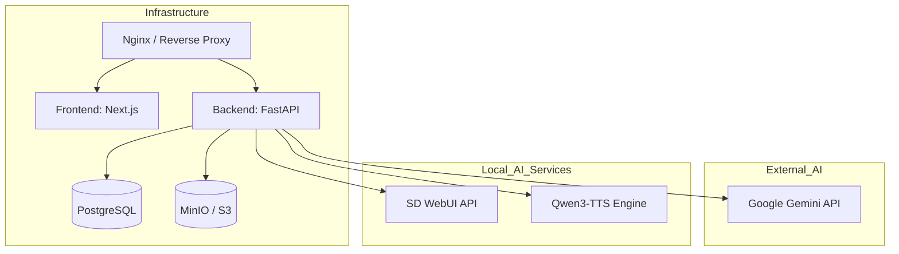

# Deployment Guide

Shorts Producer 시스템을 프로덕션 환경에 배포하고 운영하기 위한 전체 프로세스 안내입니다.

## 1. 전체 배포 아키텍처



## 2. 필수 서비스 구축 (Setup Guides)

본 시스템은 다수의 AI 모듈과 인프라를 연동합니다. 각 모듈의 상세 구축 방법은 아래 가이드를 참조하세요.

1.  **인프라 구축**: [Storage & DB Setup](STORAGE_SETUP.md) (PostgreSQL, MinIO)
2.  **이미지 생성 서버**: [SD WebUI Setup](SD_WEBUI_SETUP.md) (Stable Diffusion, ControlNet)
3.  **음성 생성 엔진**: [TTS Setup](TTS_SETUP.md) (Qwen3-TTS)
4.  **이미지 검증 모델**: [WD14 Setup](WD14_SETUP.md) (ONNX Tagger)

## 3. 백엔드 배포 단계

### 3.1 환경 변수 설정
`backend/.env` 파일을 작성합니다. [STORAGE_POLICY.md](STORAGE_POLICY.md)를 참조하여 저장소 모드를 결정하세요.

### 3.2 의존성 설치 및 실행
```bash
cd backend
python -m venv venv
source venv/bin/activate
pip install -r requirements.txt
# 또는 uv 사용 권장
uv pip install -r requirements.txt

# DB 마이그레이션
alembic upgrade head

# 서버 실행 (Production)
uvicorn main:app --host 0.0.0.0 --port 8000 --workers 4
```

## 4. 프론트엔드 배포 단계

```bash
cd frontend
npm install
npm run build
npm run start
```

## 5. 지속적 유지보수

-   **포즈 데이터 보강**: [Pose Maintenance](POSE_MAINTENANCE.md)
-   **에셋 관리 정책**: [Storage Policy](STORAGE_POLICY.md)
-   **캐릭터 고도화**: [Character Control Guide](CHARACTER_CONTROL_GUIDE.md)
