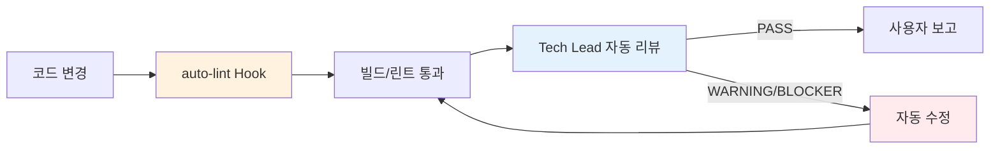

# Contributing Guide

**최종 업데이트**: 2026-02-19

> Shorts Producer 개발 참여 가이드. 코드 기여, AI 파이프라인 변경, 문서 관리 규칙을 다룹니다.

**Core Mindset**: "Move Fast, Stay Solid"

---

## 1. 개발 환경 설정

### 사전 요구사항

| 도구 | 버전 | 용도 |
|------|------|------|
| Python | 3.13+ | Backend |
| Node.js | 20+ | Frontend |
| PostgreSQL | 15+ | Database |
| uv | latest | Python 패키지 관리 |
| SD WebUI | `--api` 모드 | 이미지 생성 |
| MinIO | latest | S3 호환 스토리지 |
| LangFuse | self-hosted | 파이프라인 트레이싱 |

### Backend

```bash
cd backend
cp .env.example .env          # 환경변수 설정 (DATABASE_URL, GEMINI_API_KEY 등)
uv sync                       # 의존성 설치
uv run alembic upgrade head   # DB 마이그레이션
uv run uvicorn main:app --reload --port 8000
```

### Frontend

```bash
cd frontend
npm install
cp .env.example .env.local    # NEXT_PUBLIC_API_URL 등
npm run dev                   # http://localhost:3000
```

### 접속 정보

| 서비스 | URL |
|--------|-----|
| Frontend | http://localhost:3000 |
| Backend API | http://localhost:8000 |
| API Docs (Swagger) | http://localhost:8000/docs |
| MinIO Console | http://localhost:9001 |
| LangFuse | http://localhost:3001 |

---

## 2. 핵심 원칙

### 브랜치 & 배포

- `main` 브랜치는 항상 동작해야 한다. **"지금 데모 가능한가?"** 체크.
- 실험적 코드는 `feature/*` 브랜치에서 작업.
- "작동하는 코드"가 최우선. 리팩토링은 별도 Phase에서 집중 수행.

### SSOT (Single Source of Truth)

동일한 규칙을 여러 문서에 중복 기재하지 않습니다. **SSOT 문서를 정하고 나머지는 링크로 참조**.

| 주제 | SSOT 문서 |
|------|-----------|
| 아키텍처, 도메인 규칙, 태그 규칙, DB 규칙 | [`CLAUDE.md`](../../CLAUDE.md) |
| Frontend 코딩 표준 (TypeScript) | [`CODING_STANDARDS.md`](../03_engineering/frontend/CODING_STANDARDS.md) |
| DB 스키마 상세 | [`DB_SCHEMA.md`](../03_engineering/architecture/DB_SCHEMA.md) |
| API 명세 (Backend↔Frontend 계약) | [`REST_API.md`](../03_engineering/api/REST_API.md) |
| 테스트 전략, 커버리지 기준, TDD | [`TEST_STRATEGY.md`](../03_engineering/testing/TEST_STRATEGY.md) |
| 로드맵, 기능 명세 | [`ROADMAP.md`](../01_product/ROADMAP.md), [`FEATURES/`](../01_product/FEATURES/) |
| 제품 스펙 | [`PRD.md`](../01_product/PRD.md) |
| 트러블슈팅 | [`TROUBLESHOOTING.md`](../04_operations/TROUBLESHOOTING.md) |

### 문서 업데이트 타이밍

| 이벤트 | 업데이트 대상 |
|--------|--------------|
| API 변경 (엔드포인트/스키마) | `REST_API.md` — 해당 PR에 포함 필수 |
| Phase 완료 | `PRD.md` DoD 체크리스트, `ROADMAP.md` |
| 이슈 해결 | `TROUBLESHOOTING.md` — 반복 이슈 즉시 추가 |
| Tag 시스템 변경 | DB 리발란싱 실행 (아래 섹션 참조) |

---

## 3. 개발 워크플로우

### 커밋 메시지 (Conventional Commits)

```
<type>: <description>

Co-Authored-By: Claude Opus 4.6 <noreply@anthropic.com>
```

| Type | 용도 | 예시 |
|------|------|------|
| `feat` | 새 기능 | `feat: Studio 칸반 보드 추가` |
| `fix` | 버그 수정 | `fix: 이미지 팝업이 오버레이에 가려지던 버그 수정` |
| `docs` | 문서 변경 | `docs: ROADMAP 구조 정리` |
| `refactor` | 동작 변경 없는 코드 개선 | `refactor: 프롬프트 엔진 12-Layer 분리` |
| `test` | 테스트 추가/수정 | `test: P1 라우터 테스트 4건 추가` |
| `chore` | 설정, 빌드, 의존성 | `chore: ruff 규칙 업데이트` |

### PR 체크리스트

```markdown
- [ ] 린트 통과 (`ruff check` / `eslint`)
- [ ] 테스트 통과 (`pytest` / `npm test`)
- [ ] API 변경 시 → `REST_API.md` 업데이트
- [ ] 스키마 변경 시 → Alembic 마이그레이션 + `DB_SCHEMA.md` 업데이트
- [ ] 프롬프트 변경 시 → 변경 사유 기록 + 테스트 결과 첨부
- [ ] 새 기능 시 → `FEATURES/` 명세 존재 확인
```

### 자동 워크플로우 (Claude Code)

코드 변경 시 자동으로 실행되는 파이프라인:



| 트리거 | 자동 액션 |
|--------|----------|
| Edit/Write 후 | `auto-lint.sh` — ruff(`.py`) / prettier(`.ts/.tsx`) |
| 구현 완료 | Tech Lead 에이전트 자동 코드 리뷰 |
| `models/*.py` 변경 | DBA 에이전트 자동 검증 |
| Phase 완료 | PM 에이전트 문서 동기화 |

> Hook 설정: `.claude/settings.json` / 스크립트: `.claude/hooks/auto-lint.sh`

---

## 4. 테스트

상세 전략은 [`TEST_STRATEGY.md`](../03_engineering/testing/TEST_STRATEGY.md) 참조.

### 실행 명령

```bash
# 전체 테스트
./run_tests.sh

# Backend
cd backend && uv run pytest -v                    # 전체
cd backend && uv run pytest tests/api/ -v         # API만
cd backend && uv run pytest --testmon -v          # 변경분만
cd backend && uv run pytest --lf -v               # 마지막 실패만
cd backend && uv run pytest -n auto -v            # 병렬 실행

# Frontend
cd frontend && npm test                           # 단위 (vitest)
cd frontend && npx playwright test                # E2E
cd frontend && npm run test:vrt                   # VRT

# 린트
cd backend && uv run ruff check .                 # Python
cd frontend && npx eslint .                       # TypeScript
```

### 테스트 작성 규칙

- **TDD**: 새 서비스/유틸리티는 테스트 먼저 작성 (Red → Green → Refactor)
- **커버리지**: 핵심 로직 80% 이상 유지
- **API 테스트 필수**: 새 엔드포인트 → 정상(200) + 예외(4xx) 테스트
- **파일 위치**: Backend `tests/test_{module}.py`, `tests/api/test_{router}.py` / Frontend `__tests__/`, `tests/`

---

## 5. AI 파이프라인 변경 가이드

### 프롬프트 변경

프롬프트(LangFuse 관리)는 코드와 동급의 자산입니다. 변경 시 동일한 리뷰 프로세스를 적용합니다.

**변경 전 체크리스트**:
- [ ] 변경 사유와 기대 효과를 PR에 기록
- [ ] 기존 테스트 케이스 통과 확인
- [ ] 출력 JSON 스키마 변경 시 Backend Pydantic 스키마와 동기화
- [ ] Gemini Function Calling 도구 시그니처 변경 시 Backend + DBA 리뷰

**버전 관리**: 프롬프트 문서 [`PROMPT_SPEC.md`](../03_engineering/backend/PROMPT_SPEC.md)의 Changelog에 변경 이력 기록.

**모니터링**: LangFuse에서 변경 전/후 트레이스를 비교하여 품질 저하 여부 확인.

### LangGraph 노드 추가

현재 17개 노드 운용 중. 상세: [`AGENT_SPEC.md`](../03_engineering/backend/AGENT_SPEC.md)

**추가 절차**:
1. `docs/01_product/FEATURES/`에 기능 명세 작성
2. `backend/services/agent/nodes/`에 노드 구현
3. `backend/services/agent/state.py`에 State 필드 추가 (필요 시)
4. `backend/services/agent/routing.py`에 라우팅 조건 추가
5. 테스트: 노드 단위 테스트 + 그래프 통합 테스트
6. `AGENT_SPEC.md` 노드 테이블 + `CLAUDE.md` 아키텍처 업데이트

### Gemini 도구(Tool) 추가

현재 9개 도구 (Research 5 + Cinematographer 4). 상세: [`AGENT_SPEC.md`](../03_engineering/backend/AGENT_SPEC.md)

**추가 절차**:
1. `backend/services/agent/tools/`에 도구 구현
2. Function Calling 스키마 정의 (파라미터, 반환값)
3. 해당 노드의 `tool_calls` 처리 로직에 연결
4. 단위 테스트 작성
5. `AGENT_SPEC.md` 도구 테이블 업데이트

### Tag 시스템 변경

태그 형식은 **Danbooru 언더바 표준** (상세: [`CLAUDE.md`](../../CLAUDE.md) "Tag Format Standard" 섹션).

| 변경 내용 | 필수 액션 |
|-----------|----------|
| `CATEGORY_PATTERNS` 수정 | `POST /keywords/sync-category-patterns?update_existing=true` 실행 |
| 새 카테고리 추가 | `GROUP_TO_DB_CATEGORY` 매핑 추가 + 리발란싱 |
| 태그 규칙 변경 | `tag_rules` / `tag_aliases` / `tag_filters` DB 테이블 수정 (코드 하드코딩 금지) |

---

## 6. DB 스키마 변경

상세 규칙: [`CLAUDE.md`](../../CLAUDE.md) "DB Schema Design Principles" 섹션 / 스키마 명세: [`DB_SCHEMA.md`](../03_engineering/architecture/DB_SCHEMA.md)

### Alembic 마이그레이션 절차

```bash
cd backend
uv run alembic revision --autogenerate -m "설명"   # 마이그레이션 생성
uv run alembic upgrade head                        # 적용
uv run alembic downgrade -1                        # 롤백
```

### DBA 리뷰 체크리스트

`models/*.py` 또는 `alembic/` 변경 시 DBA 에이전트가 자동 검증:

- [ ] 네이밍 규칙 (Boolean → `is_`, FK → `_id`, JSONB 사용)
- [ ] FK 제약조건 + CASCADE 정책
- [ ] `DB_SCHEMA.md` + `SCHEMA_SUMMARY.md` 업데이트
- [ ] Known Issues 목록 갱신 필요 여부

---

## 7. API 변경

상세 규칙: [`CLAUDE.md`](../../CLAUDE.md) "API Contract Principles" 섹션 / 명세: [`REST_API.md`](../03_engineering/api/REST_API.md)

**신규 엔드포인트 체크리스트**:
1. `schemas.py`에 Request + Response Pydantic 모델 정의
2. 라우터에 `response_model=` 지정 (raw dict 반환 금지)
3. Frontend 타입(`app/types/`)을 Backend 스키마와 일치
4. `REST_API.md` 업데이트
5. API 테스트 작성 (`tests/api/test_{router}.py`)

---

## 8. Agents & Commands 관리

### 구조

```
.claude/
├── agents/              # Sub Agents (11개)
├── commands/            # Commands (10개)
├── hooks/               # 자동화 스크립트 (auto-lint.sh)
├── settings.json        # Hook 설정 (프로젝트 공유)
└── settings.local.json  # 로컬 설정 (git 제외)
```

Agent/Command 전체 목록: [`CLAUDE.md`](../../CLAUDE.md) "Sub Agents" / "Commands" 테이블 참조.

### 레이어 분리

```
Commands (원자적 작업) ← Agents (판단/분석) ← MCP Servers (외부 데이터)
```

### Agent 파일 필수 섹션

```
1. 핵심 책임 (역할 정의)
2. MCP 도구 활용 가이드 (도구별 시나리오, 예시)
3. 활용 Commands (커맨드별 용도, 주요 시나리오)
4. 참조 문서 (디렉토리 레벨 + 핵심 파일)
```

### 추가/수정 시 체크리스트

- [ ] Agent/Command 추가 → `CLAUDE.md` 테이블 업데이트
- [ ] Agent가 Command 활용 → Agent 파일의 "활용 Commands" 섹션 업데이트
- [ ] Hook 추가 → `.claude/settings.json` + `CLAUDE.md` Hooks 테이블 업데이트
- [ ] MCP 추가 → `.mcp.json` + Agent `allowed_tools` + "MCP 도구 활용 가이드" 섹션
- [ ] 네이밍: `kebab-case.md` (예: `prompt-engineer.md`)

---

## 9. AI 생성 코드 규칙

이 프로젝트는 Claude Code 기반 개발을 진행합니다.

1. AI 생성 코드도 **동일한 코드 리뷰 기준** 적용
2. **이해하지 못한 코드는 머지 금지** — 복잡한 로직에는 주석 추가
3. 커밋 시 `Co-Authored-By: Claude Opus 4.6 <noreply@anthropic.com>` 헤더 포함
4. 프롬프트 변경은 코드 변경과 동일한 리뷰 프로세스
5. 코드 크기 가이드라인 준수 — 상세: [`CLAUDE.md`](../../CLAUDE.md) "코드 및 문서 크기 가이드라인"
