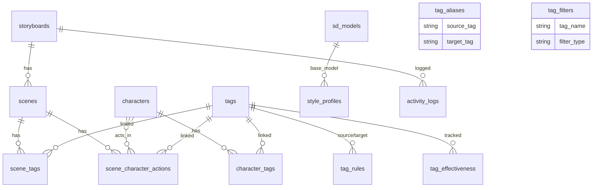

# Database Schema (v3.1)

Shorts Producer의 PostgreSQL 데이터베이스 스키마입니다.
SQLAlchemy ORM + Alembic 마이그레이션으로 관리합니다.

## 📝 변경 이력

| 버전 | 날짜 | 주요 변경사항 |
|------|------|--------------|
| v3.1 | 2026-01-31 | **Media Asset 시스템**: 폴리모픽 참조, Legacy URL 컬럼 삭제, S3/Local 통합, Video Asset 생성 활성화 |
| v3.0 | 2026-01-30 | V3 아키텍처: Storyboard-Centric, Relational Tags, Activity Logs, Tag Aliases/Filters |
| v2.0 | 2026-01-27 | Characters, LoRAs, Style Profiles, Tag System |

---

## 🗺️ ER Diagram



---

## 📦 Core: Storyboard System

### `storyboards`
YouTube Shorts 프로젝트 단위.

| Column | Type | Description |
|--------|------|-------------|
| `id` | Integer (PK) | |
| `title` | String(200) | 스토리보드 제목 |
| `description` | Text | 설명 |
| `default_character_id` | Integer | 기본 캐릭터 |
| `default_style_profile_id` | Integer | 기본 스타일 프로파일 |
| `default_caption` | String(500), nullable | 기본 캡션 텍스트 (Post Layout용) |
| `video_asset_id` | Integer (FK → media_assets) | 최신 렌더링 영상 (폴리모픽 참조) |
| `recent_videos_json` | JSONB | 최근 렌더링 이력 (최대 5개) |
| `created_at`, `updated_at` | DateTime | 타임스탬프 |

**Read-only 속성**:
- `video_url` (`@property`): `video_asset.url` 반환
- `recent_videos` (`@property`): `recent_videos_json` 파싱 결과

### `scenes`
스토리보드의 개별 씬/샷.

| Column | Type | Description |
|--------|------|-------------|
| `id` | Integer (PK) | |
| `storyboard_id` | Integer (FK → storyboards) | 소속 스토리보드 |
| `order` | Integer | 씬 순서 (0-based) |
| `script` | Text | 나레이션 텍스트 |
| `description` | Text | LLM 생성 시각적 설명 |
| `width` | Integer | 이미지 너비 (default: 512) |
| `height` | Integer | 이미지 높이 (default: 768) |
| `image_asset_id` | Integer (FK → media_assets) | 생성된 이미지 (폴리모픽 참조) |
| `created_at`, `updated_at` | DateTime | 타임스탬프 |

**Read-only 속성**:
- `image_url` (`@property`): `image_asset.url` 반환

---

## 🔗 Association Tables (V3 Relational Tags)

### `character_tags`
캐릭터 ↔ 태그 연결 (identity/clothing 구분).

| Column | Type | Description |
|--------|------|-------------|
| `character_id` | Integer (PK, FK → characters) | |
| `tag_id` | Integer (PK, FK → tags) | |
| `weight` | Float | 태그 가중치 (default: 1.0) |
| `is_permanent` | Boolean | `true` = identity, `false` = clothing |

### `scene_tags`
씬 ↔ 태그 연결 (환경/분위기 태그).

| Column | Type | Description |
|--------|------|-------------|
| `scene_id` | Integer (PK, FK → scenes) | |
| `tag_id` | Integer (PK, FK → tags) | |
| `weight` | Float | 태그 가중치 (default: 1.0) |

### `scene_character_actions`
씬 내 캐릭터별 액션/표정 태그.

| Column | Type | Description |
|--------|------|-------------|
| `id` | Integer (PK) | |
| `scene_id` | Integer (FK → scenes) | |
| `character_id` | Integer (FK → characters) | |
| `tag_id` | Integer (FK → tags) | 액션/표정 태그 |
| `weight` | Float | 태그 가중치 (default: 1.0) |

---

## 🏷️ Tag System

### `tags`
프롬프트 키워드의 마스터 테이블 (12-Layer 시맨틱 데이터).

| Column | Type | Description |
|--------|------|-------------|
| `id` | Integer (PK) | |
| `name` | String(100) | Unique, 언더바 형식 (`brown_hair`) |
| `ko_name` | String(100) | 한국어 이름 |
| `category` | String(50) | `character`, `scene`, `meta` |
| `group_name` | String(50) | 의미론적 그룹 (`hair_color`, `expression`, `camera` 등 24종) |
| `description` | String(500) | 태그 설명 |
| `default_layer` | Integer | 12-Layer 위치 (0-11) |
| `usage_scope` | String(20) | `PERMANENT`, `TRANSIENT`, `ANY` |
| `priority` | Integer | 정렬 우선순위 (default: 100) |
| `classification_source` | String(20) | `pattern`, `danbooru`, `llm`, `manual` |
| `classification_confidence` | Float | 분류 신뢰도 (0.0-1.0) |
| `wd14_count` | Integer | WD14 출현 횟수 |
| `wd14_category` | Integer | WD14 카테고리 코드 |
| `is_active` | Boolean | 태그 활성화 상태 (default: TRUE) |
| `deprecated_reason` | String(200) | 비활성화 이유 |
| `replacement_tag_id` | Integer | 대체 태그 ID (FK to tags.id) |

> **Removed**: `subcategory` 컬럼 (deprecated Phase 6-4.25, removed Phase 6-4.26)
> **Added** (Phase 6-4.15.8): `is_active`, `deprecated_reason`, `replacement_tag_id` - DB 기반 태그 비활성화 시스템

### `tag_rules`
태그 간 충돌/의존성 규칙 (개별 태그 레벨).

| Column | Type | Description |
|--------|------|-------------|
| `id` | Integer (PK) | |
| `rule_type` | String(20) | `conflict` or `requires` |
| `source_tag_id` | Integer | 충돌 소스 태그 |
| `target_tag_id` | Integer | 충돌 대상 태그 |
| `message` | String(200) | 규칙 설명 |
| `priority` | Integer | 우선순위 |
| `active` | Boolean | 활성 여부 |
| `created_at`, `updated_at` | DateTime | 타임스탬프 |

> **Removed**: `source_category`, `target_category` (Phase 6-4.26)
> 카테고리 간 충돌은 논리적으로 불가능. 모든 충돌은 개별 태그 레벨에서만 발생.

### `tag_aliases`
위험/비표준 태그의 자동 치환 규칙.

| Column | Type | Description |
|--------|------|-------------|
| `id` | Integer (PK) | |
| `source_tag` | String(100) | 변환 전 (`medium shot`) |
| `target_tag` | String(100) | 변환 후 (`cowboy_shot`), NULL = 삭제 |
| `reason` | String(200) | 치환 사유 |
| `active` | Boolean | 활성 여부 |

### `tag_filters`
무시/스킵할 태그 관리.

| Column | Type | Description |
|--------|------|-------------|
| `id` | Integer (PK) | |
| `tag_name` | String(100) | Unique, 필터 대상 태그 |
| `filter_type` | String(20) | `ignore` or `skip` |
| `reason` | String(200) | 필터 사유 |
| `active` | Boolean | 활성 여부 |

### `classification_rules`
패턴 기반 태그 자동 분류 규칙.

| Column | Type | Description |
|--------|------|-------------|
| `id` | Integer (PK) | |
| `rule_type` | String(20) | `suffix`, `prefix`, `contains`, `exact` |
| `pattern` | String(100) | 매칭 패턴 (`_hair`, `eyes`) |
| `target_group` | String(50) | 대상 그룹 |
| `priority` | Integer | 평가 순서 |
| `active` | Boolean | 활성 여부 |

### `tag_effectiveness`
WD14 피드백 루프 데이터.

| Column | Type | Description |
|--------|------|-------------|
| `id` | Integer (PK) | |
| `tag_id` | Integer (FK → tags) | |
| `use_count` | Integer | 프롬프트 사용 횟수 |
| `match_count` | Integer | WD14 감지 횟수 |
| `effectiveness` | Float | `match_count / use_count` |

---

## 🎨 Asset System

### `media_assets` (V3.1)
통합 미디어 저장소. S3/Local 스토리지 폴리모픽 참조 시스템.

| Column | Type | Description |
|--------|------|-------------|
| `id` | Integer (PK) | |
| `file_name` | String(500) | 원본 파일명 |
| `file_type` | String(50) | `image`, `video`, `audio` |
| `storage_key` | String(1000) | 스토리지 경로 (버킷명 제외, 상대 경로만) |
| `file_size` | BigInteger | 파일 크기 (bytes) |
| `mime_type` | String(100) | `image/png`, `video/mp4` 등 |
| `owner_type` | String(50) | 폴리모픽 타입 (`character`, `scene`, `lora`, `sdmodel`, `storyboard`) |
| `owner_id` | Integer | 폴리모픽 ID |
| `created_at` | DateTime | 생성 시각 |

**특징**:
- **폴리모픽 연관**: `owner_type` + `owner_id`로 모든 엔티티 연결
- **URL 생성**: `url` property가 storage_key 기반 public URL 반환 (`http://minio:9000/shorts-producer/{storage_key}`)
- **S3/Local 통합**: LocalStorage/S3Storage 모두 지원
- **계층 구조**:
  - 영상: `projects/{p_id}/groups/{g_id}/storyboards/{s_id}/videos/{file}`
  - 씬 이미지: `projects/{p_id}/groups/{g_id}/storyboards/{s_id}/images/{file}`
  - 캐릭터: `characters/{id}/preview/{file}`
  - 공유 에셋: `shared/{type}/{file}` (audio, fonts, overlay, references, poses)

**마이그레이션**:
- `ca169902f4a4`: 모든 모델에 `*_asset_id` FK 추가
- `4249c8f1cd5c`: Legacy `*_url` 컬럼 삭제

**중요**: `storage_key`는 버킷명(`shorts-producer`)을 포함하지 않음. `get_storage().get_url(key)`가 버킷명을 자동 추가.

### `characters`
캐릭터 프리셋. V3에서는 `character_tags` 관계형 테이블로 태그 연결.

| Column | Type | Description |
|--------|------|-------------|
| `id` | Integer (PK) | |
| `name` | String(100) | Unique |
| `gender` | String(10) | `female`, `male` |
| `description` | String(500) | |
| `loras` | JSONB | `[{"lora_id": 1, "weight": 0.8}]` |
| `recommended_negative` | Text[] | 캐릭터별 네거티브 |
| `custom_base_prompt` | Text | 커스텀 기본 프롬프트 |
| `custom_negative_prompt` | Text | 커스텀 네거티브 |
| `reference_base_prompt` | Text | 참조 이미지 생성용 |
| `reference_negative_prompt` | Text | 참조 네거티브 |
| `preview_image_asset_id` | Integer (FK → media_assets) | 미리보기 이미지 (폴리모픽 참조) |
| `prompt_mode` | String(20) | `auto`, `standard`, `lora` |
| `ip_adapter_weight` | Float | 0.0-1.0 |
| `ip_adapter_model` | String(50) | `clip`, `clip_face`, `faceid` |

**Read-only 속성**:
- `preview_image_url` (`@property`): `preview_image_asset.url` 반환

> V3 변경: `identity_tags Integer[]`, `clothing_tags Integer[]` 제거 → `character_tags` 테이블로 이관
> V3.1 변경: `preview_image_url` 제거 → `preview_image_asset_id` FK로 전환

### `loras`
Stable Diffusion LoRA 모델.

| Column | Type | Description |
|--------|------|-------------|
| `id` | Integer (PK) | |
| `name` | String(100) | Unique, 파일명/키 |
| `display_name` | String(100) | 표시명 |
| `lora_type` | String(20) | `character`, `style`, `concept`, `pose` |
| `gender_locked` | String(10) | 성별 제한 |
| `civitai_id` | Integer | Civitai ID |
| `civitai_url` | String(500) | |
| `trigger_words` | Text[] | 트리거 키워드 |
| `default_weight` | Decimal(3,2) | 기본 가중치 |
| `optimal_weight` | Decimal(3,2) | 보정된 최적 가중치 |
| `calibration_score` | Integer | 최적 가중치 시 점수 |
| `weight_min`, `weight_max` | Decimal(3,2) | 가중치 범위 |
| `preview_image_asset_id` | Integer (FK → media_assets) | 미리보기 이미지 (폴리모픽 참조) |
| `created_at`, `updated_at` | DateTime | 타임스탬프 |

**Read-only 속성**:
- `preview_image_url` (`@property`): `preview_image_asset.url` 반환

### `sd_models`
Stable Diffusion 체크포인트.

| Column | Type | Description |
|--------|------|-------------|
| `id` | Integer (PK) | |
| `name` | String(200) | Unique |
| `display_name` | String(200) | |
| `model_type` | String(50) | `checkpoint`, `vae` |
| `base_model` | String(50) | `SD1.5`, `SDXL`, `Pony` |
| `civitai_id` | Integer | |
| `civitai_url` | String(500) | |
| `description` | Text | |
| `preview_image_asset_id` | Integer (FK → media_assets) | 미리보기 이미지 (폴리모픽 참조) |
| `is_active` | Boolean | |

**Read-only 속성**:
- `preview_image_url` (`@property`): `preview_image_asset.url` 반환

### `style_profiles`
Model + LoRAs + Embeddings 번들.

| Column | Type | Description |
|--------|------|-------------|
| `id` | Integer (PK) | |
| `name` | String(100) | Unique |
| `sd_model_id` | Integer (FK → sd_models) | 베이스 체크포인트 |
| `loras` | JSONB | LoRA 목록 |
| `positive_embeddings` | Integer[] | Embedding IDs |
| `negative_embeddings` | Integer[] | Embedding IDs |
| `default_positive` | Text | 기본 포지티브 |
| `default_negative` | Text | 기본 네거티브 |
| `is_default` | Boolean | |
| `is_active` | Boolean | |

### `embeddings`
Textual Inversion 임베딩.

| Column | Type | Description |
|--------|------|-------------|
| `id` | Integer (PK) | |
| `name` | String(200) | Unique |
| `display_name` | String(200) | |
| `embedding_type` | String(50) | |
| `trigger_word` | String(100) | |
| `description` | Text | |
| `is_active` | Boolean | |

---

## 📊 Analytics & History

### `activity_logs`
생성 이력 로그 (Analytics & Tracking).

| Column | Type | Description |
|--------|------|-------------|
| `id` | Integer (PK) | |
| `storyboard_id` | Integer (nullable) | 소속 스토리보드 (FK 제거됨, NULL 허용) |
| `scene_id` | Integer | 씬 인덱스 |
| `character_id` | Integer | 캐릭터 ID (Character Consistency 추적용) |
| `prompt` | Text | 사용된 프롬프트 |
| `negative_prompt` | Text | 네거티브 프롬프트 |
| `sd_params` | JSONB | `{steps, cfg_scale, sampler, ...}` |
| `seed` | BigInteger | 생성 시드 |
| `image_url` | String(500) | 생성 이미지 경로 |
| `match_rate` | Float | WD14 매치율 |
| `tags_used` | JSONB | 사용된 태그 배열 |
| `status` | String(20) | `success`, `fail` |
| `created_at`, `updated_at` | DateTime | 타임스탬프 |

> v3.0: `generation_logs` → `activity_logs`로 이름 변경 및 통합
> **Removed** (Phase 6-4.26): `is_favorite`, `name` - 즐겨찾기 기능 미구현 (0 usage, 0 data)

### `prompt_histories`
저장된 프롬프트 설정.

| Column | Type | Description |
|--------|------|-------------|
| `id` | Integer (PK) | |
| `name` | String(200) | |
| `positive_prompt` | Text | |
| `negative_prompt` | Text | |
| `steps`, `cfg_scale`, `seed`, `clip_skip` | Integer/Float | SD 파라미터 |
| `character_id` | Integer | |
| `lora_settings` | JSONB | |
| `context_tags` | JSONB | |
| `last_match_rate`, `avg_match_rate` | Float | |
| `validation_count` | Integer | |
| `is_favorite` | Boolean | |
| `use_count` | Integer | |

### `evaluation_runs`
프롬프트 모드 A/B 테스트 결과.

| Column | Type | Description |
|--------|------|-------------|
| `id` | Integer (PK) | |
| `batch_id` | String(50) | 배치 실행 그룹 |
| `test_name` | String(100) | 테스트명 |
| `mode` | String(20) | `standard`, `lora` |
| `character_id` | Integer | 캐릭터 ID |
| `character_name` | String(100) | 캐릭터명 |
| `prompt_used` | Text | 사용된 프롬프트 |
| `negative_prompt` | Text | 네거티브 프롬프트 |
| `seed` | Integer | 생성 시드 |
| `steps` | Integer | 샘플링 스텝 |
| `cfg_scale` | Float | CFG 스케일 |
| `match_rate` | Float | WD14 매치율 |
| `matched_tags`, `missing_tags`, `extra_tags` | JSONB | 태그 분석 결과 |
| `created_at`, `updated_at` | DateTime | 타임스탬프 |

---

## 📝 JSONB Structures

### `Character.loras`
```json
[{"lora_id": 1, "weight": 0.8, "name": "lora_name", "trigger_words": ["word"], "lora_type": "character"}]
```

### `ActivityLog.sd_params`
```json
{"steps": 20, "cfg_scale": 7, "sampler": "DPM++ 2M Karras", "width": 512, "height": 768}
```

---

## 🔑 Enums

| Enum | Values |
|------|--------|
| `Tag.usage_scope` | `PERMANENT`, `TRANSIENT`, `ANY` |
| `Tag.classification_source` | `pattern`, `danbooru`, `llm`, `manual` |
| `LoRA.lora_type` | `character`, `style`, `concept`, `pose` |
| `Character.prompt_mode` | `auto`, `standard`, `lora` |
| `TagRule.rule_type` | `conflict`, `requires` |
| `TagAlias.target_tag` | String or `NULL` (= remove tag) |
| `TagFilter.filter_type` | `ignore`, `skip` |
| `ActivityLog.status` | `success`, `fail` |

---

**Last Updated:** 2026-01-31
**Schema Version:** v3.1
**ORM:** SQLAlchemy 2.0 (Mapped Columns)
**Migrations:** Alembic (V3 Baseline + Media Assets)
