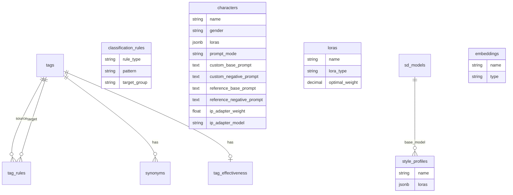

# Database Schema

This document describes the PostgreSQL database schema for the Shorts Producer application.

---

## 🗺️ ER Diagram



---

## 🏷️ Tags System

Core system for managing prompt tokens, their categorization, and relationships.

### `tags`
The primary table for all prompt keywords.

| Column | Type | Description |
|--------|------|-------------|
| `id` | Integer (PK) | Unique identifier |
| `name` | String(100) | Unique tag name (normalized, lowercase) |
| `category` | String(50) | High-level category (`character`, `scene`, `meta`) |
| `group_name` | String(50) | Specific group (`hair_color`, `expression`, `lighting`) |
| `priority` | Integer | Sorting priority (1=highest, 99=lowest) |
| `exclusive` | Boolean | If true, only one tag from this group can be selected |
| `classification_source` | String(20) | Source of classification (`pattern`, `danbooru`, `llm`, `manual`) |
| `classification_confidence` | Float | Confidence score of the classification (0.0-1.0) |

### `classification_rules`
Pattern-based rules for auto-classifying tags. Replaces hardcoded `CATEGORY_PATTERNS`.

| Column | Type | Description |
|--------|------|-------------|
| `id` | Integer (PK) | Unique identifier |
| `rule_type` | String(20) | Matching type: `suffix`, `prefix`, `contains`, `exact` |
| `pattern` | String(100) | Pattern to match (e.g., `_hair`, `eyes`) |
| `target_group` | String(50) | Target group to assign if matched |
| `priority` | Integer | Evaluation order (higher = checked first) |
| `active` | Boolean | Whether the rule is active |

### `tag_rules`
Defines logical relationships between tags (conflicts and dependencies).

| Column | Type | Description |
|--------|------|-------------|
| `id` | Integer (PK) | Unique identifier |
| `rule_type` | String(20) | `conflict` (mutual exclusion) or `requires` (dependency) |
| `source_tag_id` | Integer (FK) | The tag triggering the rule |
| `target_tag_id` | Integer (FK) | The tag that conflicts with or is required by source |

### `tag_effectiveness`
Feedback loop data from WD14 analysis.

| Column | Type | Description |
|--------|------|-------------|
| `id` | Integer (PK) | Unique identifier |
| `tag_id` | Integer (FK) | Reference to `tags` |
| `use_count` | Integer | Times used in prompts |
| `match_count` | Integer | Times detected in generated images |
| `effectiveness` | Float | `match_count / use_count` (0.0-1.0) |

---

## 🎨 Assets System

Manages SD resources and character definitions.

### `characters`
Character presets defining appearance and LoRA configurations.

| Column | Type | Description |
|--------|------|-------------|
| `id` | Integer (PK) | Unique identifier |
| `name` | String(100) | Character name (unique) |
| `gender` | String(10) | `female`, `male` |
| `identity_tags` | Integer[] | Array of Tag IDs (base appearance) |
| `clothing_tags` | Integer[] | Array of Tag IDs (default outfit) |
| `loras` | JSONB | List of LoRAs: `[{"lora_id": 1, "weight": 0.8}, ...]` |
| `prompt_mode` | String(20) | `auto`, `standard`, `lora` |
| `recommended_negative` | Text[] | Character-specific negative prompts |
| `custom_base_prompt` | Text | Raw prompt text for inclusion |
| `custom_negative_prompt` | Text | Raw negative prompt text |
| `reference_base_prompt` | Text | Prompt for building reference |
| `reference_negative_prompt` | Text | Negative prompt for reference |
| `ip_adapter_weight` | Float | IP-Adapter weight (0.0-1.0) |
| `ip_adapter_model` | String(50) | `clip`, `clip_face`, `faceid` |

### `loras`
Stable Diffusion LoRA models with metadata and calibration data.

| Column | Type | Description |
|--------|------|-------------|
| `id` | Integer (PK) | Unique identifier |
| `name` | String(100) | LoRA filename/key (unique) |
| `civitai_id` | Integer | ID on Civitai |
| `trigger_words` | String[] | Trigger keywords |
| `lora_type` | String(20) | `character`, `style`, `concept`, `pose` |
| `default_weight` | Decimal | Default weight to use |
| `optimal_weight` | Decimal | **Auto-calibrated** weight for best results |
| `calibration_score` | Decimal | Match rate score at optimal weight |
| `weight_min/max` | Decimal | Recommended weight range |

### `sd_models`
Checkpoints (Base Models).

| Column | Type | Description |
|--------|------|-------------|
| `id` | Integer (PK) | Unique identifier |
| `name` | String(200) | Filename |
| `base_model` | String(50) | `SD1.5`, `SDXL`, `Pony` |
| `model_type` | String(50) | `checkpoint`, `vae` |

### `style_profiles`
Bundles of Model + LoRAs + Embeddings + Prompts.

| Column | Type | Description |
|--------|------|-------------|
| `id` | Integer (PK) | Unique identifier |
| `sd_model_id` | Integer (FK) | Base checkpoint |
| `loras` | JSONB | List of LoRAs with weights |
| `positive_embeddings` | Integer[] | Array of Embedding IDs |
| `negative_embeddings` | Integer[] | Array of Embedding IDs |
| `default_positive` | Text | Base positive prompt |
| `default_negative` | Text | Base negative prompt |

---

## 📝 Common Types

### JSONB Structures

#### `Character.loras` / `StyleProfile.loras`
Stores references to LoRAs with specific weights for that context.
```json
[
  {
    "lora_id": 123,
    "weight": 0.8
  },
  {
    "lora_id": 456,
    "weight": 0.6
  }
]
```

### Enums

#### `Tag.classification_source`
*   `pattern`: Matched by regex rule in `classification_rules`.
*   `danbooru`: Fetched from Danbooru Wiki API.
*   `llm`: Classified by Gemini (LLM).
*   `manual`: Manually approved/corrected by user.

#### `LoRA.lora_type`
*   `character`: Defines a specific character identity.
*   `style`: Applies an art style.
*   `concept`: Adds a concept or object.
*   `pose`: Defines a pose.
